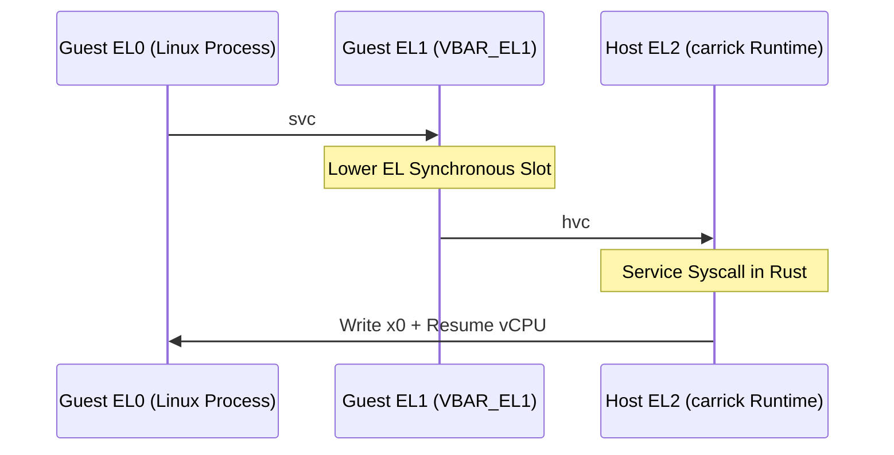

# Carrick

Carrick is a high-performance, fully concurrent Linux binary compatibility layer for macOS on Apple Silicon. Unmodified Linux processes run as native macOS processes, with syscalls trapped via `Hypervisor.framework` and translated directly to Darwin host primitives. Unlike traditional virtual machines, Carrick requires no guest Linux kernel, no separate hypervisor memory pool, and no slow snapshot-restore loops for process lifecycle management.

The name refers to a type of knot used to join two heavy ropes of different sizes.

> [!IMPORTANT]
> **Carrick is fully functional and production-ready.** The runtime has successfully retired the Big Kernel Lock (BKL), supports fully multi-threaded guest execution, implements a robust socket translation layer, serves pseudo-terminals (`/dev/pts`), and runs complex workloads like `apt-get install` and `python3 -m http.server` entirely end-to-end.

---

## Implemented Now

Carrick provides a robust translation layer and lifecycle supervisor covering the following features:

* **ELF Loading & Address-Space Mapping:** Parses static and dynamic AArch64 Linux ELF binaries (`goblin`), layouts the memory regions, and populates the initial guest stack with `argc`, `argv`, `envp`, and target auxiliary vectors (e.g., `AT_BASE` for dynamic interpreters).
* **VFS & Rootfs Composition:** Merges OCI container layers in-memory at runtime to provide a virtual root filesystem (supporting Whiteouts, symlinks, and opaque directories) without physical disk extraction.
* **Fully Concurrent Dispatcher (BKL Retired):** Decodes and services guest syscalls in host Rust code. Since the Big Kernel Lock (BKL) retirement, vCPU threads run concurrently against per-subsystem thread-safe locks (`Mutex`/`RwLock` over `fs`, `creds`, `proc`, `signal`, and `mem`), avoiding global serialization.
* **Socket Networking Subsystem:** Translates Linux socket calls (`socket`, `bind`, `connect`, `listen`, `accept`, `sendto`/`recvfrom`, `setsockopt`/`getsockopt`, `shutdown`) directly onto native Darwin sockets, and synthesizes `AF_NETLINK` sockets locally to satisfy routing table audits (like glibc's `__check_pf`).
* **kqueue-Backed Event Multiplexing:** Maps Linux `epoll` boundaries (`epoll_create1`, `epoll_ctl`, `epoll_pwait`) onto native Darwin `kqueue` descriptors, alongside customuserspace implementations of `eventfd2` and `timerfd`.
* **Interactive Pseudo-Terminals (`carrick run -t`):** Bridges the host terminal and guest `/dev/pts/N` using a dedicated poll-based thread multiplexing terminal inputs and PTY master events, enabling job control (Ctrl-C, Ctrl-Z) and live size resize (`SIGWINCH`) propagation.
* **Synthetic procfs & sysfs:** Populates expected nodes like `/proc/self/maps`, `/proc/cpuinfo`, `/proc/version`, and `/sys/devices/system/cpu/...` to fulfill assertions made during Musl/Glibc and language runtime (e.g., Go, Rust) startup sequences.
* **DTrace Loop (USDT Probes):** Wires static USDT probes at translation boundaries. Running `carrick compat-report -- <cmd>` uses these probes to collect and aggregate unhandled or partially-implemented syscalls or `/proc` paths.

---

## Under the Hood: Architectural Deep-Dive

### 1. HVF Trap Boundary & CPU Mode Switch
To map unmodified Linux ELF execution onto macOS host processes, Carrick sets up a tiny virtual machine per process using Apple's `Hypervisor.framework` (HVF):
1. **CPU State Initialization:** The vCPU's EL0 state is initialized with the program counter (`PC`) pointing to the guest entry and the stack pointer (`SP_EL0`) pointing to the seeded guest stack.
2. **Exception Vectors:** Carrick configures `VBAR_EL1` to point to a host-allocated vector table page. When the guest process executes a Linux syscall via the `svc #0` instruction, it traps directly into our EL1 synchronous handler.
3. **Hypervisor Exit (`hvc`):** The EL1 vector table handler executes a single `hvc #0` instruction. This causes an immediate hypervisor VM-exit to EL2 (the hypervisor context), which returns control to `carrick` in host userspace.
4. **Register Inspection:** The supervisor decodes the guest's registers (GPRs `x0` through `x8`) using `applevisor` APIs to determine the syscall number and arguments, dispatches to the corresponding Rust handler, and writes the return value back into `x0` before resuming the guest.



### 2. Identity Mapping & the FEAT_PAN3 Workaround
On ARMv8-A, exclusive load/store primitives (`ldaxr`/`stlxr`) are critical for guest atomic operations and mutex locks (e.g., Musl's `pthread_mutex_lock` path). However:
* **The Device Memory Trap:** By default, running a guest without page tables leaves the MMU disabled (`SCTLR_EL1.M=0`), forcing all memory accesses to be treated as `Device-nGnRnE` cache type. Exclusive instructions on Device memory are prohibited by the ARM architecture and immediately raise an external abort (`DFSC=0x35` translation table walk fault).
* **The Solution:** Carrick builds a 4-page stage-1 identity-mapping page table (`stage1_identity_page_tables` in `src/memory.rs`) that maps the 1 TiB guest physical address space and enables the guest MMU (`SCTLR_EL1.M=1`), forcing memory to be cached as `Normal Inner Shareable WB`.
* **FEAT_PAN3 Bypass:** On M-series chips, Apple's HVF starts the vCPU with `PSTATE.PAN=1` (Privileged Access Never) enabled. FEAT_PAN3 raises a permission fault if EL1 fetches instructions from user-accessible pages. To bypass this, we map pages with fine-grained access permissions (`AP` bits):
  * **Kernel-only pages:** AP=00 (EL1 read/write, no EL0 access), `UXN=1` (User execute never). Covers the trampoline, exception vectors, and the page table pages themselves.
  * **User pages:** AP=01 (EL0/EL1 read/write), `UXN=0` (User execute allowed), and `PXN=1` (Privileged execute never). Setting `PXN=1` tells the CPU that EL1 is blocked from fetching instructions here, satisfying the PAN check and preventing spurious faults.

### 3. BKL-free Concurrency Model
To allow heavy parallel workloads (like multithreaded web servers and build systems) to scale, Carrick operates entirely without a Big Kernel Lock (BKL):
* **Decoupled vCPUs:** Each guest thread maps to a native macOS `pthread` that spawns its own HVF vCPU context. The threads concurrently map the same guest address space.
* **Subsystem-Level Locks:** The global `SyscallDispatcher` wraps its internal subsystems (`mem::MemState`, `proc::ProcState`, `creds::CredState`, `signal::SignalState`, `fs::IoState`) in separate, thread-safe locks (`Mutex`/`RwLock`).
* **Narrow Borrowing:** Syscall handlers accept a `SyscallCtx` containing narrow borrows of only the memory and subsystem state they require. Parallel vCPUs calling unrelated subsystems (e.g., thread `A` reading a socket and thread `B` writing to the heap) execute concurrently without lock contention.

### 4. Interactive PtyRelay & Terminal Bridging
Interactive shells (`carrick run -t`) require clean byte propagation, terminal state save/restore, and reliable signal forwarding:
* **PTY Bridging:** Carrick allocates a host pseudo-terminal pair (master and slave) via `posix_openpt`. The slave fd is duplicated onto host fds 0, 1, and 2, which the guest process inherits.
* **The Relay Thread:** A background `PtyRelay` thread manages a bidirectional `poll(2)` loop:
  * Copies bytes from the real host terminal `stdin` to the PTY master (keystrokes to guest).
  * Copies bytes from the PTY master to the real host terminal `stdout` (guest prints to screen).
  * Monitors a shutdown self-pipe for clean termination.
* **SIGWINCH self-pipe:** The process-level `SIGWINCH` handler writes a single byte to a non-blocking self-pipe to notify the relay loop of window resizes. The poll loop drains the pipe and issues `ioctl(TIOCSWINSZ)` to propagate the new dimensions to the PTY master without calling unsafe functions in the signal handler context.

---

## License Policy

The crate is dual licensed as `Apache-2.0 OR MIT`. Dependencies are selected from permissive Rust ecosystem crates. `deny.toml` records the allowed dependency licenses for `cargo-deny`; the current resolved dependency graph uses permissive licenses such as MIT, Apache-2.0, BSD, ISC, Unicode-3.0, Zlib, Unlicense, 0BSD, BSL-1.0, and CDLA-Permissive-2.0.

---

## Development

Carrick is a Cargo workspace:

| Crate | Responsibility |
| --- | --- |
| `carrick-spec` | Pure vocabulary types (`RunSpec`, `ContainerSpec`, `ImageConfig`, `Mount`, `NamespaceConfig`) shared across layers. |
| `carrick-image` | OCI image references, pull/store, image-config parsing, layer + config resolution. |
| `carrick-runtime` | The HVF runtime: ELF loading, syscall dispatch, VFS, fs backends, and the `execute(&RunSpec)` seam. |
| `carrick-engine` | The container layer: docker `run` merge semantics, lowering a `CliRunRequest` into a `RunSpec`. |
| `carrick-cli` | The `carrick` binary (docker-compatible `run` + diagnostic subcommands). |

The dependency direction is `cli → engine → {image, runtime} → spec`; `runtime` and `image` never depend on each other or on `engine`.

```sh
cargo fmt --all
cargo build
cargo test --workspace
```

### Build performance

`carrick-runtime` is a single large crate (~41k lines), and the workspace links
27 integration-test binaries plus the cli, each statically linking its rlib.
With macOS's default `ld64`, an incremental rebuild after a one-line runtime
edit spends ~37s of its ~57s wall time in the linker.

> [!WARNING]
> Do **not** switch the linker to LLVM `lld` globally. `lld`'s Mach-O port
> drops the `__DATA,__dof_carrick` section that the `usdt` crate's
> `register_probes()` reads, so `carrick trace`'s USDT probes silently stop
> firing (the provider registers empty; `dtrace -l` shows nothing). `ld64`
> preserves the section. A faster linker can be re-introduced only if it keeps
> `__dof_carrick` — verify with `otool -l target/release/carrick | grep dof`
> and confirm `carrick trace` still emits syscall events.

The remaining incremental cost is rustc recompiling the monolithic runtime
crate; that is inherent to keeping the runtime as one crate (its
dispatch/memory/trap internals are too coupled to split cheaply).

### No-panic gate

The supervisor must never crash on guest input, so `unwrap`/`expect`/`panic!`/`todo!`/`unimplemented!` are denied crate-wide via `[lints.clippy]` in `Cargo.toml` (test code is exempt via `clippy.toml`). A handful of audited, provably-infallible sites carry a targeted `#[allow(...)]` with an `// INVARIANT:` comment. Run the gate with:

```sh
cargo clippy --all-targets
```

This exits non-zero on any *new* unguarded panic/unwrap. (Do **not** add `-D warnings`: that promotes unrelated pre-existing style lints to errors; the `Cargo.toml` deny levels are what enforce the no-panic gate.)
