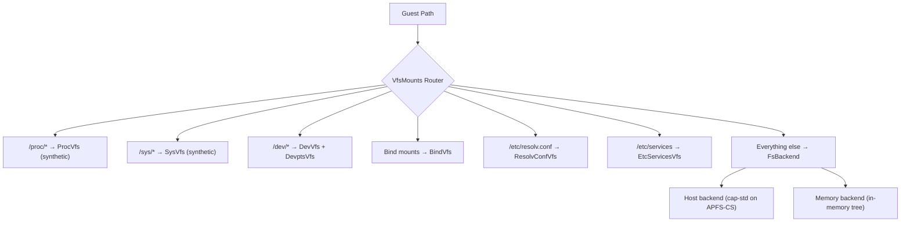

# Carrick: Comprehensive Systems-Level Code Review

**Date:** 2026-05-27  
**Scope:** Full codebase read (~66K LOC, 9 crates), no execution  
**Reviewer context:** Deep familiarity with lx branded zones, Noah, WSLv1, FreeBSD Linuxulator, and OS internals  

---

## Executive Summary

Carrick is a **Linux user-space binary compatibility layer** for macOS on Apple Silicon, using `Hypervisor.framework` (HVF) to trap guest EL0 execution and translating Linux syscalls to Darwin host primitives in Rust. It occupies the same design space as Solaris lx branded zones, Noah (macOS/x86_64), WSLv1 (Windows), and FreeBSD's Linuxulator — but with a distinctive **HVF trap boundary** that is both its greatest architectural strength and its primary complexity source.

The project is **remarkably mature for a single-developer effort**: ~66K lines of Rust spanning 9 crates, with **~150 implemented syscalls** (comprehensive inventory below), a fully concurrent (BKL-free) dispatcher, OCI container support, DTrace/USDT observability, and proven Go/Python/apt-get/HTTP workloads. The engineering discipline — no-panic clippy gates, differential Docker oracle testing, conformance probes, comprehensive design documents — is genuinely impressive.

What follows is a thorough analysis of strengths, weaknesses, architectural gaps, and strategic opportunities.

---

## 1. Architecture: The HVF Trap Boundary

### How It Works

```mermaid
sequenceDiagram
    participant G as Guest EL0 (Linux binary)
    participant V as VBAR_EL1 (Carrick vectors)
    participant H as Host EL2→userspace (Carrick runtime)
    
    G->>V: svc #0 (Linux syscall)
    V->>H: hvc #0 (VM exit to host)
    H->>H: Decode x0-x5, x8; dispatch to Rust handler
    H->>G: Write x0 (retval), resume vCPU
```

### Comparison to Prior Art

| System | Trap Mechanism | Guest Kernel? | Process Model |
|--------|---------------|---------------|---------------|
| **Carrick** | HVF EL1→EL2 trap + host dispatch | No (identity-mapped EL0) | guest pid == host pid |
| **lx branded zones** | `sysenter` trap in kernel brand module | No (host Solaris kernel) | Single PID namespace |
| **Noah** | HVF trap (macOS/x86_64 variant) | No | Single process |
| **WSLv1** | NT syscall intercept (pico processes) | No (NT kernel) | Translated PIDs |
| **FreeBSD Linuxulator** | `int 0x80`/`syscall` trap in kernel | No (host FreeBSD kernel) | Shared PID space |

### Strengths of the HVF Approach

1. **No kernel module required.** Unlike lx zones (brand module in the Solaris kernel) or WSLv1 (pico provider in NT), carrick runs entirely in userspace. This dramatically simplifies development and deployment — `codesign` + `com.apple.security.hypervisor` is the only privilege needed.

2. **True hardware isolation of guest execution.** The guest runs at EL0 inside a real HVF vCPU with its own register file, page tables, and exception level boundaries. This gives carrick something neither Noah nor the Linuxulator have: **genuine hardware enforcement** of the guest/host boundary.

3. **Identity-mapped page tables with FEAT_PAN3 workaround.** The stage-1 identity mapping ([memory.rs](file:///Volumes/CaseSensitive/carrick/crates/carrick-mem/src/memory.rs)) that enables the MMU for guest `ldaxr`/`stlxr` atomics is elegant engineering. The PAN bypass via AP/PXN bits is a clever solution to an Apple Silicon-specific constraint.

4. **Guest pid == host pid.** This is the same design choice lx zones made, and it's the right one. `fork()` → `libc::fork()`, `wait4()` → `libc::wait4()`, `kill()` → `libc::kill()` with signal number translation. The host kernel provides real process scheduling, memory isolation, and zombie reaping. WSLv1's PID translation layer was a source of endless bugs; carrick avoids it entirely.

### Weaknesses / Risks

1. **Per-syscall trap cost.** Every `svc #0` triggers a full EL0→EL1→EL2→host roundtrip. Unlike lx zones (where the brand module runs at kernel privilege and can service many syscalls without a full context switch) or FreeBSD's Linuxulator (in-kernel handler), carrick pays the HVF exit/enter cost on every trap.

2. **Single EL1 vector page.** The EL1 vectors catch synchronous exceptions and re-trap via `hvc #0`. The host decodes `ESR_EL1` after every exit to distinguish syscalls from faults, debug traps, sysreg emulation, etc. — adding latency to the hot path.

3. **No stage-2 translation.** Carrick uses stage-1 identity mapping only. Apple's HVF *does* support stage-2 (IPA→PA) translation, which could provide finer-grained memory protection without the FEAT_PAN3 complexity. This is a deliberate trade-off avoiding stage-2 TLB pressure, but it requires the `PtQuiesce` stop-the-world barrier for any page table edit.

---

## 2. Syscall Translation Layer

### Complete Syscall Inventory

Based on the `normalized_dispatch!` table and the full dispatch files, carrick implements **~150 distinct syscall numbers**. Here is the complete inventory by category:

#### File I/O (56 syscalls)

| Nr | Name | Quality | Notes |
|----|------|---------|-------|
| 5-7 | setxattr/lsetxattr/fsetxattr | Full | Linux XATTR_CREATE/REPLACE → macOS |
| 8-10 | getxattr/lgetxattr/fgetxattr | Full | |
| 11-13 | listxattr/llistxattr/flistxattr | Full | |
| 14-16 | removexattr/lremovexattr/fremovexattr | Stub | ENOSYS (compat note) |
| 17 | getcwd | Full | Synthetic VFS cwd |
| 19 | eventfd2 | Full | Real host pipe pair + EFD_SEMAPHORE/NONBLOCK/CLOEXEC |
| 20 | epoll_create1 | Full | Backed by macOS kqueue |
| 21 | epoll_ctl | Full | ADD/DEL/MOD, EPOLLIN→EVFILT_READ etc |
| 22 | epoll_pwait | Full | WaitOnPollFds + sigmask |
| 23 | dup | Full | |
| 24 | dup3 | Full | O_CLOEXEC |
| 25 | fcntl | Full | F_DUPFD, F_GETFD/SETFD, F_GETFL/SETFL, F_GETLK/SETLK/SETLKW, F_OFD_*, F_GETPIPE_SZ, F_ADD_SEALS/GET_SEALS |
| 29 | ioctl | Full | 20+ ioctls: TCGETS/TCSETS*/TIOCGWINSZ/TIOCSWINSZ/TIOCGPGRP/TIOCSPGRP/TIOCSCTTY/TIOCNOTTY/TIOCGSID/TIOCGPTN/TIOCSPTLCK/FIONREAD/FIONBIO |
| 32 | flock | Stub | No-op success (single-tenant) |
| 33 | mknodat | Partial | Regular files only (not devices) |
| 34 | mkdirat | Full | VFS + host |
| 35 | unlinkat | Full | AT_REMOVEDIR |
| 36 | symlinkat | Full | |
| 37 | linkat | Full | |
| 38 | renameat | Full | |
| 43-44 | statfs/fstatfs | Full | Synthetic overlayfs values |
| 45-46 | truncate/ftruncate | Full | |
| 47 | fallocate | Full | FL_KEEP_SIZE/PUNCH_HOLE/COLLAPSE/ZERO/INSERT/UNSHARE |
| 48 | faccessat | Full | AT_SYMLINK_NOFOLLOW/AT_EACCESS/AT_EMPTY_PATH |
| 49-50 | chdir/fchdir | Full | |
| 52 | fchmod | Full | |
| 53 | fchmodat | Full | |
| 54-55 | fchownat/fchown | Full | |
| 56 | openat | Full | Full flag translation, VFS overlay + host passthrough |
| 57 | close | Full | Ref-counted cleanup |
| 59 | pipe2 | Full | O_CLOEXEC/O_NONBLOCK, host kernel pipes |
| 61 | getdents64 | Full | Correct d_reclen/d_type/d_off |
| 62 | lseek | Full | SEEK_SET/CUR/END |
| 63-64 | read/write | Full | Host fd / pipe / eventfd / timerfd / signalfd / pidfd paths |
| 65-66 | readv/writev | Full | Iovec translation |
| 67-70 | pread64/pwrite64/preadv/pwritev | Full | |
| 71 | sendfile | Full | In-kernel copy loop |
| 72-73 | pselect6/ppoll | Full | WaitOnFds + sigmask |
| 76 | splice | Full | Pipe↔fd |
| 78 | readlinkat | Full | /proc/self/exe handling |
| 79-80 | newfstatat/fstat | Full | |
| 81-83 | sync/fsync/fdatasync | Full | Host passthrough |
| 88 | utimensat | Full | UTIME_NOW/UTIME_OMIT |
| 267 | syncfs | Full | |
| 276 | renameat2 | Full | RENAME_NOREPLACE/EXCHANGE/WHITEOUT |
| 285 | copy_file_range | Full | |
| 291 | statx | Full | STATX_BASIC_STATS |
| 436 | close_range | Full | CLOSE_RANGE_UNSHARE/CLOEXEC |
| 437 | openat2 | Full | struct open_how ABI |
| 439 | faccessat2 | Full | |
| 452 | fchmodat2 | Full | |
| 74,75,77 | signalfd4/vmsplice/tee | Stub | ENOSYS |

#### Memory Management (14 syscalls)

| Nr | Name | Quality | Notes |
|----|------|---------|-------|
| 214 | brk | Full | Bump allocator within HEAP_BASE..+HEAP_SIZE |
| 215 | munmap | Full | Free-list + stage-1 invalidation + shared aperture writeback |
| 216 | mremap | Full | MREMAP_MAYMOVE/FIXED/DONTUNMAP, copies data on move |
| 222 | mmap | Full | MAP_SHARED/PRIVATE/FIXED/ANON + host file backing + shared aperture |
| 223 | fadvise64 | Stub | No-op success |
| 226 | mprotect | Full | Stage-1 page table edits for arena |
| 227 | msync | Full | MS_SYNC/ASYNC/INVALIDATE, shared aperture writeback |
| 228-229 | mlock/munlock | Stub | No-op success |
| 230-231 | mlockall/munlockall | Stub | Flag validation only |
| 232 | mincore | Full | Returns all-resident (page-alignment validated) |
| 233 | madvise | Full | MADV_DONTNEED zeros pages; others no-op |
| 283 | membarrier | Partial | CMD_QUERY returns 0 |

#### Process & Thread (32 syscalls)

| Nr | Name | Quality | Notes |
|----|------|---------|-------|
| 90-91 | capget/capset | Full | Empty capabilities (validates version) |
| 92 | personality | Full | Records and echoes |
| 93-94 | exit/exit_group | Full | ThreadExit/Exit outcomes |
| 95 | waitid | Full | P_ALL/PID/PGID/PIDFD, WaitOnProcExit for blocking |
| 96 | set_tid_address | Full | Per-thread clear_child_tid |
| 98 | futex | Full | WAIT/WAKE/WAIT_BITSET/WAKE_BITSET + PRIVATE. **REQUEUE returns ENOSYS** |
| 99 | set_robust_list | Stub | Records, no-op |
| 117 | ptrace | Stub | ENOSYS |
| 122-123 | sched_setaffinity/getaffinity | Full | |
| 124 | sched_yield | Full | |
| 129 | kill | Full | Linux→host signum translation |
| 130-131 | tkill/tgkill | Full | Thread routing + self-delivery |
| 140-141 | setpriority/getpriority | Stub | |
| 142 | reboot | Stub | EPERM |
| 153 | times | Full | CPU time accounting |
| 154-157 | setpgid/getpgid/getsid/setsid | Full | Host passthrough |
| 158 | getgroups | Partial | Returns [0] |
| 160 | uname | Full | Reports "Linux" 6.x |
| 161-162 | sethostname/setdomainname | Stub | EPERM |
| 165 | getrusage | Full | RUSAGE_SELF/CHILDREN/THREAD |
| 166 | umask | Full | |
| 167 | prctl | Partial | PR_SET/GET_NAME, DUMPABLE, PDEATHSIG |
| 168 | getcpu | Full | |
| 172-178 | getpid..gettid | Full | |
| 179 | sysinfo | Full | Host memory/CPU stats |
| 220 | clone | Full | Fork + CloneThread + CLONE_PIDFD |
| 221 | execve | Full | Path/argv/envp + shebang (4-level recursion limit) |
| 260 | wait4 | Full | WaitOnProcExit, rusage, WNOHANG/WUNTRACED/WCONTINUED/WALL |
| 261 | prlimit64 | Full | RLIMIT_NOFILE/STACK/AS |
| 278 | getrandom | Full | Host /dev/urandom |
| 293 | rseq | Stub | ENOSYS |
| 424 | pidfd_send_signal | Full | |
| 434 | pidfd_open | Full | Backed by kqueue EVFILT_PROC |
| 435 | clone3 | Full | struct clone_args ABI, CLONE_PIDFD |

#### Credentials (12 syscalls)

| Nr | Name | Quality | Notes |
|----|------|---------|-------|
| 143-152 | setregid..setfsgid | Full | All recorded in CredState |
| 159 | setgroups | Stub | No-op |

#### Signals (10 syscalls)

| Nr | Name | Quality | Notes |
|----|------|---------|-------|
| 132 | sigaltstack | Full | Per-thread (was process-global → Go SIMD corruption fix) |
| 133 | rt_sigsuspend | Partial | Returns EINTR immediately |
| 134 | rt_sigaction | Full | Install/query handlers, ensures host handler |
| 135 | rt_sigprocmask | Full | Per-thread, SIG_BLOCK/UNBLOCK/SETMASK, SIGKILL/SIGSTOP unmaskable |
| 136 | rt_sigpending | Full | |
| 137 | rt_sigtimedwait | Full | Dequeue pending with timeout |
| 138 | rt_sigqueueinfo | Stub | ENOSYS |
| 139 | rt_sigreturn | Full | Frame pop + register restore |

#### Time (9 syscalls)

| Nr | Name | Quality | Notes |
|----|------|---------|-------|
| 85-87 | timerfd_create/settime/gettime | Full | kqueue EVFILT_TIMER backing |
| 101 | nanosleep | Full | |
| 102-103 | getitimer/setitimer | Full | ITIMER_REAL/VIRTUAL/PROF |
| 113 | clock_gettime | Full | All 11 CLOCK_* mapped (MONOTONIC→UPTIME_RAW, BOOTTIME→MONOTONIC) |
| 114 | clock_getres | Full | 1ms resolution |
| 115 | clock_nanosleep | Full | TIMER_ABSTIME |
| 169 | gettimeofday | Full | |

#### Networking (17 syscalls)

| Nr | Name | Quality | Notes |
|----|------|---------|-------|
| 198 | socket | Full | AF_INET/INET6/UNIX/NETLINK(stub) |
| 199 | socketpair | Full | |
| 200-205 | bind..getpeername | Full | sockaddr translation (sin_len, AF_INET6 10→30) |
| 206-207 | sendto/recvfrom | Full | MSG flag translation |
| 208-209 | setsockopt/getsockopt | Full | SOL_SOCKET/TCP/IP/IPV6 option number translation |
| 210 | shutdown | Full | |
| 211-212 | sendmsg/recvmsg | Full | msghdr iovec, cmsg passthrough, MSG_CMSG_CLOEXEC |
| 242 | accept4 | Full | SOCK_NONBLOCK/CLOEXEC |
| 243 | recvmmsg | Full | Multi-message |
| 269 | sendmmsg | Full | Multi-message |

---

### Architectural Analysis

The dispatch architecture in [dispatch/mod.rs](file:///Volumes/CaseSensitive/carrick/crates/carrick-runtime/src/dispatch/mod.rs) is well-structured:

- **`SyscallDispatcher`** owns all guest kernel state, split into narrowly-locked subsystems: `io` (fs), `mem`, `proc`, `creds`, `signal`, `fs`.
- The `define_syscall!` macro provides uniform handler signatures with automatic argument extraction from the `SyscallCtx`.
- **`DispatchOutcome`** is a rich enum covering 15 variants: simple returns, lifecycle events (`Fork`, `Execve`, `SigReturn`, `CloneThread`, `ThreadExit`, `SignalThread`), blocking operations (`FutexWait`, `SharedFutexWait`, `WaitOnFds`, `WaitOnPollFds`, `WaitOnProcExit`). This keeps the dispatcher pure (no HVF access) and pushes all side effects to the runtime loop.
- **`KernelAbi` trait** enforces compile-time size assertions on every UAPI struct via `const ABI_SIZE`, preventing the class of bug where Rust struct size differs from Linux wire size.
- **Systematic flag validation** via `SYSCALL_FLAG_VALIDATORS` checks flag arguments BEFORE handlers run, recording unknown bits via USDT probes.

> [!TIP]
> The `DispatchOutcome` pattern is similar to what lx zones does with its `lx_sysreturn()` mechanism, but carrick's version is richer because it must handle HVF-specific lifecycle (vCPU fork, execve-into, etc.) that an in-kernel implementation doesn't need.

### Comparison to lx Branded Zones

lx zones' syscall table is **exhaustive** (~300+ entries, even unimplemented ones return ENOSYS with logging). Carrick's table is 120 entries in the static table; unlisted syscalls silently return ENOSYS without a compat-report entry.

**Recommendation:** Populate the full aarch64 syscall table (all ~450 entries) with `SupportLevel::Deferred` entries, so every guest syscall is *known* to the compat reporter. This is how you detect workload-driven priority.

### ABI Translation Quality

**Strengths:**
- Struct layout translations (`stat`, `sockaddr_in`, `termios`, `iovec`, etc.) use `zerocopy` + manual field mapping — correct and explicit
- Flag translations (`O_*`, `MAP_*`, `PROT_*`, `MSG_*`, `SO_*`) are comprehensive
- Socket option translation correctly handles the Linux↔Darwin numbering differences
- errno translation uses explicit `LINUX_E*` constants — never passes Darwin errno to guest
- Termios translation handles the bit-level differences (Linux ONLCR=0x0004 vs Darwin 0x0002, ISIG=0x01 vs 0x0080, etc.) and c_cc index remapping
- `write_kernel_struct()` writes exactly `ABI_SIZE` bytes (e.g., kernel termios is 36 bytes, not Rust's 44-byte struct)

**Weaknesses:**
- `stat` translation hardcodes `st_dev=0` and `st_ino=path_hash` for VFS nodes — stat-based change detection may behave unexpectedly across VFS/host boundaries
- `ioctl` is handled case-by-case rather than through a systematic translation table

---

## 3. VFS and Filesystem Layer

### Architecture



### File Descriptor Table ([fd_table.rs](file:///Volumes/CaseSensitive/carrick/crates/carrick-runtime/src/dispatch/fd_table.rs))

13 `OpenDescription` variants covering every fd type:
- **File** / **Directory** / **SyntheticFile** (in-memory) — for VFS/overlay/procfs
- **EventFd** — `Arc<EventFdState>` with readiness pipe pair for kqueue integration
- **TimerFd** — kqueue EVFILT_TIMER backing
- **Epoll** — interest map + pending queue + kqueue
- **Pidfd** — kqueue EVFILT_PROC/NOTE_EXIT
- **HostPipe** / **HostSocket** / **HostFile** — real Darwin fds
- **PipeReader/Writer** — in-memory (retained but unused; host pipes preferred for fork survival)
- **Netlink** — synthetic RTM_GETLINK/RTM_GETADDR

**Open descriptions are ref-counted** via `Arc<RwLock<OpenDescription>>` — dup'd fds share the Arc (correct POSIX semantics for shared file offset/flags).

### /proc Synthesis ([vfs/proc.rs](file:///Volumes/CaseSensitive/carrick/crates/carrick-runtime/src/vfs/proc.rs) — 918 lines)

**Comprehensive coverage:**
`/proc/self/maps`, `/proc/self/status` (with TracerPid), `/proc/self/stat`, `/proc/self/cmdline`, `/proc/self/exe`, `/proc/self/environ`, `/proc/self/cgroup`, `/proc/self/mountinfo`, `/proc/self/comm`, `/proc/self/auxv`, `/proc/self/fd/`, `/proc/cpuinfo`, `/proc/version`, `/proc/meminfo`, `/proc/stat`, `/proc/loadavg`, `/proc/uptime`, `/proc/filesystems`, `/proc/mounts`, `/proc/net/tcp`, `/proc/net/tcp6`, `/proc/sys/kernel/osrelease`, `/proc/sys/kernel/random/uuid`, `/proc/sys/vm/overcommit_memory`, `/proc/sys/net/core/somaxconn`

Uses `host_statistics64` for memory metrics, `sysctl` for CPU info. `/proc/self/maps` generates real-looking entries with [heap]/[stack]/[vvar]/[vdso] labels from the live `AddressSpace` regions.

### OCI Layer Composition ([rootfs.rs](file:///Volumes/CaseSensitive/carrick/crates/carrick-runtime/src/rootfs.rs) — 824 lines)

- Streams tar layers, handles `.wh.<name>` file whiteouts and `.wh..wh..opq` opaque directory whiteouts
- `HostFsBackend` uses `clonefile(2)` (APFS copy-on-write) for near-instant layer reuse via [layer_cache.rs](file:///Volumes/CaseSensitive/carrick/crates/carrick-runtime/src/layer_cache.rs)
- Preserves mode/uid/gid via xattrs (`user.carrick.mode`, `user.carrick.uid`, `user.carrick.gid`) since macOS doesn't enforce Linux ownership
- Requires case-sensitive APFS volume (`APFSX`) for host backend; auto-detects via `apfs.rs`

### File Locking

- **flock**: No-op success (single-tenant VM, no concurrent access). Correct for apt's lock semantics.
- **fcntl advisory locks** (F_SETLK/SETLKW/OFD variants): No-op success. Critical for apt to work.
- **Scratch directory locking**: Uses `fd_lock::RwLock` on `.carrick.lock` for inter-process scratch dir exclusion.

### Strengths

1. **Synthetic /proc is remarkably complete** — covers musl, glibc, Go runtime, Python, Rust needs
2. **Host FS backend uses `cap-std`** for sandboxed directory access — defense-in-depth
3. **OCI layer caching with `clonefile(2)`** is an excellent use of APFS's COW semantics
4. **40-hop symlink resolution** with sandbox-aware path rewriting (absolute symlinks reinterpreted relative to guest root)
5. **EventFd readiness pipe** pattern gives kqueue a real host fd to watch — smart integration

### Weaknesses

1. **No `inotify`/`fanotify`.** #1 gap for file watchers, build systems, container orchestrators. Could use kqueue `EVFILT_VNODE` as backend.
2. **No `/proc/[pid]/*` for child processes.** Guest `ps` or process inspection fails.
3. **`/sys/` is minimal.** No `/sys/class/net/`, `/sys/block/`, etc.
4. **No `chroot` or `pivot_root`.** Blocks container-in-container scenarios.
5. **No `O_TMPFILE`, `mknod` for devices, `mount`/`umount`.**
6. **Ownership not enforced.** uid/gid stored as xattrs, reported faithfully, but never checked for access control.
7. **OverlayEntry has no `Symlink` variant** — symlinks are reported as `File` in overlay lookups (metadata has the correct kind, but lookups don't distinguish).

---

## 4. Memory Management

### Guest VA Layout

| Region | Base | Size | Purpose |
|--------|------|------|---------|
| Null guard | 0x0 | 64 KiB | 16 invalid L3 pages |
| Low VA | 0x10000 | ~2 MiB | Static ET_EXEC (Go at 0x10000) |
| Kernel hole | 0x2D_0000_0000 | 2 MiB | Trampoline, vectors, page tables |
| Sigreturn tramp | 0x30_0000_0000 | 16 KiB | `mov x8, #139; svc #0` |
| Heap | 0x40_0000_0000 | 128 MiB | brk arena |
| mmap arena | 0x60_0000_0000 | 32 GiB | Lazy anon, demand-zeroed |
| Interpreter | 0x80_0000_0000 | — | ld-linux/ld-musl |
| Shared file | 0x90_0000_0000 | 2 GiB | MAP_SHARED aperture |
| Stack | 0xFF_FFFF_0000 | 2 MiB | Grows down |

### Page Table Manager ([page_table.rs](file:///Volumes/CaseSensitive/carrick/crates/carrick-mem/src/page_table.rs) — 845 lines)

- 4 KiB granule, 40-bit IPA identity map
- Boot: L0 → L1A/L1B (1 GiB blocks) → L2A/L2B (2 MiB blocks) → L3A (4 KiB pages for null guard)
- Runtime: `set_prot_none()`, `set_readonly()`, `set_rw()`, `invalidate()` operate at **coarsest granularity possible** — edits covering full blocks in-place, splits only at unaligned edges
- **Spare pool**: 442 pages (1.75 MiB) for runtime splits. Bump allocator + free list for reclaimed tables.
- **Coalescing**: `try_coalesce()` reclaims uniform sub-tables back into blocks. **Disabled when multi-vCPU** (break-before-make unsafe without all-vCPU TLB flush).
- **Dirty tracking**: `sync_to_host()` replays descriptor stores as aligned atomic 64-bit writes with `SeqCst` fences
- **Clone for fork**: Child inherits `next_free`/`free_tables` to prevent re-handing-out live table pages

### EL1 Plumbing ([memory.rs](file:///Volumes/CaseSensitive/carrick/crates/carrick-mem/src/memory.rs))

- **Trampoline**: `tlbi vmalle1is; dsb sy; ic ialluis; dsb sy; isb; clrex; eret` — cache+TLB maintenance after host enables SCTLR_EL1.M
- **Vectors**: 16 slots; slot 0x400 (Lower EL Sync) = `hvc #0; eret`; others = bare `eret`
- **Maintenance page**: `dsb sy; tlbi vmalle1is; dsb sy; isb; hvc #1` — flushes stage-1 TLB after host edits descriptors
- **FEAT_PAN3 workaround**: Kernel pages use AP=00 (no EL0 access); user pages use PXN=1 (no EL1 fetch)

### Strengths

1. **`protect_range` edits stage-1 PTEs in-place** + TLB flush — `mprotect(PROT_NONE)` actually faults on guest access
2. **PtQuiesce barrier** for page table edits: Dekker-style handshake with `in_guest` atomic flag prevents race
3. **COW-aware fork**: `clone_region_for_child` uses `mincore` to snapshot only resident pages, bounded by `GUEST_ARENA_HIGH_WATER`
4. **Zero-copy heap/mmap**: zeroed regions carry NO payload bytes — HVF demand-zeroes them

### Weaknesses

1. **Fixed 32 GiB mmap arena** — should be configurable for JVM/database workloads
2. **No huge page support** — 4K granule on hardware that supports 16K natively
3. **`mlock`/`munlock` are no-ops**
4. **No ASLR** — deterministic guest layout
5. **SharedAperture uses linear scan** — fine now, not future-proof for heavy allocation counts

---

## 5. Concurrency and Threading

### The BKL-Free Architecture

```
SyscallDispatcher {
    io:     fs::IoState,       // fd table, open descriptions, buffered I/O
    mem:    Mutex<MemState>,    // brk, mmap arena, shared mappings
    proc:   Mutex<ProcState>,  // executable path, personality, comm
    creds:  Mutex<CredState>,  // uid/gid/umask
    signal: Mutex<SignalState>, // handlers, mask, pending set
    fs:     fs::FsState,       // VFS mount table, rootfs overlay
}
```

> [!IMPORTANT]
> The lock ordering documented at the top of [dispatch/mod.rs](file:///Volumes/CaseSensitive/carrick/crates/carrick-runtime/src/dispatch/mod.rs#L11-L18) is exactly what Solaris does with its mutex-ordering comments, and it's critical for deadlock prevention.

### Threaded Dispatch Path

The `dispatch_threaded_independent` path handles futex, sched_yield, set_tid_address, set_robust_list, tkill/tgkill, and gettid **WITHOUT the dispatcher lock** — these are the hot-path syscalls for Go/pthread runtimes. Everything else goes through `dispatch_threaded_shared` which takes subsystem-specific interior locks.

### FutexTable ([thread.rs](file:///Volumes/CaseSensitive/carrick/crates/carrick-runtime/src/thread.rs))

- **64-shard** design with multiplicative (Fibonacci) hash for spreading aligned addresses
- Each address → `Arc<FutexBucket>` with atomic generation counter + waiter count
- Wait uses `parking_lot_core::park` with prepare/validate/park pattern
- Signal-aware: `notify_signal_pending` wakes ALL buckets; `notify_signal_pending_for` targets specific tid via ParkToken

### Fork Quiesce ([fork_quiesce.rs](file:///Volumes/CaseSensitive/carrick/crates/carrick-runtime/src/fork_quiesce.rs) + [runtime.rs](file:///Volumes/CaseSensitive/carrick/crates/carrick-runtime/src/runtime.rs#L1323-L1519))

The fork sequence is extraordinarily thorough:

1. **Serialization**: CAS on `forking` flag — at most one fork at a time. Losers park at the barrier.
2. **Topology lock** held for the entire fork (prevents vCPU creation racing hv_vm_destroy)
3. **Stop-the-world**: set quiescing → kick all vCPUs + wake futex/io waiters → wait for `paused >= others` (retries, never EAGAIN)
4. **VCPU_LIVE invariant check**: busy-wait up to 5s for `VCPU_LIVE==1`, **process abort** on violation (prevents HV_BUSY VM corruption)
5. **Real host `libc::fork()`**
6. **Parent**: publish rebuilt VM → end quiesce → restart signal pump → re-register vCPU
7. **Child**: fresh registry/futex/kicker/threads → clear quiesce → reinit signals

### Weaknesses

- **`EPOLL_INMEM_KQUEUES` global static** (`Mutex<Vec<i32>>`) — broadcast to ALL epoll instances on any in-memory readiness change. O(n) in epoll instance count.
- **Three near-identical run loops** in runtime.rs (~600+ lines of duplication):
  1. `run_combined_syscall_loop` (single-threaded, combined memory+trap)
  2. `run_split_loop` (single-threaded, split)
  3. `run_vcpu_until_exit` (multi-threaded HVF)

---

## 6. Signal Handling

### Signal Number Translation

10 signals differ between Linux and Darwin:

| Linux | Darwin | Signal |
|-------|--------|--------|
| 7 | 10 | SIGBUS |
| 10 | 30 | SIGUSR1 |
| 12 | 31 | SIGUSR2 |
| 17 | 20 | SIGCHLD |
| 18 | 19 | SIGCONT |
| 19 | 17 | SIGSTOP |
| 20 | 18 | SIGTSTP |
| 23 | 16 | SIGURG |
| 29 | 23 | SIGIO |
| 31 | 12 | SIGSYS |

Translation is bidirectional via `linux_to_host_signum()` / `host_to_linux_signum()`. Must happen on send (`kill`), receive (handler→guest), AND in `wait4` status.

### Signal Delivery Architecture

**Two-layer pending model:**
- **Process-directed**: `static PENDING: AtomicI32` — single slot, last-writer-wins
- **Thread-directed**: `Mutex<HashMap<i32, i32>>` — one slot per tid

**Wake mechanisms (three layers):**
1. Process-wide self-pipe (async-signal-safe) — wakes threads parked in `kevent()`
2. Per-thread wake pipe — private, siblings cannot drain
3. Pump kqueue EVFILT_USER — for itimer thread signaling

**Host signal handlers:**
- `handle_routed` (with SA_SIGINFO): **Critical guard** — distinguishes synchronous CPU faults (`si_code > 0`) from externally-sent signals. Host SIGSEGV from a carrick bug is NOT published to the guest; it restores SIG_DFL and re-raises for a clean crash.
- SIGCHLD excluded from routing to avoid breaking `wait4` passthrough
- SIGPIPE deliberately SIG_IGN'd process-wide

**Signal frame injection** (`inject_signal` / `restore_from_sigframe` in [trap.rs](file:///Volumes/CaseSensitive/carrick/crates/carrick-runtime/src/trap.rs)):
- Full `CarrickSigframe` with `LinuxSiginfo` + `LinuxUcontext` + `LinuxFpsimdContext` (V0-V31 SIMD save/restore)
- Magic cookie `'CarrickS'` for frame authentication on `rt_sigreturn`
- Saves all 31 GP regs + FP/SIMD + FPSR/FPCR — enables Go's `TestDebugCall` (handler mutates `uc_mcontext`)

### Signal Semantics Gaps

> [!WARNING]
> These gaps are explicitly acknowledged as v0 trade-offs:

1. **Single-slot model loses concurrent signals** — if two signals arrive before delivery, only the last is stored
2. **No signal queue for RT signals** — SIGRTMIN–SIGRTMAX semantics unsupported
3. **SIGCHLD not routable to guest handlers** — excluded from `ensure_host_handler`
4. **No `siginfo_t` delivery** (partially — fault-driven siginfo (si_code, si_addr) IS delivered for SIGSEGV/SIGBUS; SI_USER is not)
5. **`rt_sigsuspend` returns EINTR immediately** rather than truly suspending

---

## 7. Terminal and PTY

### Three-Process Interactive Architecture

```
Launcher (original process)
  └─ fork → Supervisor (creates session, owns pty)
              └─ fork → Runtime Child (Carrick runtime, own pgrp)
```

The supervisor runs a `PtyRelay` — bidirectional `poll(2)` loop between host stdin/stdout and the PTY master. `SIGWINCH` uses a two-pronged approach: async-signal-safe self-pipe handler + 250ms poll timeout fallback (because SIGWINCH delivery is unreliable under HVF).

**Launcher death detection**: poll on `life_r` pipe — POLLHUP → SIGHUP → SIGTERM → SIGCONT → (8 cycles) → SIGKILL. Ensures orphaned runtime processes are cleaned up.

### DevPTS ([vfs/devpts.rs](file:///Volumes/CaseSensitive/carrick/crates/carrick-runtime/src/vfs/devpts.rs))

`PtyTable` tracks allocated pty indices. `/dev/ptmx` → `posix_openpt` + `grantpt` + `unlockpt`. `/dev/pts/N` opens the slave via `ptsname_r` + `libc::open`.

---

## 8. Networking

### Strengths

1. **AF_NETLINK synthesis** for `RTM_GETLINK`/`RTM_GETADDR` — uses `getifaddrs(3)` for real interface data
2. **AF_UNIX abstract/autobind emulation** — Darwin has no abstract namespace, so carrick hashes to a host subdirectory (same approach as FreeBSD Linuxulator)
3. **SOCK_SEQPACKET emulation over SOCK_STREAM** — macOS lacks AF_UNIX SEQPACKET
4. **Comprehensive sockopt translation** — Linux↔Darwin option number mapping done correctly
5. **sockaddr translation**: BSD `sin_len` insertion/removal, `AF_INET6` 10→30 mapping

### Weaknesses

1. **No `splice(2)` for socket→pipe zero-copy** — used by Go's `io.Copy`, causes hangs
2. **No `SO_PEERCRED`** — used by D-Bus, systemd authentication
3. **No raw sockets beyond stub**
4. **Netlink only covers ROUTE** — no NETLINK_AUDIT, NETLINK_CONNECTOR, etc.

---

## 9. OCI Image Pipeline

### Three-Stage Pipeline ([carrick-image](file:///Volumes/CaseSensitive/carrick/crates/carrick-image/src/lib.rs) — 511 lines)

1. **Pull**: `oci_client` (anonymous auth) → manifest+layers → blobs at `$CARRICK_HOME/blobs/sha256/<hex>`
2. **Store**: Content-addressable at `~/.carrick/images/{registry}/{repo}/{tag}`
3. **Resolve**: Load `PullSummary` → parse `config.json` (PascalCase serde for Docker compat) → extract `ImageConfig` (entrypoint, cmd, env, working_dir, user)

### Engine ([carrick-engine](file:///Volumes/CaseSensitive/carrick/crates/carrick-engine/src) — ~337 lines)

`resolve_run_spec(CliRunRequest, ResolvedImage) → RunSpec` follows Docker semantics:
- **argv**: `entrypoint_override || image.entrypoint` + `user_args || image.cmd`
- **envp**: Image ENV → baseline defaults → CLI overrides (sorted for determinism)
- **fs_backend auto-probe**: checks APFS case-sensitivity via `probe_case_sensitive()`

### Docker Compatibility Gaps

No auth, no container lifecycle (stop/restart/exec), no networking (port mapping), no resource limits (cgroups), no layer deduplication, no digest verification, no multi-container.

---

## 10. Observability

### USDT/DTrace Probes ([probes.rs](file:///Volumes/CaseSensitive/carrick/crates/carrick-runtime/src/probes.rs) — 457 lines)

USDT probes at every major runtime transition: `vcpu__trap`, `syscall__entry`/`syscall__return`, fork events, execve, signal delivery, page table edits, itimer fires. All gated by `is_enabled!()` — zero cost when no consumer attached.

### In-Process DTrace Consumer ([dtrace_consumer.rs](file:///Volumes/CaseSensitive/carrick/crates/carrick-runtime/src/dtrace_consumer.rs) — 523 lines)

Links `libdtrace.dylib` via `dlopen`, compiles D programs, enables probes, reads aggregations. The `carrick trace` subcommand drives this.

> [!TIP]
> This is better than what lx zones ever had. In lx zones, syscall tracing required manual `dtrace -n 'lx-syscall:::entry'` scripts. Carrick's integrated consumer is superior ergonomics.

### Compat Reporter ([compat.rs](file:///Volumes/CaseSensitive/carrick/crates/carrick-runtime/src/compat.rs) — 621 lines)

Tracks per-syscall-number counts, unimplemented syscalls, errno distributions. Uses fixed-size arrays indexed by syscall number (no heap allocation on hot path). Emits JSON via `carrick compat-report`.

---

## 11. Build System and Developer Experience

### Crate Graph

```
carrick-cli → carrick-engine → carrick-image → carrick-spec
                              → carrick-runtime → carrick-mem → carrick-guest-mem
                                                → carrick-abi
```

### Testing Infrastructure

| Layer | Scope | Coverage |
|-------|-------|----------|
| **Integration (runtime)** | ~45 per-syscall fixture tests | timerfd, epoll, ppoll, pselect, futex, rseq, membarrier, prctl, getcpu, flock, splice, statx, openat2, madvise |
| **Conformance (CLI)** | Differential carrick-vs-Docker | 16 shell snippets + probe binary suite + Go fixture |
| **Unit (page_table)** | 12 tests | split/coalesce/fork-clone/pool-exhaustion/multi-vCPU safety |
| **Unit (engine)** | 4 tests | argv/env/workdir merging |
| **Unit (image)** | 10 tests | platform selection/parsing/config deser |
| **Conformance probes** | Static musl binaries | Forkcow, timeclock, ptypair, accounting, netpoll, memmap, cpucount, etc. |
| **Go runtime** | 341/341 PASS | runtime.test (signals, atomics, threads, debug traps) |
| **Go net** | 238/238 PASS | net.test (sockets, unix, abstract, SEQPACKET) |
| **Fuzz** | Targets exist | Coverage unclear |

### Strengths

- **No-panic gate** (`clippy::unwrap_used`, `expect_used`, `panic!`, `todo!`, `unimplemented!` denied) — excellent for a runtime
- **Differential testing** against Docker as oracle — gold standard
- **Design documents** for every major feature (ptrace, build decomposition, rosetta)
- **Codesign-aware test degradation** — HVF tests assert `Hypervisor.framework` in stderr if entitlement missing

### Weaknesses

1. **`lld` incompatible with USDT probes** — main link-time optimization lever unavailable
2. **Codesign friction** — bare `cargo build --release` produces a binary that fails with HV_DENIED
3. **No CI configuration** visible in the repo
4. **No LTP CI gate** — baseline is logged but not automatically regressed

---

## 12. Code Quality Assessment

### Strengths

| Aspect | Assessment |
|--------|-----------|
| **Error handling** | Excellent. `thiserror` + `anyhow` layering. No panics on guest input. |
| **Documentation** | Excellent. Design docs, invariant comments, WHY not just WHAT, root-cause citations for bug fixes. |
| **Safety** | Good. `unsafe` confined to FFI, SIMD shim, fork. Each block has invariant comments. |
| **Testability** | Good. `GuestMemory` trait + `LinearMemory` enables unit testing without HVF. |
| **Naming** | Good. Clear, descriptive, Rust-idiomatic. |
| **Observability** | Best-in-class for this problem space. |

### Areas for Improvement

| Aspect | Issue |
|--------|-------|
| **Run loop duplication** | Three near-identical loops (~600 LOC) sharing ~60% logic. Should unify via trait. |
| **Entry point proliferation** | 11 `run_*` functions with minor variations → builder pattern. |
| **File sizes** | `dispatch/fs.rs` (5,147), `dispatch/mod.rs` (4,278), `trap.rs` (3,260), `runtime.rs` (2,685) — all too large. |
| **Global statics** | `EPOLL_INMEM_KQUEUES`, `VCPU_LIVE`, `fork_quiesce` globals — harder to test and reason about. |
| **execute.rs duplication** | Host/Memory paths share ~50% structure. |
| **tokio dependency** | Heavy for primarily synchronous code — likely pulled by `oci-client`. |

---

## 13. Strategic Gaps and Opportunities

### Critical Path (Blocks Adoption)

| # | Gap | Impact | Effort |
|---|-----|--------|--------|
| 1 | **Complete crate split** (carrick-hvf, carrick-dispatch) | Faster iteration, parallel builds | Medium |
| 2 | **Full 450-entry syscall table** with Deferred entries | Compat reporting completeness | Low |
| 3 | **`inotify` emulation** via kqueue EVFILT_VNODE | File watcher workloads | High |
| 4 | **`splice(2)` for socket↔pipe** | Go `io.Copy` zero-copy; fixes hangs | Medium |
| 5 | **Land Rosetta x86_64 support** | linux/amd64 containers on Apple Silicon | High |

### High Value / Lower Effort

| # | Opportunity | Notes |
|---|-------------|-------|
| 6 | `/proc/<pid>/*` for child processes | `ps`, `top`, process management |
| 7 | Automate codesign in build | Justfile or cargo alias |
| 8 | LTP CI gate | Automate baseline comparison against Docker |
| 9 | Consolidate run loops | Unify 3 loops behind a trait |
| 10 | SIGCHLD delivery to guest handlers | Needed for job control, wait-based patterns |

### Strategic / Longer Term

| # | Opportunity | Notes |
|---|-------------|-------|
| 11 | Container lifecycle (create/start/stop/exec) | Move from compat layer to lightweight runtime |
| 12 | `FUTEX_REQUEUE`/`CMP_REQUEUE` | Needed for efficient pthread condvars |
| 13 | `io_uring` emulation over kqueue/dispatch | Database/web server workloads |
| 14 | CNTVCT_EL0 passthrough | Eliminate timer register traps |
| 15 | `seccomp` emulation | Dispatcher has full syscall visibility; BPF check would be straightforward |
| 16 | Signal queuing for RT signals | Full POSIX RT signal semantics |
| 17 | ITIMER_VIRTUAL/PROF use CPU time (not wall clock) | Currently uses kqueue wall-clock timers |

---

## 14. Comparison Matrix: Carrick vs. Prior Art

| Feature | Carrick | lx zones | Noah | WSLv1 | FreeBSD Linuxulator |
|---------|---------|----------|------|-------|---------------------|
| **Host OS** | macOS (Apple Silicon) | Solaris/illumos | macOS (x86_64) | Windows | FreeBSD |
| **Trap mechanism** | HVF EL1→EL2 | sysenter (in-kernel) | HVF (x86_64) | Pico process | int 0x80/syscall |
| **Implementation** | Rust (userspace) | C (kernel module) | C++ (userspace) | C (kernel driver) | C (kernel module) |
| **LOC** | ~66K | ~100K+ | ~30K | ~200K+ | ~50K+ |
| **Syscall coverage** | ~150 BringUp | ~300+ | ~100 | ~250 | ~350 |
| **Threading** | Full (BKL-free) | Full | Single-threaded | Full | Full |
| **fork()** | Real host fork | Real host fork | No | Real NT process | Real host fork |
| **exec()** | In-process reload | In-zone brand exec | Yes | NT process replace | In-process |
| **Networking** | Direct Darwin sockets | Branded TCP/IP stack | Direct | Hyper-V vmswitch | Direct BSD sockets |
| **/proc** | Synthetic (rich) | /proc brand module | Minimal | Synthetic | linsysfs/linprocfs |
| **inotify** | ❌ Deferred | ✅ Via FEM | ❌ | ✅ | ✅ Via kevent |
| **ptrace** | ❌ ENOSYS (Phase 1) | ✅ Full | ❌ | ✅ | ✅ |
| **Observability** | USDT + DTrace (best) | DTrace (native) | None | ETW | DTrace |
| **Container support** | OCI (single) | Full zones | None | Full (WSL2 replaced) | jail + Linux compat |

---

## 15. Conclusion

Carrick is an **exceptionally well-engineered** project that makes the right architectural choices for its design space. The HVF trap boundary, identity-mapped page tables, pid-identity process model, BKL-free dispatcher, and DTrace observability are all decisions that reflect deep systems engineering experience.

The code quality — no-panic enforcement, differential testing, exhaustive design documentation, and comment quality that explains *why* (citing specific bug root causes like the SIGURG/go-build flake, the SIMD altstack corruption, the apt deadlock) — sets a high bar.

The primary challenges are:
- The inherent per-syscall trap cost (unavoidable without an in-kernel fast path)
- The breadth of the Linux syscall surface remaining to be covered (~150 of ~450)
- Structural code duplication (three run loops, entry point proliferation)

The strategic opportunity around **Rosetta x86_64 support** is genuinely unique — no other Linux compatibility layer on macOS can offer hardware-accelerated x86_64 translation without a VM. Combined with the already-proven Go/Python/apt workloads and the OCI container pipeline, carrick is well-positioned to become a lightweight, zero-overhead alternative to Docker Desktop for developer workflows on Apple Silicon.
