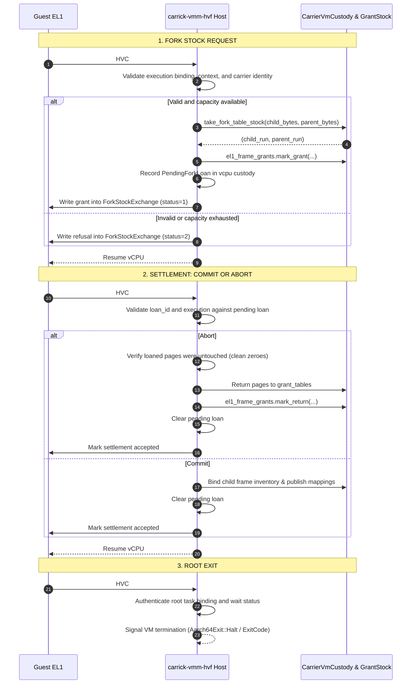

# Design: AArch64 EL1 Page-Table Stock and Root-Exit Crossing

**Rulebook Authority:** [`AGENTS.md`](../../AGENTS.md)  
**Host Facility Boundary:** [`docs/host-facility-boundary.md`](../host-facility-boundary.md)  
**Adoption Plan:** [`docs/design/arm-shared-process-owner-adoption.md`](arm-shared-process-owner-adoption.md) ("Step 3" and Section 2 Hook 2)  
**Base Branch:** `origin/work/shared-process-owner` (PR #121)  
**Target:** Shared in-kernel process owner adoption for AArch64 EL1  

---

## 1. Executive Summary

On x86, the shared in-kernel process owner borrows physical page-table pages from the hypervisor carrier via a typed fork-stock exchange over I/O port `X86_FORK_STOCK_PORT` (`0xd2`) and signals container termination over `X86_NATIVE_ROOT_EXIT_PORT` (`0xd3`). The calling vCPU stops synchronously during the port exit; the host inspects an exclusive stack-allocated record, services or refuses the loan, and resumes the guest without any asynchronous queueing or host-side semantic process orchestration.

On AArch64, N1 previously implemented a hybrid model where forks were orchestrated on the host (`prepare_owner_fork_builder`), injecting synthetic ESR codes (`MM_PORTAL_FORK_ESR`, `MM_PORTAL_FORK_FINISH_ESR`) into EL1 and attempting multi-phase state transitions over `PortalForkSlot`. Per Section 4.1 of [`arm-shared-process-owner-adoption.md`](arm-shared-process-owner-adoption.md), this host-side orchestration and synthetic ESR injection is obsolete and being retired.

This document specifies:
1. **The Crossing Mechanism:** Reusing the existing physical grant hypercall `HVC #6` (`AARCH64_HVC_METADATA_GRANT_IMM`) to carry both fork-stock exchange and root-exit notification, avoiding new HVC numbers or architectural syndrome proliferation.
2. **The Exact ABI Record Layout:** Hoisting `X86ForkStockExchange`, `X86ForkStockSettlement`, and `X86NativeRootExit` into unified, ISA-neutral `ForkStockExchange`, `ForkStockSettlement`, and `NativeRootExit` records in `carrick-el1-abi`, strictly preserving 100% byte-identity with x86.
3. **HVF Host Handling:** How `carrick-vmm-hvf` services loan and settlement requests using existing frame authorities (`grant_tables: Vec<RootGpa>`, `El1FrameGrantLedger`, and stage-2 mapping infrastructure), tracking custody and exactly-once rollback.
4. **Fail-Closed Semantics:** Exact conditions under which requests and settlements are refused or trigger fail-loud invariants.

---

## 2. Crossing Mechanism: Reusing `HVC #6` (`AARCH64_HVC_METADATA_GRANT_IMM`)

### 2.1 Audit of Existing ARM Traps and Crossings

The Carrick AArch64 trap architecture in [`crates/carrick-hal/src/aarch64.rs`](../../crates/carrick-hal/src/aarch64.rs) defines the following hypervisor call immediate values:

| Immediate | Constant / Helper | Purpose |
|---|---|---|
| `hvc #1` | `is_aarch64_hvc_maintenance` | Stage-1 TLB maintenance completion trampoline |
| `hvc #2` | `is_aarch64_syscall_exception` | Syscall forwarding to host carrier (or `svc #0`) |
| `hvc #3` | `AARCH64_HVC_FAULT_IMM` / `is_aarch64_hvc_fault` | Unexpected current-EL synchronous exception (fail-loud) |
| `hvc #4` | `AARCH64_HVC_KICK_IMM` / `is_aarch64_hvc_kick` | Lower-EL IRQ kick boundary trap |
| `hvc #5` | `AARCH64_HVC_IDLE_IMM` / `is_aarch64_hvc_idle` | In-guest scheduler idle exit (vCPU parked) |
| `hvc #6` | `AARCH64_HVC_METADATA_GRANT_IMM` / `is_aarch64_hvc_metadata_grant` | In-guest EL1 physical metadata extent grant / return |

Additionally, N1 had synthetic ESR codes (`MM_PORTAL_FORK_ESR`, `MM_PORTAL_BIND_ESR`, etc.) that were injected by the host into guest EL1. These are host-to-guest entries, not guest-to-host crossings, and are being deleted in Step 6.

### 2.2 Why Reuse `HVC #6` Instead of Adding New HVC Numbers

1. **Avoid Architectural Syndrome Proliferation:** In Carrick's HAL, `is_aarch64_syscall_exception` considers any HVC other than `#1`, `#3`, `#4`, `#5`, and `#6` to be an EL0/EL1 syscall forward (`hvc #2`). Adding new HVC numbers (e.g. `hvc #7` or `0xC200_0001`) would require modifying `carrick-hal`, updating exception classification in all backends, and altering the core trap dispatch loop in `carrick-vmm-hvf/src/trap.rs`.
2. **Unified Physical Grant Substrate:** `HVC #6` is already established as the synchronous physical facility crossing between guest EL1 and the host carrier. Dynamic metadata extent allocation and page-table stock loans are both physical memory grant operations from the host carrier to EL1.
3. **Clean Stopped-CPU Dispatch:** When EL1 executes `HVC #6`, the calling vCPU stops synchronously with its execution context preserved. The host inspects registers `X0..X3`, performs the requested operation, writes return values to registers or guest memory, and resumes the vCPU.

### 2.3 Operation Multiplexing on `HVC #6`

`HVC #6` multiplexes operations via register `X0`:

```rust
// Existing metadata extent grant operations in carrick-el1-abi:
pub const METADATA_GRANT_OP_ALLOC: u64 = 1;
pub const METADATA_GRANT_OP_FREE: u64 = 2;

// Shared physical stock & exit operations:
pub const GRANT_OP_FORK_STOCK: u64 = 3;
pub const GRANT_OP_ROOT_EXIT: u64 = 4;
```

- **`GRANT_OP_FORK_STOCK` (Opcode 3):**
  - Input: `X0 = GRANT_OP_FORK_STOCK`, `X1 = record_gpa` (guest-physical address of the 64-byte aligned `ForkStockExchange` or `ForkStockSettlement` allocated on the calling vCPU's EL1 kernel stack).
  - Output: `X0 = status` (0 on success, non-zero on failure). Record fields are updated in guest memory by the host.
- **`GRANT_OP_ROOT_EXIT` (Opcode 4):**
  - Input: `X0 = GRANT_OP_ROOT_EXIT`, `X1 = record_gpa` (guest-physical address of `NativeRootExit`).
  - Output: Terminates VM execution; does not resume guest userspace.

---

## 3. Shared ABI Record Layout (`carrick-el1-abi`)

The record structures in `crates/carrick-el1-abi/src/fork_stock.rs` are strictly ISA-neutral definitions shared between x86 and AArch64 with zero compatibility shims or aliases:
- `ForkStockKind`
- `ForkStockRequest`
- `ForkLifecycleLoan`
- `ForkStockLoan`
- `ForkStockRefusal`
- `ForkStockExchange`
- `ForkStockSettlement`
- `NativeRootExit`

All x86 call sites (`carrick-x86-cpl0`, `carrick-vmm-kvm`, `carrick-el1`) directly use these neutral types. Wire compatibility with the pre-change x86 layout is proven via compile-time const assertions (`offset_of!`, sizes, and alignments) and exhaustive byte-level wire layout tests against numeric constants.

### 3.1 `ForkStockExchange` Layout (192 bytes, 64-byte aligned)

```rust
#[repr(C, align(64))]
pub struct ForkStockExchange {
    tag: u64,           // Offset 0:  CRFKLOAN (0x4352_464b_4c4f_414e)
    request: [u64; 15], // Offset 8:  15 request words
    response: [u64; 6], // Offset 128: 6 response words
    status: u64,        // Offset 176: 0=init, 1=granted, 2=refused, 3=taken
    _reserved: u64,     // Offset 184: padding, must be 0
}
```

#### Request Words (15 words):
1. `binding.task: u64`
2. `binding.generation: u64`
3. `binding.mm: u64`
4. `binding.thread_generation: u64`
5. `context.mm: u64`
6. `context.root: u64` (GPA of CR3 on x86, TTBR0_EL1 on AArch64)
7. `context.generation: u64`
8. `operation.carrier: u64`
9. `operation.mm: u64`
10. `operation.incarnation: u64`
11. `operation.sequence: u64`
12. `parent_generation: u64`
13. `child_mm: u64`
14. `child_bytes: u64` (multiple of 4096)
15. `parent_bytes: u64` (multiple of 4096)

#### Response Words (6 words):
1. `child_base: u64` (GPA of child page table run)
2. `parent_base: u64` (GPA of parent page table run)
3. `kernel_control_ipa: u64`
4. `loan_id: u64` (NonZeroU64 loan token)
5. `lifecycle_page: u64` (KernelVa of ThreadLifecyclePage)
6. `lifecycle_controls: u64` (KernelVa of ThreadControlSlot array)

### 3.2 `ForkStockSettlement` Layout (128 bytes, 64-byte aligned)

```rust
#[repr(C, align(64))]
pub struct ForkStockSettlement {
    words: [u64; 16],
}
```

- **Commit Tag (`0x4352_464b_434f_4d4d`):**
  - Word 0: `CRFKCOMM`
  - Word 1: `loan_id`
  - Word 2: `child_incarnation`
  - Word 3: `parent_generation`
  - Word 4: `child_tables_used`
  - Word 5: `parent_tables_used`
  - Word 6: `custody_kernel_va`
  - Word 7: `custody_count`
  - Word 8: `status` (0=init, 1=accepted, 2=refused, 3=taken)
  - Word 9: `refusal_code`
  - Words 10..15: 0
- **Abort Tag (`0x4352_464b_4142_4f52`):**
  - Word 0: `CRFKABOR`
  - Word 1: `loan_id`
  - Words 2..7: 0
  - Word 8: `status` (1=accepted, 2=refused, 3=taken)
  - Words 9..15: 0

### 3.3 `NativeRootExit` Layout (64 bytes, 64-byte aligned)

```rust
#[repr(C, align(64))]
pub struct NativeRootExit {
    words: [u64; 8],
}
```
- Word 0: `CRROOTEX` (`0x4352_524f_4f54_4558`)
- Word 1: `binding.task`
- Word 2: `binding.generation`
- Word 3: `binding.mm`
- Word 4: `binding.thread_generation`
- Word 5: `status` (Linux wait status encoding: `code << 8`)
- Words 6..7: 0

---

## 4. HVF Host Handling & Existing Frame Authorities

### 4.1 Frame Authority, Table Stock, and Dispatcher Wiring

In `carrick-vmm-hvf`, physical frame custody is rooted in `CarrierVmCustody`:
1. **`grant_tables: Vec<RootGpa>`:** The carrier maintains a bounded stock of pre-mapped, stage-2 intermediate physical pages (`RootGpa`) reserved for EL1 page-table allocations.
2. **`take_fork_table_stock`:** A deterministic allocator searches `grant_tables` for contiguous runs of 4 KiB frames matching `child_bytes` and `parent_bytes`.
3. **`El1FrameGrantLedger` (`custody.el1_frame_grants`):** The existing ledger records physical grant extents via `mark_grant(base, length, mm)` and returns via `mark_return(base, length, mm, release_ipa)`.
4. **Dispatcher Wiring (`service_metadata_operation`):** `GRANT_OP_FORK_STOCK` (3) and `GRANT_OP_ROOT_EXIT` (4) are directly wired into `service_metadata_operation` in `crates/carrick-vmm-hvf/src/metadata_grant.rs`, where `GRANT_OP_ALLOC` (1) and `GRANT_OP_FREE` (2) are handled. `handle_metadata_grant_trap` passes `X0` (op) and `X1..X3` (args) directly to `service_metadata_operation`.
5. **Active Execution Authentication:** `ForkStockHostCustody` tracks admitted vCPU execution context (`active_executions`) via `set_active_execution`. Requests missing active execution or presenting mismatched bindings fail closed (`ForkStockRefusal::Stale` / `METADATA_GRANT_ERR_DENIED`) leaving `El1FrameGrantLedger` unmodified.

### 4.2 Handling Flow on the Host



---

## 5. Fail-Closed Principles

1. **Stale or Foreign Execution:** If `request.binding != execution.binding`, `request.context != execution.context`, or `request.operation.carrier != vm_carrier`, the host marks `ForkStockRefusal::Stale`. Pages are never loaned across execution or MM boundaries.
2. **Malformed Request Geometry:** If `child_bytes` or `parent_bytes` are zero, not multiples of 4096, overflow, or if `child_mm == parent_mm`, the host marks `ForkStockRefusal::Invalid`.
3. **Capacity Exhaustion:** If `grant_tables` cannot supply contiguous runs, or a prior loan on this vCPU remains uncompleted, the host marks `ForkStockRefusal::Capacity`.
4. **Exposed Pages on Abort:** If the guest requests `Abort` on a loan but any page in the loaned runs contains non-zero bytes, the settlement is refused (`ExposedDirtyTable`; on KVM the carrier stops) and nothing re-enters the clean page pool. Guests zero their stored child tables and lifecycle record after rollback before aborting.
5. **Exactly-Once Settlement:** Once an exchange or settlement is consumed via `take()`, its status transitions to `Taken` (3); subsequent calls return `None`. Pending loan state on the host is cleared atomically.
6. **Root Exit Verification:** The host authenticates that the exiting task is the admitted root container task and that the wait status is a valid Linux encoding; foreign or corrupt exit requests fail closed.

---

## 6. Shared Child Retirement (both ISAs) and Current Limits

The stock, loan, settlement and child quarantine state machine is one
ISA-neutral type, `carrick_hal::fork_stock::ForkStock`; HVF and KVM supply
only mechanics (address tags, grant ledger, physical page access).

- **Retire record.** A fork child's final exit sends `NativeChildRetire`
  (8 words; word 7 is the carrier's typed reply: pending, quarantined,
  refused-stale, refused-invalid, consumed). AArch64 uses `HVC #6` with
  `GRANT_OP_CHILD_RETIRE` (x0 agrees with the reply); x86 uses port
  `NATIVE_CHILD_RETIRE_PORT` (0xd5). A refusal fails only that process's
  stock return: the stock stays charged and is never reissued.
- **Quarantine.** Retired stock is reclaimed on a later fork-stock loan only
  when the MM is not the servicing CPU's MM and the zone occupancy authority
  mints a `SlotAbsence` proof (no slot installs it). Guests leave the root for
  the carrier maintenance root before publishing absence. The proof is what
  retires the child's address tag (AArch64 ASID). Carrier per-MM state (frame
  inventory rows, COW residency, on KVM the CR3 registration, aliases and
  child-private memslots) is released before any of the stock is reissued.
- **Lifecycle hygiene.** An issued lifecycle record must be all zero; a
  returned record is cleared. A dirty record at loan time is withdrawn for
  good and the fork is refused (`Inventory`, lowered to `EAGAIN`).
- **Live-children limit.** Each live fork child holds one lifecycle record
  until it is reclaimed. AArch64 has 31 records (one 512 KiB metadata extent,
  16 KiB per record, first slot unused). x86 CPL0 has **8 records** at
  metadata offset `0x88000`. A fork beyond the limit while children are
  alive is refused with a counted `Capacity` refusal (`EAGAIN`), never a
  hang; this divergence from Linux is the conformance contract
  `kernel.fork.live-children-limit`. Eight covers sequential fork/wait loops and small pipelines; it
  should grow (the mapped x86 metadata window has room for about 30 records
  above the reservations table) once a workload is measured to need it.
- **Not yet verified on KVM.** The x86 path type-checks for
  `x86_64-unknown-linux-gnu` and its shared logic is exercised by VM-free
  tests, but it has not run under KVM.
