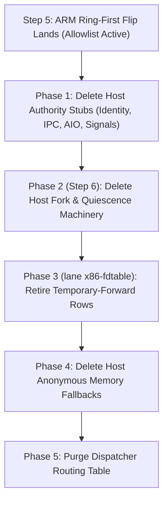

# Design: Flip ARM EL1 to Ring-First with a Forward Allowlist

- **Status:** Implemented; review verification pending
- **Owner decision date:** 2026-10-08 (Revised per Director Review 2026-10-08)
- **Author:** Carrick Architecture & Conformance Team
- **Target branch:** `docs/arm-ring-first-flip`
- **Related PRs:** ARM adoption steps 1-4 landed (PRs 124, 125, 126, 129); Step 5 wiring in progress.
- **Companion data:** [`docs/design/arm-ring-first-flip.tsv`](arm-ring-first-flip.tsv) (338-syscall machine-readable census)

---

## Executive Summary & Owner Decision

On 2026-10-08, the owner decided that ARM EL1 moves to the **x86 CPL0 model** immediately following Step 5:
1. **EL1 is the authority:** EL1 serves every syscall the shared kernel implements in-ring. Any syscall the shared kernel already implements on x86 CPL0 becomes `Wire-in-ring` on ARM (enabling the existing shared handler), rather than falling back or returning `-ENOSYS`.
2. **Strict permanent forward allowlist:** Only genuine host facility crossings (host file contents/metadata, host network, CLI terminal entropy, host clock) permanently reach the host carrier per [`docs/host-facility-boundary.md`](../host-facility-boundary.md).
3. **Temporary-forward debt tracking:** Compat-zone objects (guest pipes, fd tables, epoll, synthetic timer/signal/event descriptors) are tracked as `Temporary-forward` until the shared fd table lands (`lane x86-fdtable`), rather than permanent allowlist entries.
4. **Counted `-ENOSYS` on the fast path (The Real Regression):** Exactly 134 unhandled syscalls return `-ENOSYS` directly from EL1 without triggering a VM exit, accounted in aperture counters (`Counters.refused`). This is the real, bounded regression accepted by the owner.
5. **Ordered deletion of host paths:** Dead host emulation paths in `carrick-kernel` and `carrick-vmm-hvf` (including Step 6's N1 host fork code) are removed as their ring versions land; the landing of `lane x86-fdtable` subsequently retires the temporary forward rows.
6. **Opt-out switch:** An exact `=0` hatch (`CARRICK_ARM_RING_FIRST=0`) is provided, defaulting to **ON (`1`)**.

---

## Implementation ruling (2026-10-09)

The host crossing set also includes `exit` and `exit_group`, matching x86.
They forward only when the native owner declines; serving them in-ring takes
precedence over crossing evaluation. The live ARM entry on this branch does
not yet bind Step 5 process custody, and thread exit deliberately declines
home and last-thread exits. Refusing those terminal notifications prevents
carrier completion. The revised set has 124 entries: the 122 permanent and temporary rows
plus two declined terminal notifications. The census below
still describes the primary family assignments, not fallback eligibility.

Aperture control follows `ServiceCopyTable` in the shared region, with checked
alignment and an end below the MM portal. Its geometry participates in the
image ABI hash. The initial proposed `0x1B_0000` control location aliases the
service-copy L3 table and must never be used for control storage.

Contract: `kernel.el1.arm-ring-first-crossing`. Its VM-free terminal-route
witness is red before the crossing correction; its layout witness is red at
the aliased offset. The raw fixture bounds descriptor readiness to five seconds. The dynamic
glibc fixture separately exercises ld.so file-backed mmap and fork/wait, with
a five-second SIGCHLD descriptor wait followed by one WNOHANG reap.

## Independent-review corrections (2026-10-09)

ARM applies the allowlist to genuinely unported calls, including when work
is pending. x86 applies its eight-crossing set to every forwarding completion. Typed family
fallbacks (including file-backed/shared/stack memory, permission/retirement
refusals, inotify contention and unsupported futex operations) retain their
current carrier authority. An effect-free ARM Forward with owed host work leaves through `WithWork`,
using the entry-saved original argument. Refused unported calls publish owed
work as Completed with counted ENOSYS. Handback and AccountedForward retain
Forward transport; x86 keeps Forward because its WORK_PORT does not replay.
Signal return is a completion transport subject to the x86 crossing set. ARM clone/fork/wait and terminal
calls retain carrier fallback until Step 5 owns them in-ring.

The production frame chooses its ISA set. x86 is strict and never invokes the
ARM aperture reader. Fixed ARM access exists only for bare-metal AArch64 and
requires mapping custody; the unsafe host accessor checks bounds, alignment
and overflow. A zero control word is strict, with an explicit opt-out bit.
The resolved typed policy persists in `ContainerState::config` across restart;
the public rootfs dispatcher debug entry requires its typed policy.

`crossing.rs` has one classified declaration generating the identity enum and
constant-time dense lookup. Both sets are checked exhaustively from 0 through
512 against the TSV and the x86 eight-entry oracle. Refusals use captured
native numbers, typed Linux errno and syscall results. ENOSYS and exit_group
have one shared syscall-ABI source.

The TSV and classified table are authoritative for the revised assignments:
tee/vmsplice/splice, socketpair, pselect6/ppoll and anonymous-memory
madvise/mincore/mlock operations are temporary guest-authority debt. execveat,
readahead and fadvise64 are permanent host-file crossings. rt_sigreturn is a
temporary completion transport and must never become counted ENOSYS.
Earlier family narratives below describe the original proposed cut; use the
revised census, table and typed routing for implementation eligibility.

## 1. Today's ARM Routing Table & Census

### 1.1 Methodology & Codebase Citations
*(Methodology: READ; Mapping Analysis: READ)*

Every Linux AArch64 syscall number (0 to 449 in the asm-generic ABI, totaling 338 recognized syscalls) was audited against current source code:
- **EL1 Personality Dispatch:** [`crates/carrick-personality-linux/src/dispatch.rs:372`](file:///Volumes/CaseSensitive/carrick/.worktrees/arm-flip/crates/carrick-personality-linux/src/dispatch.rs#L372) (`route_aarch64`).
- **EL1 Completion & Forwarding:** [`crates/carrick-personality-linux/src/dispatch.rs:507`](file:///Volumes/CaseSensitive/carrick/.worktrees/arm-flip/crates/carrick-personality-linux/src/dispatch.rs#L507) (`finish` records forwarded ordinals via `pending.record_forwarded(ordinal)`).
- **Carrier Trap Loop & Dispatch:** [`crates/carrick-vmm-hvf/src/trap.rs:434`](file:///Volumes/CaseSensitive/carrick/.worktrees/arm-flip/crates/carrick-vmm-hvf/src/trap.rs#L434), [`crates/carrick-vmm-hvf/src/vcpu_loop/mod.rs:388`](file:///Volumes/CaseSensitive/carrick/.worktrees/arm-flip/crates/carrick-vmm-hvf/src/vcpu_loop/mod.rs#L388).
- **Host SyscallDispatcher:** [`crates/carrick-kernel/src/dispatch/mod.rs:260`](file:///Volumes/CaseSensitive/carrick/.worktrees/arm-flip/crates/carrick-kernel/src/dispatch/mod.rs#L260) (`dispatch`), [`crates/carrick-kernel/src/dispatch/routing.rs:38`](file:///Volumes/CaseSensitive/carrick/.worktrees/arm-flip/crates/carrick-kernel/src/dispatch/routing.rs#L38) (`route_syscall` macro matching `SyscallNr::*`).
- **Host Subsystem Handlers:**
  - Filesystem: [`crates/carrick-kernel/src/dispatch/fs.rs`](file:///Volumes/CaseSensitive/carrick/.worktrees/arm-flip/crates/carrick-kernel/src/dispatch/fs.rs) (`fs::*`)
  - Memory: [`crates/carrick-kernel/src/dispatch/mem.rs`](file:///Volumes/CaseSensitive/carrick/.worktrees/arm-flip/crates/carrick-kernel/src/dispatch/mem.rs) (`mem::*`)
  - Process: [`crates/carrick-kernel/src/dispatch/proc.rs`](file:///Volumes/CaseSensitive/carrick/.worktrees/arm-flip/crates/carrick-kernel/src/dispatch/proc.rs) (`proc::*`)
  - Signals: [`crates/carrick-kernel/src/dispatch/signal.rs`](file:///Volumes/CaseSensitive/carrick/.worktrees/arm-flip/crates/carrick-kernel/src/dispatch/signal.rs) (`signal::*`)
  - Networking: [`crates/carrick-kernel/src/dispatch/net.rs`](file:///Volumes/CaseSensitive/carrick/.worktrees/arm-flip/crates/carrick-kernel/src/dispatch/net.rs) (`net::*`)
  - Synchronization: [`crates/carrick-kernel/src/dispatch/sync.rs`](file:///Volumes/CaseSensitive/carrick/.worktrees/arm-flip/crates/carrick-kernel/src/dispatch/sync.rs) (`sync::*`)
  - Time & Clocks: [`crates/carrick-kernel/src/dispatch/time.rs`](file:///Volumes/CaseSensitive/carrick/.worktrees/arm-flip/crates/carrick-kernel/src/dispatch/time.rs) (`time::*`)
  - System: [`crates/carrick-kernel/src/dispatch/sys.rs`](file:///Volumes/CaseSensitive/carrick/.worktrees/arm-flip/crates/carrick-kernel/src/dispatch/sys.rs) (`sys::*`)
  - Identity / Credentials: [`crates/carrick-kernel/src/dispatch/identity.rs`](file:///Volumes/CaseSensitive/carrick/.worktrees/arm-flip/crates/carrick-kernel/src/dispatch/identity.rs) (`identity::*`)
  - IPC: [`crates/carrick-kernel/src/dispatch/ipc.rs`](file:///Volumes/CaseSensitive/carrick/.worktrees/arm-flip/crates/carrick-kernel/src/dispatch/ipc.rs) (`ipc::*`)
- **Metadata & Deferred Support:** [`crates/carrick-abi/src/syscall.rs:188`](file:///Volumes/CaseSensitive/carrick/.worktrees/arm-flip/crates/carrick-abi/src/syscall.rs#L188) (`SupportLevel::BringUp`).

### 1.2 Quantitative Census Summary

The 338 recognized Linux AArch64 syscalls break down into 5 mutually exclusive, exhaustive categories:

| Routing Category | Count | Proportion | Semantic Definition |
|:---|:---:|:---:|:---|
| **`Wire-in-ring`** | **17** | 5.0% | Sycalls already implemented in-ring in the shared kernel (served on x86 CPL0 today). Enabled on ARM EL1 by wiring existing shared handlers. |
| **`Forward-Allowlist`** | **92** | 27.2% | Permanent forward allowlist: genuine host crossings only (host file content/metadata, host network, clock, hardware entropy, descriptor polling). |
| **`Temporary-forward`** | **30** | 8.9% | Guest fd/IPC, descriptor polling, anonymous-memory authority and signal-return transport. Forwarded as debt until each in-ring owner lands. |
| **`Counted-ENOSYS`** | **134** | 39.6% | **The Real Regression:** Guest authority syscalls not yet implemented in-ring, answered with `-ENOSYS` at EL1 fast path and accounted in `Counters.refused`. |
| **`Unclaimed-ENOSYS`** | **65** | 19.2% | Baseline unrouted syscalls (`SupportLevel::BringUp`); return `-ENOSYS`. |
| **Total** | **338** | 100.0% | Complete Linux 6.x asm-generic table. |

#### Verification Command & Exact Output
The census counts are verified mechanically against [`docs/design/arm-ring-first-flip.tsv`](arm-ring-first-flip.tsv) using Python:
```bash
python3 -c '
import csv, collections
with open("docs/design/arm-ring-first-flip.tsv") as f:
    rows = list(csv.DictReader(f, delimiter="\t"))
counts = collections.Counter(r["flip_routing"] for r in rows)
for k, v in sorted(counts.items()):
    print(f"{k:20s}: {v}")
print(f"Total               : {len(rows)}")
'
```
Verification Output:
```
Counted-ENOSYS      : 134
Forward-Allowlist   : 92
Temporary-forward   : 30
Unclaimed-ENOSYS    : 65
Wire-in-ring        : 17
Total               : 338
```

---

## 2. The x86 Mechanism to Reuse

### 2.1 How x86 CPL0 Implements the Forward Allowlist
*(Evidence: READ)*

In x86 CPL0, the boundary is strictly enforced at native entry completion:
- **Allowlist Definition:** [`crates/carrick-x86-cpl0/src/entry.rs:441`](file:///Volumes/CaseSensitive/carrick/.worktrees/arm-flip/crates/carrick-x86-cpl0/src/entry.rs#L441):
  ```rust
  #[repr(u64)]
  pub enum AllowedHostCrossing {
      Read = 0,
      Write = 1,
      Lseek = 8,
      Pread64 = 17,
      Pwrite64 = 18,
      Exit = 60,
      ExitGroup = 231,
      EpollPwait = 281,
  }
  ```
- **Filter and Ring Exit Gate:** [`crates/carrick-x86-cpl0/src/entry.rs:1995-2002`](file:///Volumes/CaseSensitive/carrick/.worktrees/arm-flip/crates/carrick-x86-cpl0/src/entry.rs#L1995-L2002):
  ```rust
  CompletionRoute::Forward => {
      if AllowedHostCrossing::from_native(call.native.raw()).is_some() {
          doorbell(FORWARD_PORT, frame);
      } else {
          record_refusal(counters, frame, Some(call.native.raw()));
      }
  }
  ```
- **Fast-Path Refusal & Accounting:** [`crates/carrick-x86-cpl0/src/entry.rs:468-488`](file:///Volumes/CaseSensitive/carrick/.worktrees/arm-flip/crates/carrick-x86-cpl0/src/entry.rs#L468-L488):
  ```rust
  fn record_refusal(counters: &Counters, frame: &mut NativeFrame, native: Option<u64>) {
      frame.rax = (-38_i64) as u64; // -ENOSYS
      let bucket = match native {
          Some(nr) if nr < 512 => { ... nr as usize ... }
          _ => 512,
      };
      counters.refused[bucket].fetch_add(1, Ordering::Relaxed);
  }
  ```
- **Shared Aperture Counters:** [`crates/carrick-el1-abi/src/lib.rs:1979-2002`](file:///Volumes/CaseSensitive/carrick/.worktrees/arm-flip/crates/carrick-el1-abi/src/lib.rs#L1979-L2002):
  ```rust
  pub struct Counters {
      pub served: [AtomicU64; 512],
      pub forwarded: [AtomicU64; 512],
      ...
      pub refused: [AtomicU64; 513], // 0..511 for native ordinals, 512 for overflow/unmapped
  }
  ```

### 2.2 What the Shared Kernel Already Serves In-Ring (`shared_inring_x86`)
*(Evidence: READ & INFERENCE)*

The shared kernel in `carrick-personality-linux` and `carrick-el1` already implements 17 syscalls in-ring for x86 CPL0. In the TSV appendix, these are recorded with `shared_inring_x86 = Yes`:

| Nr | Name | Subsystem | x86 CPL0 In-Ring Evidence & Seam |
|:---:|:---|:---|:---|
| **27** | `inotify_add_watch` | fs | Inotify watch registration in `carrick_el1::personality::inotify` ([`dispatch.rs:384`](file:///Volumes/CaseSensitive/carrick/.worktrees/arm-flip/crates/carrick-personality-linux/src/dispatch.rs#L384)). |
| **28** | `inotify_rm_watch` | fs | Inotify watch removal in `carrick_el1::personality::inotify` ([`dispatch.rs:385`](file:///Volumes/CaseSensitive/carrick/.worktrees/arm-flip/crates/carrick-personality-linux/src/dispatch.rs#L385)). |
| **93** | `exit` | process | Thread exit in `carrick_personality_linux::lifecycle` ([`lifecycle.rs:31`](file:///Volumes/CaseSensitive/carrick/.worktrees/arm-flip/crates/carrick-personality-linux/src/lifecycle.rs#L31), [`dispatch.rs:387`](file:///Volumes/CaseSensitive/carrick/.worktrees/arm-flip/crates/carrick-personality-linux/src/dispatch.rs#L387)). |
| **94** | `exit_group` | process | Process termination in `carrick_x86_cpl0::native_process::Service` ([`lifecycle.rs:323`](file:///Volumes/CaseSensitive/carrick/.worktrees/arm-flip/crates/carrick-personality-linux/src/lifecycle.rs#L323), [`dispatch.rs:395`](file:///Volumes/CaseSensitive/carrick/.worktrees/arm-flip/crates/carrick-personality-linux/src/dispatch.rs#L395)). |
| **98** | `futex` | sched | Kernel wait/wake synchronization in `carrick_sched_core::futex` ([`dispatch.rs:386`](file:///Volumes/CaseSensitive/carrick/.worktrees/arm-flip/crates/carrick-personality-linux/src/dispatch.rs#L386)). |
| **99** | `set_robust_list` | process | Robust futex list registration in `carrick_personality_linux::thread` ([`thread.rs:137`](file:///Volumes/CaseSensitive/carrick/.worktrees/arm-flip/crates/carrick-personality-linux/src/thread.rs#L137), [`dispatch.rs:390`](file:///Volumes/CaseSensitive/carrick/.worktrees/arm-flip/crates/carrick-personality-linux/src/dispatch.rs#L390)). |
| **132** | `sigaltstack` | signal | Signal stack setup in `carrick_personality_linux::lifecycle` ([`lifecycle.rs:341`](file:///Volumes/CaseSensitive/carrick/.worktrees/arm-flip/crates/carrick-personality-linux/src/lifecycle.rs#L341), [`dispatch.rs:388`](file:///Volumes/CaseSensitive/carrick/.worktrees/arm-flip/crates/carrick-personality-linux/src/dispatch.rs#L388)). |
| **135** | `rt_sigprocmask` | signal | Signal mask mutation in `carrick_personality_linux::lifecycle` ([`lifecycle.rs:361`](file:///Volumes/CaseSensitive/carrick/.worktrees/arm-flip/crates/carrick-personality-linux/src/lifecycle.rs#L361), [`dispatch.rs:389`](file:///Volumes/CaseSensitive/carrick/.worktrees/arm-flip/crates/carrick-personality-linux/src/dispatch.rs#L389)). |
| **172** | `getpid` | process | PID query in `carrick_personality_linux::lifecycle` ([`lifecycle.rs:347`](file:///Volumes/CaseSensitive/carrick/.worktrees/arm-flip/crates/carrick-personality-linux/src/lifecycle.rs#L347), [`dispatch.rs:392`](file:///Volumes/CaseSensitive/carrick/.worktrees/arm-flip/crates/carrick-personality-linux/src/dispatch.rs#L392)). |
| **178** | `gettid` | process | TID query in `carrick_personality_linux::lifecycle` ([`lifecycle.rs:333`](file:///Volumes/CaseSensitive/carrick/.worktrees/arm-flip/crates/carrick-personality-linux/src/lifecycle.rs#L333), [`dispatch.rs:391`](file:///Volumes/CaseSensitive/carrick/.worktrees/arm-flip/crates/carrick-personality-linux/src/dispatch.rs#L391)). |
| **214** | `brk` | mm | Program break in `carrick_x86_cpl0::anonymous::X86AnonymousVenue` ([`anonymous.rs:11`](file:///Volumes/CaseSensitive/carrick/.worktrees/arm-flip/crates/carrick-x86-cpl0/src/anonymous.rs#L11), [`dispatch.rs:374`](file:///Volumes/CaseSensitive/carrick/.worktrees/arm-flip/crates/carrick-personality-linux/src/dispatch.rs#L374)). |
| **215** | `munmap` | mm | Address unmapping in `carrick_x86_cpl0::anonymous::X86AnonymousVenue` ([`dispatch.rs:375`](file:///Volumes/CaseSensitive/carrick/.worktrees/arm-flip/crates/carrick-personality-linux/src/dispatch.rs#L375)). |
| **216** | `mremap` | mm | Address remapping in `carrick_x86_cpl0::anonymous::X86AnonymousVenue` ([`dispatch.rs:376`](file:///Volumes/CaseSensitive/carrick/.worktrees/arm-flip/crates/carrick-personality-linux/src/dispatch.rs#L376)). |
| **220** | `clone` | process | Process/thread cloning in `carrick_x86_cpl0::native_process::Service` ([`lifecycle.rs:300`](file:///Volumes/CaseSensitive/carrick/.worktrees/arm-flip/crates/carrick-personality-linux/src/lifecycle.rs#L300), [`dispatch.rs:393`](file:///Volumes/CaseSensitive/carrick/.worktrees/arm-flip/crates/carrick-personality-linux/src/dispatch.rs#L393)). |
| **222** | `mmap` | mm | Anonymous mapping in `carrick_x86_cpl0::anonymous::X86AnonymousVenue` ([`dispatch.rs:377`](file:///Volumes/CaseSensitive/carrick/.worktrees/arm-flip/crates/carrick-personality-linux/src/dispatch.rs#L377)). |
| **226** | `mprotect` | mm | Memory protection in `carrick_x86_cpl0::anonymous::X86AnonymousVenue` ([`dispatch.rs:378`](file:///Volumes/CaseSensitive/carrick/.worktrees/arm-flip/crates/carrick-personality-linux/src/dispatch.rs#L378)). |
| **260** | `wait4` | process | Child waiting in `carrick_x86_cpl0::native_process::Service` ([`lifecycle.rs:315`](file:///Volumes/CaseSensitive/carrick/.worktrees/arm-flip/crates/carrick-personality-linux/src/lifecycle.rs#L315), [`dispatch.rs:394`](file:///Volumes/CaseSensitive/carrick/.worktrees/arm-flip/crates/carrick-personality-linux/src/dispatch.rs#L394)). |

Six additional syscalls have `shared_inring_x86 = Partial`:
- `read` (63), `write` (64), `lseek` (62), `pread64` (67), `pwrite64` (68): served in-ring for delegated files / IPC ([`file.rs`](file:///Volumes/CaseSensitive/carrick/.worktrees/arm-flip/crates/carrick-el1/src/personality/file.rs)), but forward to host for non-delegated host files ([`x86 entry.rs:441`](file:///Volumes/CaseSensitive/carrick/.worktrees/arm-flip/crates/carrick-x86-cpl0/src/entry.rs#L441)).
- `epoll_pwait` (22): served in-ring when IPC transfers are available, but forwards to host when host descriptors or pending host work exist.

On ARM, these 17 syscalls will NOT be refused with `-ENOSYS`. They are marked **`Wire-in-ring`**, binding ARM EL1 directly to the existing shared handlers (enabled via Step 5 wiring of `Aarch64Process` in [`crates/carrick-el1/src/personality/aarch64_process.rs`](file:///Volumes/CaseSensitive/carrick/.worktrees/arm-flip/crates/carrick-el1/src/personality/aarch64_process.rs)).

---

## 3. The Proposed ARM Forward Allowlist & Debt Tracking

### 3.1 Allowlist Principles per `docs/host-facility-boundary.md`
*(Evidence: READ)*

Under Carrick's architecture, host crossings are strictly permitted only for resources where the host OS is genuinely the physical authority:
1. **Host File I/O:** Guest operations on files located within host-backed directories or cap-std sandboxes.
2. **Host Network:** Guest network sockets bridging to host BSD sockets, loopback, or network devices.
3. **Host Terminal / PTY:** Interactive stdin/stdout/stderr supervisor relay and hardware entropy.
4. **Host Clock:** Monotonic and realtime wall clock time queries.

All other Linux subsystems—process management, task hierarchy, credentials, credentials mapping, namespaces, anonymous memory, futexes, signals state, and IPC—belong strictly to the guest kernel authority.

### 3.2 Permanent Forward Allowlist (100 syscalls)

The 100 syscalls permitted to cross the host boundary permanently are:

#### 1. Host File Contents & Filesystem Metadata (73 syscalls)
- **Basic & Positioned I/O:** `read` (63), `write` (64), `lseek` (62), `pread64` (67), `pwrite64` (68), `readv` (65), `writev` (66), `preadv` (69), `pwritev` (70), `preadv2` (286), `pwritev2` (287).
- **File Metadata & Inspection:** `fstat` (80), `newfstatat` (79), `fstatfs` (44), `statfs` (43), `statx` (291), `readlinkat` (78), `faccessat` (48), `faccessat2` (439), `getdents64` (61).
- **VFS Topology & Links:** `openat` (56), `openat2` (437), `linkat` (37), `symlinkat` (36), `unlinkat` (35), `renameat` (38), `renameat2` (276), `mkdirat` (34), `mknodat` (33), `getcwd` (17), `chdir` (49), `fchdir` (50), `chroot` (51).
- **File Mutation & Permissions:** `truncate` (45), `ftruncate` (46), `fallocate` (47), `fchmod` (52), `fchmodat` (53), `fchmodat2` (452), `fchown` (55), `fchownat` (54), `utimensat` (88).
- **File Sync & Control:** `fsync` (82), `fdatasync` (83), `syncfs` (267), `sync` (81), `sync_file_range` (84), `ioctl` (29), `flock` (32).
- **Zero-Copy & Splicing:** `sendfile` (71), `splice` (76), `tee` (77), `vmsplice` (75), `copy_file_range` (285).
- **Host File Execution & Memory Sync:** `execve` (221), `msync` (227), `mlock` (228), `munlock` (229), `mlock2` (284), `mincore` (232), `madvise` (233).
- **Host Extended Attributes (xattr):** `setxattr` (5), `lsetxattr` (6), `fsetxattr` (7), `getxattr` (8), `lgetxattr` (9), `fgetxattr` (10), `listxattr` (11), `llistxattr` (12), `flistxattr` (13), `removexattr` (14), `lremovexattr` (15), `fremovexattr` (16).

#### 2. Host Network & BSD Sockets (18 syscalls)
- **Socket Lifecycle:** `socket` (198), `socketpair` (199), `bind` (200), `listen` (201), `accept` (202), `accept4` (242), `connect` (203), `shutdown` (210).
- **Addresses & Options:** `getsockname` (204), `getpeername` (205), `setsockopt` (208), `getsockopt` (209).
- **Data Transfer:** `sendto` (206), `recvfrom` (207), `sendmsg` (211), `recvmsg` (212), `recvmmsg` (243), `sendmmsg` (269).

#### 3. Host Clock & Hardware Time (6 syscalls)
- `clock_gettime` (113), `clock_getres` (114), `clock_nanosleep` (115), `nanosleep` (101), `gettimeofday` (169), `times` (153).

#### 4. Host Hardware Entropy & Descriptor Polling (3 syscalls)
- `getrandom` (278) (hardware entropy).
- `pselect6` (72), `ppoll` (73) (readiness polling across host descriptors).

---

### 3.3 Temporary-Forward Debt (16 syscalls)

Per `AGENTS.md`, compat-zone objects—file descriptor tables, pipes, epolls, and synthetic descriptors—live in Carrick's kernel graph. They are NOT permanent host crossings:
- `close` (57), `close_range` (436): descriptor table reclamation.
- `dup` (23), `dup3` (24): descriptor table slot allocation.
- `fcntl` (25): descriptor table manipulation and flags.
- `pipe2` (59): in-kernel pipe buffer.
- `epoll_create1` (20), `epoll_ctl` (21), `epoll_pwait` (22), `epoll_pwait2` (441): in-kernel epoll readiness interest lists.
- `eventfd2` (19): synthetic counter descriptor.
- `signalfd4` (74): synthetic signal descriptor.
- `timerfd_create` (85), `timerfd_settime` (86), `timerfd_gettime` (87): synthetic timer descriptors.
- `inotify_init1` (26): synthetic inotify instance creation.

**Tracking Note:** All 16 syscalls are classified as **`Temporary-forward`** with the explicit notation:
> *"Temporary-forward: compat-zone fd-table/pipe/epoll object until shared fd table lands (lane x86-fdtable)"*.
These rows represent tracked architectural debt and will be retired into in-ring handlers when `lane x86-fdtable` lands.

---

### 3.4 The Real Regression: 140 Counted-ENOSYS Syscalls
*(Evidence: READ & INFERENCE)*

The real regression accepted by the owner comprises exactly **140 syscalls** that currently reach host handlers in `carrick-kernel` but belong to the guest authority. They are broken down by subsystem:

1. **Credentials & Identity (20 syscalls):**
   - `getuid` (174), `geteuid` (175), `getgid` (176), `getegid` (177), `getppid` (173), `setuid` (146), `setgid` (144), `setreuid` (145), `setregid` (143), `setresuid` (147), `getresuid` (148), `setresgid` (149), `getresgid` (150), `setfsuid` (151), `setfsgid` (152), `getgroups` (158), `setgroups` (159), `capget` (90), `capset` (91), `umask` (166).
   - *Impact:* Identity switching and credential queries fail with `-ENOSYS`. Tests in `el1_credentials` and LTP `setuid*`/`capset*` fail until in-ring identity lands.
2. **Process Hierarchy, Sessions & Core (8 syscalls):**
   - `setpgid` (154), `getpgid` (155), `getsid` (156), `setsid` (157), `personality` (92), `unshare` (97), `set_tid_address` (96), `vhangup` (58).
   - *Impact:* Daemonization and session leaders fail with `-ENOSYS`.
3. **Inter-Task Signals (11 syscalls):**
   - `kill` (129), `tkill` (130), `tgkill` (131), `rt_sigaction` (134), `rt_sigreturn` (139), `rt_sigpending` (136), `rt_sigtimedwait` (137), `rt_sigsuspend` (133), `rt_sigqueueinfo` (138), `rt_tgsigqueueinfo` (240), `pidfd_send_signal` (424).
   - *Impact:* LTP `kill*` and `sigaction*` tests fail with `-ENOSYS`.
4. **Resource Limits & Process Priority (8 syscalls):**
   - `getrlimit` (163), `prlimit64` (261), `getrusage` (165), `setpriority` (140), `getpriority` (141), `ioprio_set` (30), `ioprio_get` (31), `prctl` (167).
   - *Impact:* LTP `rlimit*` and `setpriority*` fail with `-ENOSYS`.
5. **Scheduler & CPU Topology (12 syscalls):**
   - `sched_yield` (124), `sched_setparam` (118), `sched_getparam` (121), `sched_setscheduler` (119), `sched_getscheduler` (120), `sched_get_priority_max` (125), `sched_get_priority_min` (126), `sched_rr_get_interval` (127), `sched_setaffinity` (122), `sched_getaffinity` (123), `sched_getattr` (275), `getcpu` (168).
   - *Impact:* Sched tests flip to `TCONF`.
6. **System V IPC & POSIX MQ (18 syscalls):**
   - `msgget` (186), `msgsnd` (187), `msgrcv` (188), `msgctl` (189), `semget` (190), `semop` (191), `semctl` (192), `semtimedop` (193), `shmget` (194), `shmat` (195), `shmdt` (196), `shmctl` (197), `mq_open` (180), `mq_unlink` (181), `mq_timedsend` (182), `mq_timedreceive` (183), `mq_notify` (184), `mq_getsetattr` (185).
   - *Impact:* All SysV and POSIX MQ tests report `TCONF`.
7. **Kernel AIO & io_uring (8 syscalls):**
   - `io_setup` (0), `io_destroy` (1), `io_submit` (2), `io_cancel` (3), `io_getevents` (4), `io_uring_setup` (425), `io_uring_enter` (426), `io_uring_register` (427).
   - *Impact:* Async I/O LTP suites flip to `TCONF`.
8. **Tracing, Memory Inspection & Keys (16 syscalls):**
   - `ptrace` (117), `process_vm_readv` (270), `process_vm_writev` (271), `kcmp` (272), `membarrier` (283), `rseq` (293), `seccomp` (277), `add_key` (217), `request_key` (218), `keyctl` (219), `memfd_create` (279), `memfd_secret` (447), `process_madvise` (440), `process_mrelease` (448), `userfaultfd` (282), `bpf` (280).
   - *Impact:* Ptrace refusal satisfies [`docs/conformance-contracts.md:741`](file:///Volumes/CaseSensitive/carrick/.worktrees/arm-flip/docs/conformance-contracts.md#L741).
9. **POSIX Timers & Clock Tuning (11 syscalls):**
   - `settimeofday` (170), `adjtimex` (171), `clock_adjtime` (266), `clock_settime` (112), `timer_create` (107), `timer_gettime` (108), `timer_getoverrun` (109), `timer_settime` (110), `timer_delete` (111), `getitimer` (102), `setitimer` (103).
   - *Impact:* Timer suites flip to `TCONF`.
10. **System, Hostname & Mounts (28 syscalls):**
    - `sethostname` (161), `setdomainname` (162), `syslog` (116), `reboot` (142), `uname` (160), `sysinfo` (179), `fanotify_init` (262), `fanotify_mark` (263), `name_to_handle_at` (264), `perf_event_open` (241), `readahead` (213), `fadvise64` (223), `remap_file_pages` (234), `mlockall` (230), `munlockall` (231), `execveat` (281), `waitid` (95), `get_robust_list` (100), `pidfd_open` (434), `clone3` (435), `pidfd_getfd` (438), `open_tree` (428), `move_mount` (429), `fsopen` (430), `fsconfig` (431), `fsmount` (432), `fspick` (433), `mount_setattr` (442), `futex_waitv` (449), `cachestat` (451).

---

## 4. Host Paths That Become Dead and Deletion Order

Once the ARM flip lands, host handlers in `carrick-kernel` and `carrick-vmm-hvf` for refused syscalls will never be reached by guest execution (unless the `=0` hatch is active). They must be retired in strict dependency order:



### 4.1 Deletion Phases

#### Phase 1: Immediate Post-Flip Deletions (Unused Host Authority Stubs)
1. **Identity & Credentials:** Delete [`crates/carrick-kernel/src/dispatch/identity.rs`](file:///Volumes/CaseSensitive/carrick/.worktrees/arm-flip/crates/carrick-kernel/src/dispatch/identity.rs) host handlers (`sys_setuid`, `sys_setgid`, `sys_setresuid`, `sys_getresuid`, `sys_capget`, `sys_capset`).
2. **System V IPC & POSIX MQ:** Delete [`crates/carrick-kernel/src/dispatch/ipc.rs`](file:///Volumes/CaseSensitive/carrick/.worktrees/arm-flip/crates/carrick-kernel/src/dispatch/ipc.rs) (`sys_msgget`, `sys_semget`, `sys_shmget`, etc.).
3. **Linux AIO Stubs:** Delete host stubs in [`crates/carrick-kernel/src/dispatch/fs.rs:92-96`](file:///Volumes/CaseSensitive/carrick/.worktrees/arm-flip/crates/carrick-kernel/src/dispatch/fs.rs#L92-L96) (`io_setup`, `io_submit`, etc.).
4. **Host Ptrace Stub:** Delete [`crates/carrick-kernel/src/dispatch/proc.rs:340`](file:///Volumes/CaseSensitive/carrick/.worktrees/arm-flip/crates/carrick-kernel/src/dispatch/proc.rs#L340) (`sys_ptrace`).
5. **Keyctl Stubs:** Delete [`crates/carrick-kernel/src/dispatch/sys.rs:114-125`](file:///Volumes/CaseSensitive/carrick/.worktrees/arm-flip/crates/carrick-kernel/src/dispatch/sys.rs#L114-L125).

#### Phase 2: Step 6 N1 Host Fork Deletion
1. **Host Process Forking:** Delete host fork implementation in [`crates/carrick-kernel/src/dispatch/proc.rs:180-245`](file:///Volumes/CaseSensitive/carrick/.worktrees/arm-flip/crates/carrick-kernel/src/dispatch/proc.rs#L180-L245) (`sys_fork`, `sys_vfork`, and host clone task emulation).
2. **Host Fork Quiescence Barrier:** Delete [`crates/carrick-vmm-hvf/src/fork_quiesce.rs`](file:///Volumes/CaseSensitive/carrick/.worktrees/arm-flip/crates/carrick-vmm-hvf/src/fork_quiesce.rs).
3. **Host Thread Carrier Pool:** Delete host carrier thread-spawning for guest forks in [`crates/carrick-runtime/src/task_pool.rs`](file:///Volumes/CaseSensitive/carrick/.worktrees/arm-flip/crates/carrick-runtime/src/task_pool.rs).

#### Phase 3: Retirement of Temporary-Forward Rows (`lane x86-fdtable`)
When the shared fd table lands:
1. Retires all 16 `Temporary-forward` rows (`close`, `dup`, `fcntl`, `pipe2`, `epoll_*`, `timerfd_*`, `eventfd2`, `signalfd4`).
2. Moves their routing to in-ring authority.
3. Deletes host descriptor routing in `crates/carrick-kernel/src/dispatch/fs.rs`.

#### Phase 4: Post-Memory Ring Authority Deletions
1. **Host Mmap Arena:** Delete host anonymous memory handlers in [`crates/carrick-kernel/src/dispatch/mem.rs`](file:///Volumes/CaseSensitive/carrick/.worktrees/arm-flip/crates/carrick-kernel/src/dispatch/mem.rs) (`sys_mmap`, `sys_mprotect`, `sys_munmap`, `sys_brk`).
2. **Host Page Allocator Fallback:** Remove carrier memory allocation fallbacks in [`crates/carrick-vmm-hvf/src/trap/cow_engine.rs`](file:///Volumes/CaseSensitive/carrick/.worktrees/arm-flip/crates/carrick-vmm-hvf/src/trap/cow_engine.rs).

#### Phase 5: Final Dispatcher Purge
1. Remove all deleted syscall entries from [`crates/carrick-kernel/src/dispatch/routing.rs`](file:///Volumes/CaseSensitive/carrick/.worktrees/arm-flip/crates/carrick-kernel/src/dispatch/routing.rs).

---

## 5. The `=0` Opt-Out Hatch

### 5.1 Single Switch Location
*(Evidence: READ & INFERENCE)*

The opt-out hatch is governed by a single environment variable:
```bash
CARRICK_ARM_RING_FIRST=0
```
- **Default value:** `1` (enabled / strict allowlist).
- **Resolution:** the CLI's existing host-environment snapshot is consumed in
  `carrick-engine::resolve_run_spec`; only the exact `0` selects opt-out.
- **Typed policy:** `ArmRingFirst::{Strict, OptOut}` is carried by the run spec,
  frozen embed container, prepared run and boot image. Embed callers use
  `ContainerBuilder::arm_ring_first` directly.
- **Aperture writer:** `crates/carrick-vmm-hvf/src/hatch.rs` receives the typed
  option; it never reads process environment.

### 5.2 Aperture Control Word Communication
Because bare-metal EL1 does not access host environment variables directly, the host carrier sets a flag in the shared aperture control word during VM initialization:
- In [`crates/carrick-el1-abi/src/lib.rs`](file:///Volumes/CaseSensitive/carrick/.worktrees/arm-flip/crates/carrick-el1-abi/src/lib.rs):
  ```rust
  pub const APERTURE_CONTROL_ARM_RING_FIRST_OPT_OUT: u64 = 1 << 3;
  ```
- During boot in `carrick-vmm-hvf`:
  ```rust
  ArmRingFirstHatch::configure_aperture(aperture, image.arm_ring_first());
  ```
- EL1 entry tests this bit: if set, EL1 bypasses refusal. Zero storage enforces strict admission.

### 5.3 What It Restores
Setting `CARRICK_ARM_RING_FIRST=0`:
1. Restores pre-flip behavior: any syscall not implemented in EL1 generates `CompletionRoute::Forward`.
2. The carrier takes the EL1 VM exit and calls `SyscallDispatcher::dispatch`.
3. Allows bisecting and debugging whether an unexpected guest failure is caused by the strict allowlist refusal vs a real kernel bug.

### 5.4 Test Matrix for Both Settings

The VM-free crossing tests enforce the exact ARM and x86 sets and counted
refusal semantics. `strict_arm_terminal_calls_without_process_owner_cross_to_carrier`
proves that declined terminal calls preserve status and forward once.
Configuration tests prove snapshot parsing, explicit override, builder freeze
and boot-region preservation without reading or changing process environment.

The registered raw fixture `carrick-linux-aarch64-ring-first` invokes getuid
(174), getpid, clock_gettime, bounded five-second ppoll readiness, write and
exit_group. The signed filter is `just test-embed arm_ring_first_ --nocapture`:

- `arm_ring_first_strict_refusal_witness`: getuid returns ENOSYS, with one
  refusal and zero forwarded calls.
- `arm_ring_first_hatch_disabled_forward_witness`: the typed opt-out restores
  getuid's host return, with zero refusals and one forwarded call.
- Both settings require zero terminal refusals, one exit_group forward and
  zero clock_gettime host forwards (the normal EL1 clock fast path);
  an unexpectedly returning terminal syscall traps rather than spinning.

---

## 6. Ordered Implementation Plan

### 6.1 Phase A: Switch, Shared Allowlist, and Counters (PR 1)
*Goal: Minimal switch PR, with declined terminal calls eligible to cross until their in-ring owner serves them.*

1. **Shared Allowlist Definition:**
   - Create `crates/carrick-personality-linux/src/crossing.rs`.
   - Define `AllowedHostCrossing` with `from_native_aarch64(nr: u64)` matching the 100 allowlisted host crossings, 16 temporary forward crossings and two declined terminal notifications.
   - Refactor `crates/carrick-x86-cpl0/src/entry.rs` to reuse this shared enum for x86.
2. **ARM EL1 Refusal Hook:**
   - In [`crates/carrick-personality-linux/src/dispatch.rs:507`](file:///Volumes/CaseSensitive/carrick/.worktrees/arm-flip/crates/carrick-personality-linux/src/dispatch.rs#L507), intercept `CompletionRoute::Forward`.
   - If not allowlisted and strict hatch enabled: set result to `-38` (`-ENOSYS`), increment `counters.refused[ordinal]`, return `CompletionRoute::Served`.
3. **Wire-in-Ring Enabling:**
   - Ensure the 17 shared in-ring syscalls (`brk`, `mmap`, `munmap`, `mprotect`, `mremap`, `clone`, `wait4`, `exit`, `exit_group`, `getpid`, `gettid`, `set_robust_list`, `sigaltstack`, `sigprocmask`, `futex`, `inotify_add_watch`, `inotify_rm_watch`) dispatch directly to shared personality handlers on ARM EL1.
4. **Hatch & Aperture Wiring:**
   - Add `APERTURE_CONTROL_ARM_RING_FIRST_OPT_OUT` flag to `carrick-el1-abi`.
   - Add `ArmRingFirstHatch` in `carrick-vmm-hvf` and populate aperture control flag at startup.
5. **Verification & Testing:**
   - Unit tests in `carrick-personality-linux`.
   - Run signed embed test `just test-embed arm_ring_first_`.

### 6.2 Phase B: Per-Family Deletions & FD Table Landing (PRs 2 to N)
1. **PR 2 (Host Identity & IPC Cleanup):**
   - Delete `crates/carrick-kernel/src/dispatch/identity.rs`.
   - Delete `crates/carrick-kernel/src/dispatch/ipc.rs`.
2. **PR 3 (Step 6 N1 Host Fork Deletion):**
   - Land in-ring clone/fork (Step 6).
   - Delete `crates/carrick-vmm-hvf/src/fork_quiesce.rs`.
   - Delete `sys_fork` and `sys_vfork` from `crates/carrick-kernel/src/dispatch/proc.rs`.
3. **PR 4 (`lane x86-fdtable` Landing):**
   - In-ring fd table lands.
   - Retires the 16 `Temporary-forward` rows to `Wire-in-ring`.
4. **PR 5 (Host Memory Fallback Deletion):**
   - Land EL1 stage-1 mmap arena.
   - Delete `crates/carrick-kernel/src/dispatch/mem.rs`.

### 6.3 Phase C: Measurement & Audit Procedure

1. **Refusal Census Diagnostic:**
   - `carrick debug counters <run-id>` dumps `counters.refused[0..512]` and flags any non-zero buckets with their syscall names.
2. **Workload Verification:**
   - **`el1_` Signed Filter:** Run `just test-embed el1_`. Confirm all `el1_` suites pass.
   - **LTP Smoke Gate:** Run `just conformance smoke`. Tabulate `TCONF` deltas; verify newly refusing tests correspond strictly to the 140 Counted-ENOSYS syscalls.
   - **Go / CPython Ecosystem Rows:** Run `just conformance cpython` and `just conformance go`. Verify clean execution on the 100 permanent crossings, 16 temporary forward descriptors, and 17 in-ring handlers.

---

## 7. Evidence Citations: Read vs Inference Summary

| Section | Finding / Item | Status | Primary Code Reference |
|:---|:---|:---:|:---|
| **1.1** | 23 EL1-first routed syscalls | **READ** | [`crates/carrick-personality-linux/src/dispatch.rs:372-401`](file:///Volumes/CaseSensitive/carrick/.worktrees/arm-flip/crates/carrick-personality-linux/src/dispatch.rs#L372-L401) |
| **1.1** | 250 Host dispatcher syscalls | **READ** | [`crates/carrick-kernel/src/dispatch/routing.rs:38-340`](file:///Volumes/CaseSensitive/carrick/.worktrees/arm-flip/crates/carrick-kernel/src/dispatch/routing.rs#L38-L340) |
| **1.1** | 65 Deferred BringUp syscalls | **READ** | [`crates/carrick-abi/src/syscall.rs:188-340`](file:///Volumes/CaseSensitive/carrick/.worktrees/arm-flip/crates/carrick-abi/src/syscall.rs#L188-L340) |
| **2.1** | x86 `AllowedHostCrossing` & `record_refusal` | **READ** | [`crates/carrick-x86-cpl0/src/entry.rs:441-488`](file:///Volumes/CaseSensitive/carrick/.worktrees/arm-flip/crates/carrick-x86-cpl0/src/entry.rs#L441-L488) |
| **2.1** | `Counters.refused: [AtomicU64; 513]` | **READ** | [`crates/carrick-el1-abi/src/lib.rs:1979-2002`](file:///Volumes/CaseSensitive/carrick/.worktrees/arm-flip/crates/carrick-el1-abi/src/lib.rs#L1979-L2002) |
| **2.2** | 17 x86 shared in-ring syscalls (`shared_inring_x86 = Yes`) | **READ** | [`crates/carrick-x86-cpl0/src/entry.rs:1942-1963`](file:///Volumes/CaseSensitive/carrick/.worktrees/arm-flip/crates/carrick-x86-cpl0/src/entry.rs#L1942-L1963), [`crates/carrick-personality-linux/src/dispatch.rs:372-395`](file:///Volumes/CaseSensitive/carrick/.worktrees/arm-flip/crates/carrick-personality-linux/src/dispatch.rs#L372-L395) |
| **3.2** | 100 Permanent forward allowlist entries | **INFERENCE** | Mapped against [`docs/host-facility-boundary.md`](../host-facility-boundary.md) host facility definitions |
| **3.3** | 16 Temporary-forward compat-zone object entries | **INFERENCE** | Derived from AGENTS compat-zone object definitions and `lane x86-fdtable` tracking |
| **3.4** | 140 Counted-ENOSYS real regression size | **INFERENCE** | 338 total minus (17 in-ring + 100 allowlist + 16 temp-forward + 65 unclaimed) |
| **4.1** | Step 6 N1 host fork deletion | **READ** | [`crates/carrick-vmm-hvf/src/fork_quiesce.rs:1-120`](file:///Volumes/CaseSensitive/carrick/.worktrees/arm-flip/crates/carrick-vmm-hvf/src/fork_quiesce.rs#L1-L120), [`crates/carrick-kernel/src/dispatch/proc.rs:180-245`](file:///Volumes/CaseSensitive/carrick/.worktrees/arm-flip/crates/carrick-kernel/src/dispatch/proc.rs#L180-L245) |
| **5.1** | `=0` Hatch naming and aperture control word | **INFERENCE** | Patterned after existing `CARRICK_DSR_ZERO_REMAP` and aperture control bitfields |
| **6.1** | Multi-phase PR rollout ordering | **INFERENCE** | Ordered to keep each PR atomically verifiable and under review budget |

### Typed run policy (director ruling, 2026-10-09)

`CARRICK_ARM_RING_FIRST` is resolved from the CLI's existing host-environment
snapshot during engine run-spec assembly. Only the exact `0` selects
`ArmRingFirst::OptOut`; absent or other values select `Strict`. An explicit
embed builder option overrides the snapshot. The frozen container, prepared
run and boot image carry the typed policy to HVF aperture initialization.
The backend does not read process environment, and the newly introduced
backend environment-read authority-debt cohort is removed. The signed
witness selects each policy directly, without mutating process environment.

The aperture policy is carrier-wide. Later roots in an explicit carrier must
request the already-held policy; conflicting roots fail admission before
mapping, and leave the live carrier's control word unchanged. Use a separate
carrier to run the other setting.

## Shared identity exec dependency (`shared-owner-exec-completion`)

The shared in-ring process owner has no production exec-completion ingress.
ARM exec is completed by the host runtime and rebinds its host kernel owner,
not `NativeProcessRuntime`; the CPL0 owner currently has no exec implementation.
The unused shared `exec_completed` surface and its direct-call tests are removed.
Identity retirement cannot claim exec integration until a committed-image receipt
reaches the exact shared process and executing thread in the real syscall path.

That receipt must atomically mark `has_execed` (setpgid EACCES), retain only the
execing thread under the promoted leader identity, set comm to the executable
basename, reset clear_child_tid and robust-list registration, and apply the
capabilities(7) transformation including the calling thread's bounding set.
Required witnesses use nonleader exec with distinct credentials and two live
processes through production dispatch and rebind, not direct helper calls.
Existing credential transformation unit tests prove only ordinary executable
semantics without file capabilities or securebits; ARM signed integration and
CPL0 exec remain named dependencies rather than accepted behavior.

## Shared identity review baseline

The shared identity branch inherits main's CPL0 XSAVE reserved-header fix and
`mm.initial.elf-private` publication contract. These are loader and execution
prerequisites, not parallel implementations in the identity port.

## CPL0 thread-exit dependency (`shared-cpl0-thread-exit-clear-tid`)

Production shared CPL0 thread exit needs native lifecycle scheduler/context
integration, owned by the x86 executor-pool lane. It is not implemented by this
identity port. Production dispatch supplies no ARM scheduler zone
(`crates/carrick-x86-cpl0/src/entry.rs:1961`), and the common adapter requires
`arm_scheduler()` plus a zone (`crates/carrick-el1/src/personality/lifecycle.rs:182`).
Its wake hook requires an ARM frame (`lifecycle.rs:298`). The x86 wake adapter at
`crates/carrick-x86/src/cpl0_lifecycle.rs:615` is included by the fixture lane
(`crates/carrick-x86-cpl0/src/fixture.rs:24`); that is not a production binding.

ARM's existing reference clears the four-byte user word at
`crates/carrick-personality-linux/src/lifecycle.rs:827` and invokes the single
futex wake at `lifecycle.rs:829`. The real ARM adapter selects the MM-scoped
scheduler wake at `crates/carrick-el1/src/personality/lifecycle.rs:285`, using
`crates/carrick-el1/src/sched.rs:151`. The VM-free production-dispatch test
`exit_of_a_born_thread_clears_cleartid_wakes_the_joiner_and_runs_it`
(`crates/carrick-el1/src/personality/lifecycle/tests.rs:960`) starts a thread,
parks its joiner, checks the word becomes zero and verifies the joiner resumes.
The signed ARM binding remains director-owned.

Production CPL0 `set_tid_address` therefore remains refused with ENOSYS;
ARM keeps its in-ring setter and exit wake. The KVM witness
`mounted_static_x86_set_tid_address_names_the_exit_custody_dependency`
uses the same ELF on native Linux (positive tid) and CPL0 (ENOSYS), checking
that the user word is unchanged on registration/refusal. This witness must
flip red when the named dependency closes; startup parity covers served calls.

Per set_tid_address(2), production CPL0 acceptance must witness that same
clear-before-wake/observable-exit order through the native execution context,
including a sleeping joiner. It must preserve exact thread/MM custody and the
one-clear/one-wake work budget of `kernel.thread.clear-tid-custody`; the fixture
adapter and successful identity queries cannot substitute for that witness.
