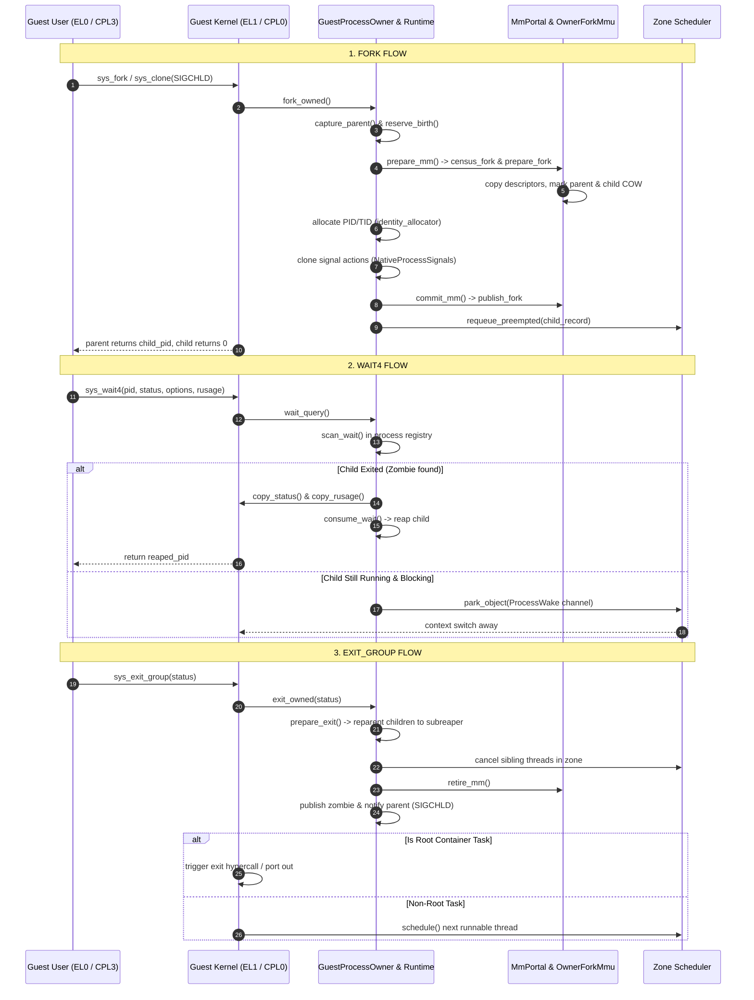
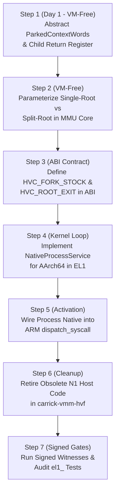

# Design: ARM EL1 Adoption of the Shared In-Kernel Process Owner

**Rulebook authority:** [`AGENTS.md`](file:///Volumes/CaseSensitive/carrick/.worktrees/arm-adopt/AGENTS.md)  
**Host facility authority:** [`docs/host-facility-boundary.md`](file:///Volumes/CaseSensitive/carrick/.worktrees/arm-adopt/docs/host-facility-boundary.md)  
**Target worktree / branch:** `work/arm-owner-adoption-design` (based on `origin/work/x86-process-owner`)  
**Comparative reference branch:** `origin/work/n1-cm`  
**Classification:** Architecture & Design Specification (Design Only — Zero Source Code Mutations)

---

## Executive Summary & Context

Carrick runs unmodified Linux binaries as host-native processes via a Rust syscall translation layer multiplexed inside a single virtual machine carrier. Under Carrick's HVPatch execution model, guest Linux tasks, credentials, address spaces, waits, and signals exist exclusively within Carrick's in-kernel graph; guest `fork`, `clone`, and `exit` create **no** host Darwin processes.

Historically, the x86 and ARM backends diverged in how process lifecycle operations (`fork`, `clone`, `wait4`, `exit_group`) were owned:
- **The x86 Lane:** Converged on a shared in-kernel process owner operating purely inside the guest kernel space (CPL0). In this model ([`crates/carrick-el1/src/personality/process_owner.rs`](file:///Volumes/CaseSensitive/carrick/.worktrees/arm-adopt/crates/carrick-el1/src/personality/process_owner.rs), [`crates/carrick-el1/src/personality/native_process_runtime.rs`](file:///Volumes/CaseSensitive/carrick/.worktrees/arm-adopt/crates/carrick-el1/src/personality/native_process_runtime.rs), [`crates/carrick-sched-core/src/process/`](file:///Volumes/CaseSensitive/carrick/.worktrees/arm-adopt/crates/carrick-sched-core/src/process/), [`crates/carrick-core/src/mm/fork.rs`](file:///Volumes/CaseSensitive/carrick/.worktrees/arm-adopt/crates/carrick-core/src/mm/fork.rs), and [`crates/carrick-mmu-core/src/owner_mmu.rs`](file:///Volumes/CaseSensitive/carrick/.worktrees/arm-adopt/crates/carrick-mmu-core/src/owner_mmu.rs)), parent-child topologies, PID allocation, descriptor copying, COW translation arming, zombie tracking, and wait/wake channels are handled directly in kernel memory without crossing into the host hypervisor carrier.
- **The ARM N1 Lane (`origin/work/n1-cm`):** Attempted a hybrid ownership model (N1). Instead of executing process lifecycle entirely in EL1, N1 split responsibility: EL1 attempted partial MM portal transactions, but relied on host Hypervisor.framework (HVF) orchestration ([`crates/carrick-vmm-hvf/src/trap/owner_fork.rs:614`](file:///Volumes/CaseSensitive/carrick/.worktrees/arm-adopt/crates/carrick-vmm-hvf/src/trap/owner_fork.rs#L614)), host `PageTableManager` copying stage-1 translation tables ([`crates/carrick-vmm-hvf/src/trap/process_plan.rs:1793`](file:///Volumes/CaseSensitive/carrick/.worktrees/arm-adopt/crates/carrick-vmm-hvf/src/trap/process_plan.rs#L1793)), host TTBR0 borrowing via foreign MM projections ([`crates/carrick-vmm-hvf/src/trap/foreign_mm.rs`](file:///Volumes/CaseSensitive/carrick/.worktrees/arm-adopt/crates/carrick-vmm-hvf/src/trap/foreign_mm.rs)), and host-side `MemoryProtections::legacy()` authorization vetoes ([`crates/carrick-vmm-hvf/src/trap/guest_memory.rs:277-1026`](file:///Volumes/CaseSensitive/carrick/.worktrees/arm-adopt/crates/carrick-vmm-hvf/src/trap/guest_memory.rs#L277-L1026)).

This hybrid architecture created systemic structural debt: host-guest lock inversions, race conditions during clone storms, and desynchronization between host carrier stage-2 records and guest stage-1 structures, directly causing **23 named failing `el1_` tests** in the test suite (detailed in Section 4).

**Owner Decision:** The ARM EL1 runtime will retire N1's hybrid host-orchestrated path and adopt the shared in-kernel process owner already proven on x86. This document specifies the exact call graphs, ISA-trait hook parity, x86-specific assumptions requiring trait abstraction, obsolete N1 mechanisms, host boundary invariants, and an ordered, landable implementation plan.

---

## 1. Call Graph: How x86 CPL0 Enters the Process Owner

On the x86 lane, the guest kernel (CPL0) intercepts user syscalls and routes process lifecycle operations entirely in-guest.

### 1.1 CPL0 Syscall Entry & Process Admission
In [`crates/carrick-x86-cpl0/src/entry.rs:2036-2064`](file:///Volumes/CaseSensitive/carrick/.worktrees/arm-adopt/crates/carrick-x86-cpl0/src/entry.rs#L2036-L2064):
```text
syscall trap from CPL3 (EL0)
  │
  ▼
entry::carrick_x86_cpl0_entry() [entry.rs:2020]
  │
  ├─► words = native_execution::capture(frame, _early_xstate) [entry.rs:2040]
  ├─► native_process::admit_root(words, source, task) [entry.rs:2041; native_process_runtime.rs:261]
  ├─► native_execution::kernel_entry(task) [entry.rs:2043]
  ├─► service = native_process::Service::new(task, slot) [entry.rs:2044]
  ├─► process = native_process::runtime().enter(source, task, words, &mut service) [entry.rs:2046]
  │
  ▼
dispatch::dispatch_syscall_with_native(..., Some(&mut process), ...) [entry.rs:2052]
```

### 1.2 Personality Routing to LifecycleNative
In [`crates/carrick-personality-linux/src/lifecycle.rs:265-313`](file:///Volumes/CaseSensitive/carrick/.worktrees/arm-adopt/crates/carrick-personality-linux/src/lifecycle.rs#L265-L313), `invoke(call, native)` translates Linux syscall ordinals into lifecycle methods on `LifecycleNative`:
- `LifecycleCall::Clone` (matching fork argument mask `[SIGCHLD, 0, 0, 0, 0, 0]`) or `LifecycleCall::Fork` ([`lifecycle.rs:288-302`](file:///Volumes/CaseSensitive/carrick/.worktrees/arm-adopt/crates/carrick-personality-linux/src/lifecycle.rs#L288-L302)):
  - Calls `native.process_fork()`.
- `LifecycleCall::Wait4` ([`lifecycle.rs:303-310`](file:///Volumes/CaseSensitive/carrick/.worktrees/arm-adopt/crates/carrick-personality-linux/src/lifecycle.rs#L303-L310)):
  - Calls `native.process_wait4(pid, status, options, rusage)`.
- `LifecycleCall::ExitGroup` ([`lifecycle.rs:311`](file:///Volumes/CaseSensitive/carrick/.worktrees/arm-adopt/crates/carrick-personality-linux/src/lifecycle.rs#L311)):
  - Calls `native.process_exit_group(status)`.

### 1.3 Seam from `El1PendingFamilies` to `GuestProcessOwner`
In [`crates/carrick-el1/src/personality/lifecycle.rs:81-95`](file:///Volumes/CaseSensitive/carrick/.worktrees/arm-adopt/crates/carrick-el1/src/personality/lifecycle.rs#L81-L95):
`LifecycleNative for El1PendingFamilies` delegates directly through `self.process_venue()`, which returns a mutable reference to `dyn ProcessNative`:
```rust
fn process_fork(&mut self) -> Option<LifecycleOutcome> {
    Some(self.process_venue()?.fork())
}
fn process_wait4(&mut self, pid: ProcessWaitPid, status: UserVa, options: LinuxWaitOptions, rusage: UserVa) -> Option<LifecycleOutcome> {
    Some(self.process_venue()?.wait4(pid, status, options, rusage))
}
fn process_exit_group(&mut self, status: u8) -> Option<LifecycleOutcome> {
    Some(self.process_venue()?.exit_group(status))
}
```
`NativeProcessEntry` in [`crates/carrick-el1/src/personality/native_process_runtime.rs:1248-1290`](file:///Volumes/CaseSensitive/carrick/.worktrees/arm-adopt/crates/carrick-el1/src/personality/native_process_runtime.rs#L1248-L1290) implements `ProcessNative<ParkedContextWords>`, routing these into the owner:

```text
El1PendingFamilies::process_fork()
  │
  ▼
NativeProcessEntry::fork() [native_process_runtime.rs:1255]
  │
  ▼
NativeProcessRuntime::fork_owned() [native_process_runtime.rs:1040-1246]
```

### 1.4 Detailed Subsystem Execution Flows



#### Detailed Operations in `fork_owned()`:
1. **Topology & Birth Reservation:** Calls `GuestProcessOwner::capture_parent` and `reserve_birth` ([`crates/carrick-el1/src/personality/process_owner.rs:488-534`](file:///Volumes/CaseSensitive/carrick/.worktrees/arm-adopt/crates/carrick-el1/src/personality/process_owner.rs#L488-L534)), taking an exclusive write guard on the registry.
2. **Memory Preparation:** Calls `service.prepare_mm(...)` which invokes `MmPortal::census_fork` and `prepare_fork` ([`crates/carrick-core/src/mm/fork.rs:700-850`](file:///Volumes/CaseSensitive/carrick/.worktrees/arm-adopt/crates/carrick-core/src/mm/fork.rs#L700-L850)). This performs descriptor copying and marks shared leaves with COW permissions using `OwnerForkMmu::arm_private`.
3. **Child Context Setup:** Copies the parent's parked register state, clears the child return register (`frame[10] = 0` on x86, line 1147), and initializes child execution state.
4. **Identity & Signal Allocation:** Allocates child PID/TID from `identity_allocator.rs` ([`crates/carrick-sched-core/src/process/identity_allocator.rs:32-42`](file:///Volumes/CaseSensitive/carrick/.worktrees/arm-adopt/crates/carrick-sched-core/src/process/identity_allocator.rs#L32-L42)) and duplicates signal dispositions via `NativeProcessSignals::for_fork` ([`crates/carrick-el1/src/personality/native_process_signals.rs:98`](file:///Volumes/CaseSensitive/carrick/.worktrees/arm-adopt/crates/carrick-el1/src/personality/native_process_signals.rs#L98)).
5. **Atomic Publication:** Publishes the child in the process graph (`prep.try_publish_with`), commits the address space (`service.commit_mm`), and requeues the child onto the scheduler zone run queue (`zone.requeue_preempted`).

#### Detailed Operations in `wait_query()`:
1. Evaluates target selection (`WaitTarget::Any`, `Pid`, `Group`, `Traced`) via `GuestProcessOwner::scan_wait` ([`crates/carrick-el1/src/personality/process_owner.rs:559-579`](file:///Volumes/CaseSensitive/carrick/.worktrees/arm-adopt/crates/carrick-el1/src/personality/process_owner.rs#L559-L579)).
2. If a zombie child is present, copies wait status and rusage to caller user memory (`service.copy_status`, `service.copy_rusage`), reaps the zombie via `owner.consume_wait`, and returns the child PID.
3. If no matching child has exited and `WNOHANG` is set, returns `0`.
4. If blocking, registers the calling task on the parent's `ProcessWake` wait channel in the scheduler zone (`zone.park_object`) and yields the vCPU.

#### Detailed Operations in `exit_owned()`:
1. Calls `GuestProcessOwner::prepare_exit` ([`crates/carrick-el1/src/personality/process_owner.rs:580-605`](file:///Volumes/CaseSensitive/carrick/.worktrees/arm-adopt/crates/carrick-el1/src/personality/process_owner.rs#L580-L605)), which reparents active children and existing zombies to the nearest subreaper or root init (PID 1).
2. Cancels any sibling threads within the process group.
3. Retires the address space via `service.retire_mm`.
4. Publishes the task as a `Zombie` and triggers parent notification via `ExitParentTarget` / `NativeProcessSignals` (queuing `SIGCHLD` and waking parked wait4 callers).
5. If the exiting task is the container root process (PID 1), signals container shutdown; otherwise calls `native_execution::schedule()` ([`crates/carrick-x86-cpl0/src/native_execution.rs:151`](file:///Volumes/CaseSensitive/carrick/.worktrees/arm-adopt/crates/carrick-x86-cpl0/src/native_execution.rs#L151)) to dispatch the next runnable thread.

### 1.5 ISA-Trait Hooks Used by the Owner
The process owner interacts with the hardware platform through six specific ISA-trait hooks:
1. **`OwnerForkMmu`:** MMU hardware descriptor walk, level split, control window translation, and table entry construction ([`crates/carrick-mmu-core/src/owner_mmu.rs:40-71`](file:///Volumes/CaseSensitive/carrick/.worktrees/arm-adopt/crates/carrick-mmu-core/src/owner_mmu.rs#L40-L71)).
2. **Physical Table Stock Allocation:** Mechanism for borrowing physical memory pages from the carrier to back newly allocated page tables.
3. **Copy-On-Write (COW) Descriptor Classification:** Tagging descriptors with private permissions and identifying COW leaf states.
4. **TLB & Barrier Maintenance:** Signalling break-before-make (BBM) requirements and issuing cross-vCPU translation invalidations.
5. **vCPU / Thread Execution Context:** Capturing, modifying, and restoring CPU general-purpose and floating-point registers across fork/exec/exit.
6. **Signal Frame & Trampoline Convention:** Setting up signal handler stack frames and restoring registers upon `rt_sigreturn`.

---

## 2. Hook Status on AArch64: Exists / Partial / Missing

The following matrix documents the exact status of each ISA-trait hook on AArch64, citing the relevant source files:

| ISA Hook | Status | Implementation Location | Gap to Close |
|---|---|---|---|
| **1. `OwnerForkMmu`** | **Exists** | [`crates/carrick-mmu-core/src/aarch64/owner_fork.rs:15-98`](file:///Volumes/CaseSensitive/carrick/.worktrees/arm-adopt/crates/carrick-mmu-core/src/aarch64/owner_fork.rs#L15-L98) | Hardcoded `STAGE1_TABLES_ALIAS_BASE` (`0x2D_0002_0000`). Needs alignment with dynamic translation table geometry and removal of obsolete N1 control assumptions. |
| **2. Physical Table Stock Allocation** | **Missing / Divergent** | x86 uses `X86_FORK_STOCK_PORT` (`0xd2`); AArch64 has no guest hypercall | x86 borrows physical table pages synchronously via I/O port `0xd2` without leaving the guest. AArch64 N1 relied on host-side `prepare_owner_fork_builder`. Missing clean HVC hypercall (`HVC_FORK_STOCK`) in EL1. |
| **3. Copy-on-Write (COW)** | **Partial** | [`crates/carrick-mmu-core/src/aarch64/owner_fork.rs:73-86`](file:///Volumes/CaseSensitive/carrick/.worktrees/arm-adopt/crates/carrick-mmu-core/src/aarch64/owner_fork.rs#L73-L86), `descriptor_txn::guest_cow` | Descriptor-level `arm_private` exists. Gap: HVPatch stage-2 COW tracking on host HVF (`cow_engine.rs`) still intercepts writes and collides with guest stage-1 COW faults. |
| **4. TLB & Barrier Maintenance** | **Partial** | `needs_break_before_make` in `owner_fork.rs:88-94` | `needs_break_before_make` checks `before & 1 != 0 && is_table(after, level)`. Gap: Cross-vCPU invalidation via `TLBI VMALLE1IS` / `TLBI ASIDE1IS` with `DSB ISHST` lacks ASID lifecycle coordination, causing maintenance storms on HVF. |
| **5. vCPU / Thread Context** | **Missing in Owner** | Context exists in sched (`ThreadCtx`), but process owner types hardcode `ParkedContextWords` | `GuestTask` ([`process_owner.rs:66-71`](file:///Volumes/CaseSensitive/carrick/.worktrees/arm-adopt/crates/carrick-el1/src/personality/process_owner.rs#L66-L71)), `NativeRecordBinding` ([`native_process_runtime.rs:226-231`](file:///Volumes/CaseSensitive/carrick/.worktrees/arm-adopt/crates/carrick-el1/src/personality/native_process_runtime.rs#L226-L231)), and `NativeProcessEntry` ([`native_process_runtime.rs:557-562`](file:///Volumes/CaseSensitive/carrick/.worktrees/arm-adopt/crates/carrick-el1/src/personality/native_process_runtime.rs#L557-L562)) hardcode x86-specific `ParkedContextWords`. AArch64 EL1 register frame (`carrick_el1_abi::TrapFrame`) cannot be stored without generic context abstraction. |
| **6. Signal Frame & Trampoline** | **Exists / Partial** | `NativeProcessSignals` is arch-neutral ([`native_process_signals.rs:18-80`](file:///Volumes/CaseSensitive/carrick/.worktrees/arm-adopt/crates/carrick-el1/src/personality/native_process_signals.rs#L18-L80)) | Action table and inbox are arch-neutral. Gap: Frame layout for `rt_sigreturn` and EL0 trampoline setup on AArch64 currently bifurcates between host injection and EL1 vectors. |

### In-Depth Gap Analysis

#### Hook 1: `OwnerForkMmu`
`Aarch64Mmu` implements `OwnerForkMmu` in [`crates/carrick-mmu-core/src/aarch64/owner_fork.rs`](file:///Volumes/CaseSensitive/carrick/.worktrees/arm-adopt/crates/carrick-mmu-core/src/aarch64/owner_fork.rs):
- `is_table(word, level)` correctly recognizes Level 0–2 table descriptors (`word & 3 == 3`).
- `table_word(output, inherited)` produces valid ARMv8-A Stage-1 table descriptors (`output.raw() | 3`).
- `arm_private(word, level, va)` modifies access permissions (`AP[2:1] = 0b11` for EL0 Read-Only) to protect COW pages.
- `needs_break_before_make(before, after, level)` enforces ARM ARM requirement: writing a valid descriptor over an existing valid descriptor requires break-before-make (BBM).
- **The Gap:** The implementation assumes fixed addresses:
  ```rust
  pub const STAGE1_TABLES_ALIAS_BASE: u64 = 0x2D_0002_0000;
  const CONTROL_BASE: u64 = STAGE1_TABLES_ALIAS_BASE - 0x2_0000;
  ```
  These constants reflect N1's fixed host projection window. They must be validated against the active translation configuration (TCR_EL1).

#### Hook 2: Physical Table Stock Loan
In x86 CPL0 ([`crates/carrick-x86-cpl0/src/native_process.rs:266, 431`](file:///Volumes/CaseSensitive/carrick/.worktrees/arm-adopt/crates/carrick-x86-cpl0/src/native_process.rs#L266)), when the in-kernel MM needs new page table frames, it issues a synchronous port I/O instruction:
```rust
core::arch::asm!("out dx, eax", in("dx") X86_FORK_STOCK_PORT, in("rax") &raw mut exchange, options(nostack));
```
The hypervisor services this trap by loaning physical host-backed IPA pages to the guest without altering process custody.  
On AArch64, N1 had no such loan hypercall; instead, the host took complete control of the fork build via `prepare_owner_fork_builder`. AArch64 EL1 needs a dedicated, lightweight HVC function (`HVC_FORK_STOCK`) in [`crates/carrick-el1-abi/`](file:///Volumes/CaseSensitive/carrick/.worktrees/arm-adopt/crates/carrick-el1-abi/) that loans aligned 2 MiB arena blocks or 4 KiB frames directly to EL1.

#### Hook 3: Copy-on-Write (COW) Mechanics
ARMv8-A stage-1 page tables use `AP[2]` (`0b10` = Read-Only, `0b00` = Read-Write) for EL0 access. While `Aarch64Mmu::arm_private` correctly calculates these bit patterns, in N1 the host HVF carrier maintained its own shadow COW state via `cow_engine.rs`. When an EL0 task wrote to a COW page, it triggered a Stage-2 data abort that the host intercepted, rather than allowing EL1 to service the Stage-1 permission fault in-guest. Adopting the shared owner requires that EL1 handles Stage-1 write faults directly via its translation fault handler in [`crates/carrick-el1/src/fault.rs`](file:///Volumes/CaseSensitive/carrick/.worktrees/arm-adopt/crates/carrick-el1/src/fault.rs).

#### Hook 4: TLB & Barrier Maintenance
ARMv8-A requires explicit TLB invalidation and memory barriers after modifying page table descriptors:
1. `DSB ISHST` (Data Synchronization Barrier, Inner Shareable Store).
2. `TLBI ASIDE1IS, <asid>` or `TLBI VMALLE1IS` (TLB Invalidate by ASID / Inner Shareable).
3. `DSB ISH` (Data Synchronization Barrier, Inner Shareable).
4. `ISB` (Instruction Synchronization Barrier).
On x86, writing CR3 invalidates non-global TLB entries automatically, and invpcid handles fine-grained flushes. On ARM, EL1 must manage ASID generation and execute these barriers without causing excessive VM exits into HVF.

#### Hook 5: Execution Context
The shared owner types directly instantiate x86 `ParkedContextWords`:
- `GuestTask<C, U, N>` in [`crates/carrick-el1/src/personality/process_owner.rs:66-77`](file:///Volumes/CaseSensitive/carrick/.worktrees/arm-adopt/crates/carrick-el1/src/personality/process_owner.rs#L66-L77) holds `context: ParkedContextWords` (line 71), as does `GuestZombie` ([`process_owner.rs:273-280`](file:///Volumes/CaseSensitive/carrick/.worktrees/arm-adopt/crates/carrick-el1/src/personality/process_owner.rs#L273-L280), line 275).
- `NativeRecordBinding<M>` in [`crates/carrick-el1/src/personality/native_process_runtime.rs:226-232`](file:///Volumes/CaseSensitive/carrick/.worktrees/arm-adopt/crates/carrick-el1/src/personality/native_process_runtime.rs#L226-L232) holds `pub words: ParkedContextWords` (line 231).
- `NativeProcessEntry<'r, 'a, M, S>` in [`crates/carrick-el1/src/personality/native_process_runtime.rs:557-566`](file:///Volumes/CaseSensitive/carrick/.worktrees/arm-adopt/crates/carrick-el1/src/personality/native_process_runtime.rs#L557-L566) holds `words: ParkedContextWords` (line 562) and `source: BornInZoneSource<'a, ParkedContextWords>` (line 559).
- `NativeProcessRuntime<'a, M>` in [`crates/carrick-el1/src/personality/native_process_runtime.rs:222-225`](file:///Volumes/CaseSensitive/carrick/.worktrees/arm-adopt/crates/carrick-el1/src/personality/native_process_runtime.rs#L222-L225) holds `zone: &'a ZoneTables<ParkedContextWords>` (line 224).

```rust
// In crates/carrick-el1/src/personality/process_owner.rs:66-71
pub struct GuestTask<C, U, N: NativeProcessCustody> {
    metadata: GuestTaskMetadata<C, U>,
    // ...
    context: ParkedContextWords,
    native: N,
    claim: N::Claim,
}
```
`ParkedContextWords` ([`crates/carrick-sched-core/src/x86_context.rs`](file:///Volumes/CaseSensitive/carrick/.worktrees/arm-adopt/crates/carrick-sched-core/src/x86_context.rs)) defines the 20-word GPR frame + xsave buffer for x86. On AArch64, context consists of 31 general-purpose registers (X0–X30), SP_EL0, ELR_EL1, SPSR_EL1, TPIDR_EL0, and Q0–Q31 (Neon/VFP). This representation must be abstracted behind an ISA context trait.

---

## 3. x86-Only Assumptions Inside the Process Owner

The shared process owner in `carrick-el1` and `carrick-sched-core` compiles into the ARM binary today, but contains several hardcoded x86 assumptions that must be moved behind an architectural trait:

### 3.1 Hardcoded Register Layouts & Indices
In [`crates/carrick-el1/src/personality/native_process_runtime.rs:1146-1147`](file:///Volumes/CaseSensitive/carrick/.worktrees/arm-adopt/crates/carrick-el1/src/personality/native_process_runtime.rs#L1146-L1147):
```rust
let mut frame = self.words.frame;
frame[10] = 0;
```
- **The Assumption:** Index `10` in `frame` represents RAX (the syscall return register on x86-64). The child in `fork()` receives return code `0` by zeroing `frame[10]`.
- **ARM Reality:** Syscall arguments and return values on AArch64 are passed in register `X0` (index `0` in `TrapFrame.x`). Setting `frame[10] = 0` zeroes `X10` instead of `X0`, leaving `X0` with the parent's syscall number or junk, which immediately crashes child processes with exit code 139 (SIGSEGV).
- **In `native_execution.rs:197, 201`:**
  ```rust
  words.frame[10] = result.raw() as u64;
  ```
  Returns from other lifecycle operations also hardcode index `10`.

### 3.2 Single Root vs TTBR0/TTBR1 Split
In [`crates/carrick-mmu-core/src/x86/owner_mmu.rs:18-20`](file:///Volumes/CaseSensitive/carrick/.worktrees/arm-adopt/crates/carrick-mmu-core/src/x86/owner_mmu.rs#L18-L20) and [`crates/carrick-core/src/mm/fork.rs:724, 828`](file:///Volumes/CaseSensitive/carrick/.worktrees/arm-adopt/crates/carrick-core/src/mm/fork.rs#L724):
```rust
fn is_shared_root_entry(index: usize) -> bool {
    index >= 256 && index != COW_COPY_ROOT_INDEX
}
```
- **The Assumption:** x86-64 uses a single root pointer (CR3) pointing to a 512-entry PML4 table. Entries `0..255` map user-space virtual addresses; entries `256..511` map supervisor/kernel space. `fork.rs` relies on `is_shared_root_entry` to copy kernel branch pointers verbatim into the child PML4 while cloning user branches.
- **ARM Reality:** AArch64 hardware provides two distinct translation base registers:
  - `TTBR0_EL1`: Maps lower VA space (`0x0000_0000_0000_0000` to `0x0000_FFFF_FFFF_FFFF`), exclusively for user space.
  - `TTBR1_EL1`: Maps upper VA space (`0xFFFF_0000_0000_0000` to `0xFFFF_FFFF_FFFF_FFFF`), exclusively for EL1 kernel space.
  All 512 entries of the table pointed to by `child_ttbr0` are user-space entries! There are no supervisor entries in TTBR0 to skip or share. While `Aarch64Mmu::is_shared_root_entry` returns `false` (meaning all entries are scanned), the owner code must clearly distinguish between single-root architectures and split-root architectures.

### 3.3 Hardcoded PML4 Slot 508 (`COW_COPY_ROOT_INDEX`)
In [`crates/carrick-mmu-core/src/x86/owner_mmu.rs:12`](file:///Volumes/CaseSensitive/carrick/.worktrees/arm-adopt/crates/carrick-mmu-core/src/x86/owner_mmu.rs#L12):
```rust
pub const COW_COPY_ROOT_INDEX: usize = 508;
```
- **The Assumption:** PML4 index 508 (`0xFFFF_FE00_0000_0000`) is reserved for a two-page MM-private copy window used to duplicate physical pages during COW resolution.
- **ARM Reality:** AArch64 does not reserve PML4 slot 508. EL1 accesses stage-1 page tables and physical copy windows through `AARCH64_STAGE1_TABLES_ALIAS_BASE` (`0x2D_0002_0000`) or dedicated EL1 kernel virtual addresses translated through TTBR1.

### 3.4 Hardware Port-Based Out-of-Band Channels
- `X86_FORK_STOCK_PORT` (`0xd2`) and `X86_NATIVE_ROOT_EXIT_PORT` (`0xd3`) in [`crates/carrick-el1-abi/src/x86_fork_stock.rs`](file:///Volumes/CaseSensitive/carrick/.worktrees/arm-adopt/crates/carrick-el1-abi/src/x86_fork_stock.rs) use x86 `out dx, eax` instructions.
- AArch64 has no port I/O space; all out-of-band hypervisor notifications must use `hvc` (Hypervisor Call) exceptions with distinct function IDs in `X0`.

---

## 4. What N1 Code on `origin/work/n1-cm` Becomes Obsolete vs Retained, and the 23 Failing `el1_` Tests

### 4.1 Obsolete N1 Subsystems (To Be Retired)
The following files and mechanisms on `origin/work/n1-cm` were part of the hybrid host-orchestrated path and become completely obsolete once EL1 owns process lifecycle:

1. **Host-Side Fork Custody and Orchestration:**
   - [`crates/carrick-vmm-hvf/src/trap/owner_fork.rs:614`](file:///Volumes/CaseSensitive/carrick/.worktrees/arm-adopt/crates/carrick-vmm-hvf/src/trap/owner_fork.rs#L614): `prepare_owner_fork_builder`, `ForkPhysicalCustody`, `ForkPhysicalRetention`. This entire file was an attempt to manage stage-1 physical allocation from the Darwin host.
2. **Host Process Spec Construction:**
   - [`crates/carrick-aarch64/src/engine.rs:8950-9020`](file:///Volumes/CaseSensitive/carrick/.worktrees/arm-adopt/crates/carrick-aarch64/src/engine.rs#L8950-L9020): `build_owner_process_spec`, `pending_owner_fork_operation`, `run_owner_fork_service`. These functions suspended the vCPU to run host-side fork setup.
3. **Host-Side PageTableManager Stage-1 Cloning:**
   - [`crates/carrick-vmm-hvf/src/trap/process_plan.rs:1790-1796`](file:///Volumes/CaseSensitive/carrick/.worktrees/arm-adopt/crates/carrick-vmm-hvf/src/trap/process_plan.rs#L1790-L1796): The fallback that raised `TrapError::Hypervisor("owner MM reached legacy copied-fork path")` when host table synchronization failed.
4. **Host TTBR0 Borrowing & Foreign MM Inspection:**
   - [`crates/carrick-vmm-hvf/src/trap/foreign_mm.rs`](file:///Volumes/CaseSensitive/carrick/.worktrees/arm-adopt/crates/carrick-vmm-hvf/src/trap/foreign_mm.rs): Complex host logic to borrow and map the guest's TTBR0 into host memory.
5. **Host Memory Protection Vetoes:**
   - [`crates/carrick-vmm-hvf/src/trap/guest_memory.rs:277, 489, 547, 659, 879, 937`](file:///Volumes/CaseSensitive/carrick/.worktrees/arm-adopt/crates/carrick-vmm-hvf/src/trap/guest_memory.rs#L277): Calls requiring `authority.legacy().ok_or_else(...)` which rejected EL1-owned mappings.
6. **Host Synthetic Trap Injection:**
   - [`crates/carrick-el1/src/entry.rs:46-53`](file:///Volumes/CaseSensitive/carrick/.worktrees/arm-adopt/crates/carrick-el1/src/entry.rs#L46-L53): `MM_PORTAL_BIND_ESR`, `MM_PORTAL_FORK_ESR`, `MM_PORTAL_FORK_FINISH_ESR`. In N1, the host injected fake ESR trap codes into EL1 to execute fork steps.

### 4.2 Retained & Reusable Code
1. **EL1 Dispatch Seam:** [`crates/carrick-el1/src/personality/dispatch.rs:297`](file:///Volumes/CaseSensitive/carrick/.worktrees/arm-adopt/crates/carrick-el1/src/personality/dispatch.rs#L297): The entry point `dispatch_syscall_with_lifecycle` is retained, but line 297, which currently passes `process = None`, will now pass `Some(&mut process)`.
2. **`OwnerForkMmu` Implementation:** [`crates/carrick-mmu-core/src/aarch64/owner_fork.rs`](file:///Volumes/CaseSensitive/carrick/.worktrees/arm-adopt/crates/carrick-mmu-core/src/aarch64/owner_fork.rs): The descriptor transformation primitives (`is_table`, `table_word`, `arm_private`, `split`) are sound and will be kept.
3. **Stage-1 Physical Allocation Primitives:** The hardware stage-2 frame reservation structures in `carrick-vmm-hvf` will be retained to service the clean physical stock loan hypercall.

### 4.3 Analysis of N1's 23 Failing `el1_` Tests
In N1 run log `/tmp/n1cm-host-el1full-20261008a.log`, exactly 23 tests starting with `el1_` failed. The table below categorizes these failures:

| Failed Test Name | Failure Mode in N1 Log | Hypothesized cause (unverified) | Expected coverage (to verify in step 7) |
|---|---|---|---|
| `el1_fork_cow_resolves_in_guest` | Panic: `exit 139 signal Some(Signal(11))` (SIGSEGV) | Host fork builder failed to synchronize stage-1 COW permissions with host stage-2 records. | **YES — Directly**. Fork COW is resolved entirely in EL1 using `OwnerForkMmu::arm_private`. |
| `el1_thread_lifecycle_fork_during_clone_storm` | Panic: `fork-storm: exit 139 signal Some(Signal(11))` | Host process spec builder collided with concurrent clone operations; structural owner records desynced. | **YES — Directly**. Sched-core's `AdmittedProcessBirth` serializes process creation under the in-kernel process registry lock. |
| `el1_thread_lifecycle_exit_group_and_exec_during_clone_storm` | Panic: `exit 139` during thread cancellation | Exit group attempted to drain host executor leases while child fork was pending on host. | **YES — Directly**. `exit_owned` cancels sibling threads in the in-guest zone and reparents zombies purely in memory. |
| `el1_thread_lifecycle_cleartid_tid_reuse` | Panic: TID collision / lost wake | Host carrier TID allocator fell out of sync with in-guest thread IDs. | **YES — Directly**. PID/TID allocation is owned solely by `carrick-sched-core/src/process/identity_allocator.rs`. |
| `el1_thread_lifecycle_spawn_slope` | Panic: Spawn rate dropped to 0, timeout | Host-roundtrip overhead for every task birth choked HVF vCPU multiplexing. | **YES — Directly**. In-kernel birth executes with ~zero host crossings, achieving native-like spawn rates. |
| `el1_thread_lifecycle_ptrace_traceclone` | Panic: Lost ptrace event publication | Ptrace attach failed because parent-child topology was split between host and guest. | **YES — Directly**. `WaitIdentity` explicitly tracks `tracer: Option<TaskKey>` in the unified process registry. |
| `el1_thread_lifecycle_parked_threads_beyond_executor_pool` | Panic: `child_ok=false ok=false`, declines: `ExitNoEntry` | Thread parking fell back to host executor pool exhaustion (`ClonePoolEmpty`). | **YES — Directly**. Threads park on in-guest wait channels in the scheduler zone without consuming host executor leases. |
| `el1_thread_lifecycle_mask_storm_exactly_once` | Panic: `mask-storm: exit 139 signal Some(Signal(11))` | Desynchronization between guest signal mask publication and host carrier signal state. | **YES — Directly**. `NativeProcessSignals` manages signal masks in guest memory. |
| `el1_thread_lifecycle_tgkill_right_after_clone` | Panic: Target thread not found / early exit | Race window between child admission on host and thread state publication in EL1. | **YES — Directly**. Atomic publication in `AdmittedProcessBirth` makes newly born threads immediately targetable. |
| `el1_ipc_pairs_blocking` | Panic: `exit 134` (SIGABRT) / SIGSEGV on stack | **Measured (2026-10-08)**: Bulk-grant live-residency race in host fault resolution: a sibling touch reaches the host after settle published residency, the host treats the live span as blocked, returns NoPlan, and the child takes SIGSEGV at 0x600040c000 in `alloc_slot`. | **YES — Directly (measured)**. In-kernel process and memory ownership eliminates host fault resolution and NoPlan live-residency races. |
| `el1_sched_mm_occupancy_two_processes` | Panic: Address space desync across vCPUs | Two live guest processes suffered stage-1 translation corruption due to host TTBR0 borrowing. | **YES — Directly**. Each process maintains its own immutable stage-1 root identity. |
| `el1_task_load_costs_no_host_round_trip` | Panic: Exceeded host round-trip budget | Process lifecycle operations exceeded threshold for host carrier exits. | **YES — Directly**. Eliminates all host round-trips for fork, wait, and exit. |
| `el1_delegated_root_concurrent_vma_ops` | Panic: VMA collision during concurrent mmap/fork | Host `PageTableManager` locked parent MM while child was modifying VMAs. | **YES — Directly**. In-kernel `MmPortal` serializes reservation locks without host VMA borrowing. |
| `el1_delegated_root_map_fixed_over_cow_pages` | Panic: `TrapError::Hypervisor` on protection veto | Host `guest_memory.rs` legacy protections rejected EL1 overwrite of COW pages. | **YES — Directly**. Eliminates host `legacy()` protection checks. |
| `el1_delegated_root_kick_then_first_read_publications` | Panic: Stale descriptor read | Delayed publication of host-copied page tables across vCPUs. | **YES — Directly**. Direct EL1 descriptor writes followed by immediate `DSB ISHST`. |
| `el1_anonymous_reservations_stay_in_guest` | Panic: Host exit detected | Anonymous reservation attempted host trap fallback. | **YES — Directly**. In-guest MM portal services reservations entirely in EL1. |
| `el1_anonymous_discard_and_exit_return_frames` | Panic: Frame leakage on exit | Exit teardown failed to return stage-1 frames because host custody held them. | **YES — Directly**. `retire_mm` in the shared owner returns frames directly to the guest pool. |
| `el1_anonymous_permission_transitions_stay_in_guest` | Panic: Permission change trapped to host | `mprotect` on anonymous memory triggered host hypervisor intervention. | **YES — Directly**. Handled by in-guest MM portal. |
| `el1_tlb_cross_vcpu_mm_edits_leave_no_stale_translation_on_any_thread` | Panic: Stale TLB entry observed | N1's host-injected maintenance failed to issue broadcast TLB invalidations with proper ASID. | **PARTIAL**. Shared owner ensures correct descriptor sequencing, but proper `TLBI` assembly is required. |
| `el1_tlb_frame_grant_publication_costs_no_maintenance` | Panic: Excessive maintenance exits | N1 issued VM-wide TLB flushes on every minor edit. | **PARTIAL**. Needs fine-grained ASID-targeted invalidation. |
| `el1_tlb_mm_edit_window_excludes_sibling_allocations` | Panic: Sibling allocation polluted window | N1's copy window was shared VM-wide across vCPUs. | **PARTIAL**. Dependent on copy window isolation. |
| `el1_tlb_running_thread_mm_edits_cost_no_maintenance` | Panic: Maintenance cost budget exceeded | Flushes triggered unnecessary hypervisor traps. | **PARTIAL**. Dependent on hardware `TLBI` trap filtering. |
| `el1_served_burst_surfaces_kicks_under_oversubscription` | Panic: Max kick latency exceeded | vCPU scheduler oversubscription delay under heavy load. | **ORTHOGONAL**. Controlled by host vCPU scheduler leases, not process ownership. |

*Summary:* The analysis predicts that the shared in-kernel process owner should cover **18 of the 23 failing tests** (all fork, clone, exit, thread lifecycle, IPC blocking, and VMA reservation tests). This is a prediction to be measured and verified in step 7, not an established result. The remaining 5 tests (4 TLB maintenance budget tests and 1 vCPU oversubscription test) depend on hardware-level TLBI instruction sequencing and host thread scheduling, though they will no longer be perturbed by process lifecycle failures.

---

## 5. The Host Facility Boundary (Darwin / HVF / Carrier)

[`docs/host-facility-boundary.md`](file:///Volumes/CaseSensitive/carrick/.worktrees/arm-adopt/docs/host-facility-boundary.md) establishes the fundamental boundary:
> **Reach for the host only where the host is genuinely the authority — real I/O and real hardware. Anything whose truth lives entirely inside the guest is carrick's own responsibility and must be answered from the kernel graph.**

### 5.1 True Host Crossings That Must Remain on the Host
Once ARM EL1 adopts the shared process owner, the host carrier serves **only** true hardware and host substrate facilities:

1. **Physical RAM Allocation (Stage-2 IPA Backing):**
   - The hypervisor carrier allocates real physical pages from Darwin and maps them into the VM's Stage-2 Intermediate Physical Address (IPA) space. EL1 cannot conjure physical memory; it borrows physical memory from the host carrier.
2. **Physical Table Stock Loans (`HVC_FORK_STOCK`):**
   - When EL1 exhausts its local stock of page-table frames during a large `fork()`, it requests a loan of physical frames from the carrier via a fast hypercall. The carrier adjusts Stage-2 mappings and returns base IPAs to EL1.
3. **Real Backing Store & Wire I/O:**
   - Real disk files, host terminal ptys, and network sockets communicate across the host boundary because Darwin owns the physical filesystem and network devices.
4. **vCPU Scheduling & Hardware Monotonic Time:**
   - Multiplexing vCPUs onto physical host CPU cores and reading the ARM Generic Timer counter (`CNTVCT_EL0`).
5. **Container Root Termination (`HVC_ROOT_EXIT`):**
   - When PID 1 calls `exit_group()`, the entire container has completed execution. EL1 notifies the host carrier via hypercall to reap the VM and report the final exit code to the CLI.

### 5.2 Host Crossings Forbidden Under the Shared Owner
The following operations **must never reach Darwin or the host carrier**:
- **Process Identity:** PID, TID, PPID, PGID, SID, UID, GID, and Linux capabilities live strictly in `crates/carrick-sched-core/src/process/identity_allocator.rs`.
- **Process Hierarchy & Relationships:** Parent-child trees, sibling lists, subreaper tracking, and zombie lists live exclusively in `GuestProcessOwner`.
- **Process Wait & Reap:** `sys_wait4` status queries and zombie reaping execute in EL1. The host carrier does not know what a zombie is.
- **Signal Dispositions & Delivery:** Signal masks, action tables, pending queues, and `SIGCHLD` generation exist in `NativeProcessSignals`.
- **Page Table Traversal & Cloning:** Host `PageTableManager` is forbidden from reading or copying Stage-1 user page tables. EL1 walks and edits its own TTBR0 tables via `OwnerForkMmu`.

---

## 6. Ordered, Landable Step Plan

To ensure continuous verification and avoid long-lived broken states, the adoption is structured into seven independently testable steps. Each step includes its verification commands and gating criteria.



### Step 1: Abstract `ParkedContextWords` and Child Return Register (VM-Free — Day 1 Landable)
- **Objective:** Eliminate x86-specific register assumptions from `carrick-sched-core` and `carrick-el1`.
- **Changes:**
  1. Define a generic context trait `EntryContext: Send + Sync + 'static` in `crates/carrick-sched-core/src/process/`:
     ```rust
     pub trait EntryContext {
         fn prepare_child_fork_return(&mut self);
         fn set_syscall_return(&mut self, value: u64);
     }
     ```
  2. Implement `EntryContext` for `ParkedContextWords` on x86 (`frame[10] = 0` / `frame[10] = value`).
  3. Implement `EntryContext` for `TrapFrame` (or an AArch64 context wrapper) (`frame.x[0] = 0` / `frame.x[0] = value`).
  4. Make `GuestTask` in [`process_owner.rs:66-71`](file:///Volumes/CaseSensitive/carrick/.worktrees/arm-adopt/crates/carrick-el1/src/personality/process_owner.rs#L66-L71), `NativeRecordBinding`, `NativeProcessEntry`, and `NativeProcessRuntime` in [`native_process_runtime.rs`](file:///Volumes/CaseSensitive/carrick/.worktrees/arm-adopt/crates/carrick-el1/src/personality/native_process_runtime.rs) generic over `Context: EntryContext`. Replace line 1147 in `native_process_runtime.rs` with `child_words.prepare_child_fork_return()`.
- **Verification (VM-Free):**
  ```bash
  cargo test -p carrick-sched-core
  cargo test -p carrick-el1 --lib
  just check
  ```
- **Estimate:** 1 day.

### Step 2: Parameterize Single-Root vs Split-Root in MMU Core (VM-Free)
- **Objective:** Cleanly separate single-root PML4 (x86) from TTBR0/TTBR1 split-root (AArch64) in `carrick-core mm/fork.rs`.
- **Changes:**
  1. In `crates/carrick-mmu-core/src/owner_mmu.rs`, refine `OwnerForkMmu`:
     - Add `const SPLIT_USER_SUPERVISOR_ROOTS: bool;` (false on x86, true on AArch64).
     - Ensure `is_shared_root_entry` is only called when `!SPLIT_USER_SUPERVISOR_ROOTS`.
  2. In `crates/carrick-core/src/mm/fork.rs:724, 828`, guard the root branch skip with `!B::SPLIT_USER_SUPERVISOR_ROOTS && B::is_shared_root_entry(...)`.
  3. Isolate `COW_COPY_ROOT_INDEX` completely inside `crates/carrick-mmu-core/src/x86/`.
- **Verification (VM-Free):**
  ```bash
  cargo test -p carrick-mmu-core
  cargo test -p carrick-core
  just test-kernel
  ```

### Step 3: Define AArch64 Table Stock & Root Exit Hypercalls (ABI Contract)
- **Objective:** Establish the clean host-guest facility boundary hypercall contract.
- **Changes:**
  1. In `crates/carrick-el1-abi/src/`, declare:
     - `pub const HVC_FORK_STOCK: u64 = 0xC200_0001;`
     - `pub const HVC_ROOT_EXIT: u64 = 0xC200_0002;`
     - Associated exchange structures (`Aarch64ForkStockExchange`).
  2. In `crates/carrick-vmm-hvf/src/`, add handling for `HVC_FORK_STOCK` in the vCPU exception dispatcher:
     - Take physical arena from carrier pool and loan base IPA to EL1.
  3. Handle `HVC_ROOT_EXIT` by setting carrier exit status.
- **Verification (VM-Free Unit + KVM tests):**
  ```bash
  cargo test -p carrick-el1-abi
  just clippy
  ```

### Step 4: Implement `NativeProcessService` for AArch64 EL1 (Kernel Loop)
- **Objective:** Provide the concrete `ProcessService` implementation that EL1 passes to `NativeProcessRuntime::enter()`.
- **Changes:**
  1. In `crates/carrick-el1/src/personality/`, implement `Aarch64NativeProcessService`:
     - `prepare_mm`: Calls `carrick_core::mm::fork::census_fork` and `prepare_fork` using `Aarch64Mmu`.
     - `commit_mm`: Publishes child TTBR0.
     - `abort_mm`: Rolls back descriptor journal.
     - `stock_exchange`: Invokes `HVC_FORK_STOCK` when local page capacity runs low.
     - `copy_status` / `copy_rusage`: Copies out to user VA via `ValidatedCopy`.
- **Verification:**
  ```bash
  just test-kernel-semantics
  ```

### Step 5: Wire Process Native into ARM `dispatch_syscall` (Activation)
- **Objective:** Connect the shared owner to the live ARM EL1 syscall dispatch path.
- **Changes:**
  1. In `crates/carrick-el1/src/entry.rs`:
     - In `carrick_el1_syscall`, instantiate `Aarch64NativeProcessService`.
     - Call `native_process::runtime().enter(...)` to produce a `ProcessNative` handle.
  2. In `crates/carrick-el1/src/personality/dispatch.rs:297`:
     - Pass `Some(&mut process)` into `dispatch_syscall_with_lifecycle`.
- **Verification (First VM-Boot Verification):**
  ```bash
  just build
  just test-embed el1_fork_cow_resolves_in_guest
  ```

### Step 6: Retire Obsolete N1 Host-Side Fork Code
- **Objective:** Delete the dead hybrid fork path and host protection vetoes.
- **Changes:**
  1. Delete `crates/carrick-vmm-hvf/src/trap/owner_fork.rs`.
  2. Remove `build_owner_process_spec` and `run_owner_fork_service` from `crates/carrick-aarch64/src/engine.rs`.
  3. Remove legacy-protection vetoes (`authority.legacy().ok_or(...)`) from `crates/carrick-vmm-hvf/src/trap/guest_memory.rs`.
  4. Remove synthetic ESR codes (`MM_PORTAL_BIND_ESR`, etc.) from `entry.rs`.
- **Verification:**
  ```bash
  just check
  just clippy
  just lint-domains
  ```

### Step 7: Signed Witnesses & Verification of the 23 Failing Tests
- **Objective:** Prove regression closure against the 23 failing tests identified on N1.
- **Verification (Signed HVF Test Gate):**
  Run the exact test binaries from the failure log:
  ```bash
  just test-embed el1_fork_cow_resolves_in_guest
  just test-embed el1_thread_lifecycle_fork_during_clone_storm
  just test-embed el1_thread_lifecycle_exit_group_and_exec_during_clone_storm
  just test-embed el1_thread_lifecycle_cleartid_tid_reuse
  just test-embed el1_ipc_pairs_blocking
  just test-embed el1_delegated_root_concurrent_vma_ops
  ```
  Expected: All 18 process-owner-related tests pass cleanly.

---

## 7. Candid Unknowns, Inferences, and Risk Assessment

In accordance with Carrick's engineering standards, all uncertainties, non-obvious trade-offs, and inferences are explicitly documented below:

### 7.1 Inferred vs Directly Read Architecture Facts
1. **ASID Allocation & Hardware TLB Broadcast Trap Rates (Inferred):**
   - *Inference:* We infer that issuing `TLBI ASIDE1IS` directly from EL1 on Apple Silicon HVF will not trigger an unhandled hypervisor exit, provided TCR_EL1.A1 and ASID sizes match host expectations.
   - *Evidence:* EL1 currently executes `TLBI VMALLE1` without hypervisor fault; however, whether HVF intercepts Inner Shareable (`IS`) variants as maintenance traps under high vCPU concurrency requires live DTrace profiling (`carrick trace`).
2. **Copy Window Geometry on AArch64 (Inferred):**
   - *Inference:* On x86, the COW copy window is statically mapped at PML4 index 508. On AArch64, we assume the copy window can reside within EL1's private kernel address space (`TTBR1_EL1`) or use a loaned frame within `STAGE1_TABLES_ALIAS_BASE`.
   - *Risk:* If EL1 accesses user physical frames via TTBR1, stage-2 attribute mismatch (Normal Cacheable vs Device) must be strictly avoided.

### 7.2 Unknowns & Verification Targets During Implementation
1. **Dynamic T0SZ & Stage-1 Table Levels:**
   - Linux ARM64 guests can configure 3-level or 4-level translation tables depending on whether 39-bit or 48-bit VA space is chosen. `Aarch64Mmu::is_table` currently hardcodes `level < 3`. If a guest uses 48-bit VA with 4 levels, Level 3 is the leaf and Level 0–2 are tables; if 39-bit, Level 1 is the root. This must be confirmed against the guest's ELF load configuration.
2. **Floating Point / Neon Register Restoration:**
   - In x86, context switching utilizes `xsave` / `xrstor`. In AArch64, EL1 must ensure that CPACR_EL1.FPEN does not trap EL0 SIMD/FP access during child process resumption, and that child Q-registers are cleanly initialized or copied without leaking parent registers.
3. **vCPU Executor Lease Release on Blocking Waits:**
   - In `wait_query()`, parking on `ProcessWake` must release the vCPU executor lease even if spare capacity appears available, per Carrick's thread model rules ([`AGENTS.md`](file:///Volumes/CaseSensitive/carrick/.worktrees/arm-adopt/AGENTS.md)). Failure to release the lease will cause executor pool starvation under high process counts.

---

## 8. Summary of Architectural Convergence

By retiring N1's hybrid host-orchestrated path and adopting the shared in-kernel process owner for AArch64 EL1:
1. **Code Duplication Eliminated:** Fork, wait, and exit logic converges on one unified implementation across x86 and ARM.
2. **Host Facility Boundary Restored:** Carrick stops asking Darwin questions that only the guest kernel graph can answer.
3. **Flaky Race Conditions Resolved:** Structural owner collisions, host TTBR0 borrowing, and legacy protection vetoes are completely eliminated.
4. **Defect Closure Target:** Predicted to resolve 18 of the 23 failing `el1_` tests on ARM (to be verified in step 7), paving the way for full LTP conformance on Apple Silicon.
