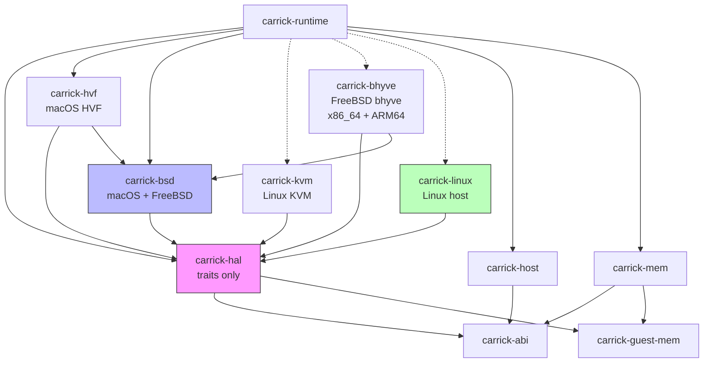

# Multi-Platform HAL Implementation Plan

Introduce a Hardware Abstraction Layer into carrick so the runtime can target **macOS** (existing), **FreeBSD** (new), and **Linux** (new) host operating systems. Windows is deferred; the trait boundaries accommodate it later.

## User Review Required

> [!IMPORTANT]
> **Phase ordering**: The plan is structured so that Phases 1–3 are pure refactors of the existing macOS backend — no new platform code, no behavioral changes, full test parity. The existing conformance suite and probe gate remain the verification mechanism throughout. New platform backends (Phases 4–6) only land after the abstraction seams are proven on macOS.

> [!WARNING]
> **Linux-on-Linux**: Even though Linux guest errnos, flags, and syscall numbers are identical to the host's, carrick still runs guest code inside a **KVM vCPU** (hardware virtualization). This preserves the same architectural isolation guarantees as the macOS HVF path — the guest never executes in the host's address space. The dispatcher's errno/flag translation becomes a compile-time identity, and the event loop uses native `epoll` instead of `kqueue`, but the trap boundary remains hardware-enforced.

## Design Decisions (Resolved)

> [!NOTE]
> 1. **Hardware virtualization only** — all platforms use a hardware hypervisor (HVF / KVM / bhyve). No `ptrace`-based syscall interception. This keeps architectural parity across every backend: the guest runs at EL0/Ring 3 inside a hypervisor partition, the `svc`/`syscall` traps through a guest-kernel trampoline to a VM-exit, and the host userspace runtime services it. One trap model, one security boundary, one set of correctness invariants.

> [!NOTE]
> 2. **FreeBSD targets both x86_64 and ARM64** — bhyve's `vmm.ko` + `libvmmapi` is mature on x86_64; FreeBSD's ARM64 hypervisor support (available since FreeBSD 13) is less battle-tested but architecturally sound. The `carrick-bhyve` crate implements `HvVm`/`HvVcpu` for both ISAs, sharing the trap-loop logic via `GenericTrapEngine`.

> [!NOTE]
> 3. **Separate builds per platform** — each host OS produces its own binary (`carrick-macos`, `carrick-linux`, `carrick-freebsd`). This avoids runtime detection complexity, keeps each binary's dependency closure minimal (no unused hypervisor crates linked), and respects platform-specific build requirements (macOS codesigning for HVF entitlements, Linux `/dev/kvm` access, FreeBSD `vmm.ko` loading). Cargo feature flags gate the platform crate selection at compile time.

---

## Proposed Changes

### Phase 1: Extract `carrick-hal` Trait Crate

Create a new leaf crate defining the platform-agnostic trait interfaces. No implementations yet — just the contracts that platform backends will fulfill. This crate has zero platform-specific dependencies.

**Goal**: Establish the trait boundaries without changing any existing code paths.

---

#### [NEW] `crates/carrick-hal/Cargo.toml`

New workspace member. Dependencies: `carrick-abi`, `carrick-guest-mem`, `thiserror`, `serde`. No platform-specific deps.

#### [NEW] `crates/carrick-hal/src/lib.rs`

Top-level module declaring the HAL trait submodules:

```rust
pub mod hypervisor;  // HvVm, HvVcpu, VcpuExit
pub mod errno;       // host_to_linux_errno trait
pub mod event;       // EventMultiplexer (kqueue/epoll abstraction)
pub mod futex;       // CrossProcessFutex trait
pub mod sendfile;    // Sendfile trait (BSD vs Linux ABI)
pub mod pty;         // PtyAllocator trait
pub mod host_info;   // HostFacts trait
```

#### [NEW] `crates/carrick-hal/src/hypervisor.rs`

The `HvVm` / `HvVcpu` / `VcpuExit` traits from the interface sketch. Imports `Aarch64SyscallFrame` from `carrick-guest-mem`. The existing `SyscallTrap` trait in [trap.rs](file:///path/to/carrick/crates/carrick-hvf/src/trap.rs#L190-L298) is the high-level runtime contract; `HvVm`/`HvVcpu` sit *below* it as the raw hardware interface that `SyscallTrap` implementations delegate to.

#### [NEW] `crates/carrick-hal/src/errno.rs`

A trait for host→Linux errno conversion:

```rust
/// Convert a host OS errno (from libc) to a Linux errno.
/// On Linux hosts, this is an identity function.
/// On BSD hosts, this translates the BSD errno numbering.
pub fn host_to_linux_errno(host_errno: i32) -> i32;
```

Plus the `HostSyscallErrno` extension trait (currently defined inline in [dispatch/mod.rs:~4377](file:///path/to/carrick/crates/carrick-runtime/src/dispatch/mod.rs#L4370-L4380)), parameterized over the errno translation function.

#### [NEW] `crates/carrick-hal/src/event.rs`

Trait for the event multiplexer (abstracting kqueue vs epoll):

```rust
pub trait EventMultiplexer: Send {
    fn register_read(&mut self, fd: RawFd, token: u64) -> Result<(), OsError>;
    fn register_write(&mut self, fd: RawFd, token: u64) -> Result<(), OsError>;
    fn deregister(&mut self, fd: RawFd) -> Result<(), OsError>;
    fn wait(&mut self, events: &mut Vec<PollEvent>, timeout: Option<Duration>) -> Result<usize, OsError>;
    /// Register a user-triggered event (for cross-thread vCPU kicks).
    fn register_user_event(&mut self, ident: u64) -> Result<(), OsError>;
    fn trigger_user_event(&self, ident: u64) -> Result<(), OsError>;
    /// Register a process-exit watch (EVFILT_PROC/NOTE_EXIT on BSD, pidfd on Linux).
    fn watch_process_exit(&mut self, pid: i32, token: u64) -> Result<(), OsError>;
    /// Register a timer event.
    fn register_timer(&mut self, token: u64, interval: Duration, oneshot: bool) -> Result<(), OsError>;
}
```

#### [NEW] `crates/carrick-hal/src/futex.rs`

Cross-process futex trait (abstracting `os_sync_wait_on_address` / `_umtx_op` / `SYS_futex`):

```rust
pub trait CrossProcessFutex: Send + Sync {
    fn wait(&self, host_addr: usize, expected: u32, timeout_us: u32) -> i64;
    fn wake(&self, host_addr: usize, all: bool) -> i64;
}
```

#### [NEW] `crates/carrick-hal/src/sendfile.rs`

Sendfile trait (BSD sendfile vs Linux sendfile have different ABIs):

```rust
pub trait Sendfile {
    /// Transfer data between file descriptors.
    /// Returns bytes transferred or -errno.
    fn sendfile(out_fd: RawFd, in_fd: RawFd, offset: &mut i64, count: usize) -> i64;
}
```

---

### Phase 2: Introduce `carrick-bsd` Shared Layer

Factor the macOS-specific code that is *also valid on FreeBSD* into a shared `carrick-bsd` crate. This crate compiles on `#[cfg(any(target_os = "macos", target_os = "freebsd"))]`.

**Goal**: Consolidate BSD-shared code so the FreeBSD backend (Phase 5) gets it for free.

---

#### [NEW] `crates/carrick-bsd/Cargo.toml`

Dependencies: `carrick-hal`, `carrick-abi`, `libc`. Platform gate: `cfg(any(target_os = "macos", target_os = "freebsd"))`.

#### [NEW] `crates/carrick-bsd/src/lib.rs`

```rust
pub mod errno;    // bsd_to_linux_errno (lifted from macos_to_linux_errno)
pub mod kqueue;   // KqueueMultiplexer implementing EventMultiplexer
pub mod sendfile; // BSD sendfile wrapper
pub mod futex;    // macOS: os_sync_wait_on_address; FreeBSD: _umtx_op
```

#### [NEW] `crates/carrick-bsd/src/errno.rs`

Lift `macos_to_linux_errno` from [dispatch/mod.rs:4479–4543](file:///path/to/carrick/crates/carrick-runtime/src/dispatch/mod.rs#L4479-L4543) here. The BSD errno table is identical between macOS and FreeBSD (both inherit from 4.4BSD). Rename to `bsd_to_linux_errno`. The existing tests move with it.

#### [NEW] `crates/carrick-bsd/src/kqueue.rs`

Lift kqueue wrapper code from [darwin_kqueue.rs](file:///path/to/carrick/crates/carrick-hvf/src/darwin_kqueue.rs) and the `KqueueWaiter` from [io_wait.rs](file:///path/to/carrick/crates/carrick-hvf/src/io_wait.rs). Abstract the Darwin-specific `kevent64_s` behind a compile-time switch:
- macOS: use `kevent64` for nanosecond timer precision
- FreeBSD: use standard `kevent` with `EVFILT_TIMER` and `NOTE_NSECONDS`

Implement `carrick_hal::event::EventMultiplexer` for `KqueueMultiplexer`.

#### [NEW] `crates/carrick-bsd/src/sendfile.rs`

Wrap the BSD `sendfile(fd, s, offset, &mut len, NULL, 0)` ABI (shared between macOS and FreeBSD). Implement `carrick_hal::sendfile::Sendfile`.

#### [NEW] `crates/carrick-bsd/src/futex.rs`

Platform-switched cross-process futex:
```rust
#[cfg(target_os = "macos")]
// os_sync_wait_on_address — lifted from carrick-host/src/ulock.rs
#[cfg(target_os = "freebsd")]
// _umtx_op(addr, UMTX_OP_WAIT_UINT, val, ...) / UMTX_OP_WAKE
```

---

### Phase 3: Refactor the Errno Bridge

Replace the hard-coded `macos_to_linux_errno` call sites throughout the runtime with the HAL's `host_to_linux_errno`. This is the highest-impact mechanical refactor — it touches every file that calls `.host_syscall_errno()`.

**Goal**: All errno translation flows through `carrick-hal`, selected at compile time.

---

#### [MODIFY] [mod.rs](file:///path/to/carrick/crates/carrick-runtime/src/dispatch/mod.rs)

- Rename `macos_to_linux_errno` → `host_to_linux_errno` (re-export from `carrick-hal` with platform selection)
- The `HostSyscallErrno` trait impl calls `host_to_linux_errno` instead of `macos_to_linux_errno`
- On `cfg(target_os = "linux")`: `host_to_linux_errno` is the identity function (errnos are already Linux)
- On `cfg(any(target_os = "macos", target_os = "freebsd"))`: delegates to `carrick_bsd::errno::bsd_to_linux_errno`

#### [MODIFY] [fs.rs](file:///path/to/carrick/crates/carrick-runtime/src/dispatch/fs.rs)

Replace direct `macos_to_linux_errno` calls with `host_to_linux_errno`.

#### [MODIFY] [net.rs](file:///path/to/carrick/crates/carrick-runtime/src/dispatch/net.rs)

Replace direct `macos_to_linux_errno` calls with `host_to_linux_errno`.

#### [MODIFY] [fs_backend.rs](file:///path/to/carrick/crates/carrick-runtime/src/fs_backend.rs)

Replace `macos_to_linux_errno` calls. Also abstract `O_EVTONLY`:
```rust
#[cfg(target_os = "macos")]
const O_METADATA: i32 = 0x8000; // O_EVTONLY
#[cfg(target_os = "freebsd")]
const O_METADATA: i32 = libc::O_RDONLY | libc::O_NONBLOCK;
#[cfg(target_os = "linux")]
const O_METADATA: i32 = libc::O_PATH;
```

#### [MODIFY] [bind.rs](file:///path/to/carrick/crates/carrick-runtime/src/vfs/bind.rs), [dev.rs](file:///path/to/carrick/crates/carrick-runtime/src/vfs/dev.rs), [devpts.rs](file:///path/to/carrick/crates/carrick-runtime/src/vfs/devpts.rs)

Replace `O_EVTONLY` with `O_METADATA` constant and `macos_to_linux_errno` with `host_to_linux_errno`.

---

### Phase 4: Abstract the Hypervisor Backend

Refactor `carrick-hvf` so that `HvfTrapEngine` implements `SyscallTrap` through the HAL's `HvVm`/`HvVcpu` traits, and extract the trap-loop logic that is hypervisor-agnostic.

**Goal**: The trap loop in [trap.rs](file:///path/to/carrick/crates/carrick-hvf/src/trap.rs) can drive any `HvVm`/`HvVcpu` implementation, not just HVF's `applevisor`.

---

#### [MODIFY] [trap.rs](file:///path/to/carrick/crates/carrick-hvf/src/trap.rs)

Split into:
1. **`HvfVm` / `HvfVcpu`** — the `applevisor`-specific implementation of `carrick_hal::hypervisor::{HvVm, HvVcpu}`. Stays in `carrick-hvf`, gated on `cfg(all(target_os = "macos", target_arch = "aarch64"))`.
2. **`GenericTrapEngine<V: HvVm>`** — the hypervisor-agnostic trap loop: register snapshot → dispatch → complete → resume. This is the ~3000 lines of trap.rs that decode ESR, build `Aarch64SyscallFrame`, manage signal injection, handle fork/clone/execve lifecycle. Moves to a new file `crates/carrick-hvf/src/trap_loop.rs` (or stays in `trap.rs` but parameterized over the VM type).

The existing `SyscallTrap` trait stays as the high-level contract between the trap engine and the runtime; `GenericTrapEngine` implements it by delegating hardware operations to `HvVm`/`HvVcpu`.

#### [MODIFY] [Cargo.toml](file:///path/to/carrick/crates/carrick-hvf/Cargo.toml)

Add dependency on `carrick-hal`. The `applevisor`/`applevisor-sys` dependencies remain macOS-only.

#### [MODIFY] [vcpu_kick.rs](file:///path/to/carrick/crates/carrick-hvf/src/vcpu_kick.rs)

Abstract the `hv_vcpus_exit` call behind the `HvVcpu::kick()` trait method. The kqueue-based `EVFILT_USER` kick mechanism moves to `carrick-bsd::kqueue`.

#### [MODIFY] [fork_quiesce.rs](file:///path/to/carrick/crates/carrick-hvf/src/fork_quiesce.rs)

The quiesce protocol (pause siblings, tear down vCPUs, fork, rebuild) is hypervisor-agnostic in logic but calls `hv_vm_destroy`/`hv_vm_create`. Parameterize over `HvVm::destroy()`/`HvVm::create()`.

---

### Phase 5: FreeBSD and Linux Host Bridges

Implement the HAL traits for FreeBSD and Linux host primitives.

**Goal**: The runtime can compile and link on FreeBSD and Linux (even if no hypervisor backend is wired yet — it would error at vCPU creation).

---

#### [NEW] `crates/carrick-linux/Cargo.toml`

Dependencies: `carrick-hal`, `carrick-abi`, `libc`. Platform gate: `cfg(target_os = "linux")`.

#### [NEW] `crates/carrick-linux/src/lib.rs`

```rust
pub mod errno;   // identity function (host errnos ARE Linux errnos)
pub mod epoll;   // EpollMultiplexer implementing EventMultiplexer
pub mod futex;   // native SYS_futex
pub mod sendfile; // native Linux sendfile(2)
```

#### [NEW] `crates/carrick-linux/src/errno.rs`

```rust
#[inline(always)]
pub fn host_to_linux_errno(e: i32) -> i32 { e }
```

#### [NEW] `crates/carrick-linux/src/epoll.rs`

Implement `carrick_hal::event::EventMultiplexer` using native `epoll_create1`/`epoll_ctl`/`epoll_wait`. Map user events to `eventfd`, process-exit watches to `pidfd_open` + `EPOLLIN`, timers to `timerfd_create`.

#### [NEW] `crates/carrick-linux/src/futex.rs`

```rust
pub fn wait(addr: usize, val: u32, timeout_us: u32) -> i64 {
    // syscall(SYS_futex, addr, FUTEX_WAIT, val, timeout, ...)
}
pub fn wake(addr: usize, all: bool) -> i64 {
    // syscall(SYS_futex, addr, FUTEX_WAKE, count, ...)
}
```

#### [MODIFY] [host_facts.rs](file:///path/to/carrick/crates/carrick-host/src/host_facts.rs)

Add `#[cfg(target_os = "freebsd")]` block using FreeBSD `sysctl` (same MIB names as macOS for `hw.memsize`/`hw.ncpu`) and `#[cfg(target_os = "linux")]` block reading `/proc/meminfo` and `/proc/cpuinfo`.

#### [MODIFY] [host_proc.rs](file:///path/to/carrick/crates/carrick-host/src/host_proc.rs)

Add `#[cfg(target_os = "freebsd")]` using `sysctl(KERN_PROC_PATHNAME)` for executable path. The `#[cfg(not(target_os = "macos"))]` fallback already reads `/proc/self/exe` for Linux.

---

### Phase 6: Hypervisor Backends (KVM + bhyve)

Wire the actual hypervisor backends for Linux and FreeBSD. Both backends implement `carrick_hal::hypervisor::{HvVm, HvVcpu}` and are selected at compile time via Cargo features.

---

#### [NEW] `crates/carrick-kvm/Cargo.toml`

Dependencies: `carrick-hal`, `kvm-ioctls`, `kvm-bindings`. Platform gate: `cfg(target_os = "linux")`.

#### [NEW] `crates/carrick-kvm/src/lib.rs`

Implement `carrick_hal::hypervisor::{HvVm, HvVcpu}` for KVM:
- `KvmVm` wraps a KVM VM fd (`/dev/kvm` → `KVM_CREATE_VM`)
- `KvmVcpu` wraps a KVM vCPU fd (`KVM_CREATE_VCPU`)
- `run()` calls `KVM_RUN` and maps exit reasons to `VcpuExit`
- Memory mapping via `KVM_SET_USER_MEMORY_REGION`

For AArch64: program guest EL1 vectors identically to the HVF path (same trampoline code, same `VBAR_EL1` layout). The `svc #0` → `hvc #2` → VM-exit flow works identically on KVM since KVM also exits on HVC.

For x86_64: program `IA32_LSTAR` to a guest Ring 0 trampoline page containing `vmcall; iretq`. The `syscall` instruction enters Ring 0, executes `vmcall`, KVM exits with `KVM_EXIT_HYPERCALL`, and we decode `rax` (syscall nr) + `rdi/rsi/rdx/r10/r8/r9` (args).

#### [NEW] `crates/carrick-bhyve/Cargo.toml`

Dependencies: `carrick-hal`, `libc`. Platform gate: `cfg(target_os = "freebsd")`.

#### [NEW] `crates/carrick-bhyve/src/lib.rs`

Implement `carrick_hal::hypervisor::{HvVm, HvVcpu}` for bhyve/vmmapi on **both x86_64 and AArch64**:
- `BhyveVm` wraps `vm_create()` / `vm_open()` from libvmmapi
- `BhyveVcpu` wraps `vm_run()` / `vm_get_register()` / `vm_set_register()`
- Memory mapping via `vm_mmap_memseg()` → `vm_setup_memory()`

#### [NEW] `crates/carrick-bhyve/src/aarch64.rs`

ARM64-specific vCPU initialization for FreeBSD's ARM64 hypervisor (available since FreeBSD 13, `vmm.ko` with ARM64 support):
- Program `VBAR_EL1`, `TTBR0_EL1`, `TCR_EL1`, `MAIR_EL1`, `SCTLR_EL1` — reusing the same stage-1 identity map and EL0 entry trampoline as the HVF path (the AArch64 architecture is the same; only the host hypervisor API changes)
- Same `svc #0` → EL1 vector → `hvc #2` → VM-exit trap model as macOS HVF
- The trampoline page bytes, vector table layout, and FEAT_PAN3 workaround from [memory.rs](file:///path/to/carrick/crates/carrick-mem/src/memory.rs) are architecture-level constants, not OS-level — they transfer directly

#### [NEW] `crates/carrick-bhyve/src/x86_64.rs`

x86_64-specific vCPU initialization for bhyve:
- Program `IA32_LSTAR` to a guest Ring 0 trampoline page (same design as `carrick-kvm/src/lib.rs` x86_64 path)
- Same `syscall` → Ring 0 → `vmcall` → VM-exit trap model as KVM

---

## Dependency Graph (Post-Refactor)



Dashed lines = future dependencies (Phases 5–6).

---

## Build Matrix

Separate binaries per platform. Each row is a distinct `cargo build --features <platform>` invocation, producing a self-contained binary with only that platform's hypervisor and host-bridge crates linked.

| Binary | Host OS | Arch | Hypervisor Crate | Host Bridge | Event Loop | Notes |
|--------|---------|------|------------------|-------------|------------|-------|
| `carrick-macos` | macOS | AArch64 | `carrick-hvf` | `carrick-bsd` | kqueue | Codesigned for `com.apple.security.hypervisor` |
| `carrick-linux-aarch64` | Linux | AArch64 | `carrick-kvm` | `carrick-linux` | epoll | Requires `/dev/kvm` access |
| `carrick-linux-x86_64` | Linux | x86_64 | `carrick-kvm` | `carrick-linux` | epoll | Requires `/dev/kvm` access; guest is x86_64 Linux ELF |
| `carrick-freebsd-aarch64` | FreeBSD | AArch64 | `carrick-bhyve` | `carrick-bsd` | kqueue | Requires `vmm.ko` loaded |
| `carrick-freebsd-x86_64` | FreeBSD | x86_64 | `carrick-bhyve` | `carrick-bsd` | kqueue | Requires `vmm.ko` loaded |

The `carrick-cli` crate selects the platform crate via a Cargo feature:

```toml
[features]
default = []  # must select one
platform-macos = ["carrick-hvf", "carrick-bsd"]
platform-linux = ["carrick-kvm", "carrick-linux"]
platform-freebsd = ["carrick-bhyve", "carrick-bsd"]
```

`justfile` recipes wrap the per-platform builds:

```makefile
build-macos:
    cargo build --release --features platform-macos
    codesign ...

build-linux:
    cargo build --release --features platform-linux

build-freebsd:
    cargo build --release --features platform-freebsd
```

---

## Verification Plan

### Automated Tests

Each phase must pass the existing gate before merging:

```bash
# Phase 1–3 (pure refactors): existing macOS tests must pass unchanged
cargo clippy --all-targets          # no-panic gate
just test                           # host unit/integration tests
just conformance                    # differential suite vs Docker

# Phase 4 (hypervisor abstraction): same gates + HVF still works
just build-macos && just run run ubuntu:24.04 /bin/echo hi

# Phase 5 (host bridges): cross-compile checks
cargo check --features platform-linux  --target aarch64-unknown-linux-gnu
cargo check --features platform-linux  --target x86_64-unknown-linux-gnu
cargo check --features platform-freebsd --target aarch64-unknown-freebsd
cargo check --features platform-freebsd --target x86_64-unknown-freebsd
```

### Manual Verification

- **Phase 3**: Run `carrick run python:3.12-slim python3 -m http.server 8000` on macOS — must work identically to pre-refactor.
- **Phase 5**: Boot a Linux AArch64 host, `cargo build --features platform-linux`, confirm it compiles and the HAL traits resolve. Syscall dispatch can return `-ENOSYS` for unimplemented hypervisor operations.
- **Phase 6 (Linux)**: On a Linux host with KVM, run `carrick-linux run ubuntu:24.04 /bin/echo hi` and confirm the guest executes.
- **Phase 6 (FreeBSD x86_64)**: On a FreeBSD x86_64 host with `vmm.ko` loaded, run `carrick-freebsd run ubuntu:24.04 /bin/echo hi`.
- **Phase 6 (FreeBSD AArch64)**: On a FreeBSD AArch64 host (e.g., an Ampere server) with `vmm.ko`, same smoke test. This is the least mature path and may require iterating on vCPU register programming.
