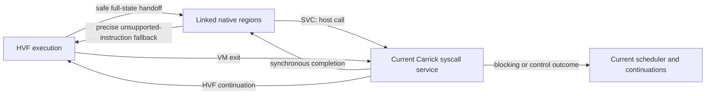

# Resident native regions inside the HVPatch kernel

Decision, 2026-09-22: pursue a hybrid execution engine using the recovered DSR
instruction machinery with the current kernel, memory and scheduler. Make the
next integration milestone the unchanged original `inotify09`, including both
race participants. Do not grow the small fixture translator into another DSR.
This is an architectural decision and implementation specification, not an
implemented backend or a new performance result.

## What must become cheaper

An ordinary synchronous guest syscall currently has a hardware execution
boundary, transport/state handling, kernel service and completion work. The
resident executor already continues across ordinary syscall boundaries;
replacing the scheduler with another resident loop does not remove HVF exits.
A faster watch lookup cannot remove the transition cost of unrelated calls.

For a serial, fixed instruction stream, the relevant comparison is:

    HVF:    guest computation + N * (exit/transport + kernel/completion)
    hybrid: translated computation + N * (native gateway + kernel/completion)
            + engine switches + translation/publication + fallback work

This is an accounting model, not a subtraction of unrelated benchmark medians.
`inotify09` is concurrent and adapts its synchronization delays. Its completion
time follows the dependency graph between add/remove, write/seek and barriers;
summed service times and static instruction counts do not identify that path.
Native execution is useful only when its avoided transitions exceed translation,
memory, synchronization, code-cache and engine-switch costs on completed work.

Current full-workload reference is 21.885 s versus 5.980 s Linux (3.66x), from
[context-borrow](../context-borrow/README.md). The latest rejected intervention
removed two context copies per call and did not move that workload. The existing
mailbox change had moved the original workload about 10.4%; that gain is already
in the reference. No new timing has been taken for this design.

The qualified census contains 3M add-watch and 3M remove-watch **host services**.
It omits EL1 and engine-local completions, including the repeated write/seek
path. It is not the total guest syscall or HVF-exit count. In particular, one
observed host-service seek does not mean the original race writes/seeks once.

Mac-native I/O remains a separate matched control. Keep raw Linux ratios and the
host-bind comparison visible; do not subtract platform timings from full LTP
completion or trade away direct host-file access.

## Why this architectural bet

| Choice | What it removes | Principal problem | Decision |
|---|---|---|---|
| More HVF transport/envelope tuning | Some host work around each exit | Hardware boundary remains; recent context reduction had no useful effect | Keep correct baseline; not the main near-parity bet |
| Execute more kernel services inside guest EL1 | Hardware exits for those services | Valid watch state, event queues, paths, policy, wakeups and host crossings need a coherent guest-accessible ownership/locking ABI | Possible future design, much larger semantic split for this workload |
| Shared-memory helper portal | Some interception or servicing work | Additional worker synchronization; the earlier Carrick portal did not improve completion and exposed cancellation trouble | Do not repeat without a changed causal mechanism |
| Linked native/DSR regions in the same carrier | Hardware exits for synchronous calls made while native | Current-MM lowering, executable-content revocation and complete state/control handoff | Selected next integration |

The strongest feasibility evidence is the existing carrier-data research ELF:
long valid watch churn at 1041 ns/pair versus Linux 907 ns/pair (1.15x), with
private research text and fixture stage-2. It is not a full-workload prediction.
Invalid and unchanged pairs remain about 2.4x and 2.35x, and translated compute
and memory remain slower than Linux. Removing HVF is therefore neither a proof
of parity nor an excuse to ignore native gateway/translation overhead.
See [compact-native](../compact-native/README.md).

The new original-binary audit materially changes implementation scope. The small
translator rejects 493 of 1,344 selected instruction sites. The recovered DSR
decoder classifies all 1,344, including the race loops, acquire/release accesses,
LSE operation, LL/SC fallback and libc calls. This is selected static decoding,
not full-program support or evidence that current-MM emission works. Its two
exclusive instructions still need a fused region or a correct fallback. Reuse
the decoder, block planning, register virtualization and emission machinery;
do not restore `NativeMappedMemory`, its fixed bias, or host-process fork state.
Full counts, identities and limitations are in [README.md](README.md).

## The unit of execution is a region, not a syscall wrapper

Both engines use the same logical task, current MM and carrier backing. Engine
selection is execution machinery; it does not choose a different syscall kernel.

One logical guest thread has one kernel execution lease and one active engine.
HVF handles startup and any ineligible execution. At a safe existing execution
boundary, native admission can transfer the full guest state and enter a linked
set of translated blocks. Direct edges, calls, PLT/indirect calls and returns
remain native after resolution; an SVC calls the existing host service and
resumes native code. Entry selection is based on executable identity and
observed behavior, never a benchmark name or symbol allowlist.

Returning to HVF after each SVC defeats the premise: it adds two engine-state
transfers to the operation being optimized. The first experiment must measure
native residence length, crossings and fallback reasons, as well as elapsed
time. A region need not be one function or one ELF. For this binary, the watch
loop calls libc's generic `syscall`, the synchronization helper and calibration
code; specializing only libc's named inotify wrappers misses the actual route.

Admission and every native segment reuse `NativeExecutor`/`NativeExecution` and
the existing exact task/thread/MM ownership. The running handshake may block a
conflicting mutation's drain, but does not hold mutation exclusion over guest
work. No second scheduler or host process is created for a Linux task. A native
segment must participate in the existing bounded executor capacity and release
any unneeded HVF lease without creating another independently running census
entry for the same thread.

At SVC, spill the required guest state, end native pointer/running scopes, and
use the existing request, policy, interception, observation and completion
path. Preserve synchronous return and errno behavior. Blocking, exec, fork,
signal and control outcomes return to the existing continuation/scheduler path.
Do not retain a mutable file-table or MM snapshot across calls. Re-entry may
reuse immutable translation metadata only after the current generation check.

## Current memory and code publication are one integration

The required native memory lowering is an explicit current-MM mode, distinct
from the recovered `Direct` and `Biased` modes. Guest VA, stage-1 IPA, resident
backing/owner generation and host pointer remain distinct domains.

Use scoped, pinned current-carrier windows for read and write access. Read-only
and executable-read permissions must remain distinct: permission to fetch an
instruction does not grant a guest data load from execute-only text. Handle the
stack, globals, TLS, read-only data and heap; one fixture RW window is not enough.
A warmed access may use a small authenticated window/leaf cache with inlined
whole-range checks. Cache misses use the current authority API; stores prepare
COW before execution. Do not walk or copy the whole VMA set per load or syscall,
and do not eagerly materialize the guest mmap arena. Record misses and slow
loads/stores so cheaper syscalls cannot conceal an expensive memory interpreter.

Native and HVF operations on the same shared guest memory must use the same
physical backing and Linux memory ordering. Emit acquire/release and supported
LSE atomics on authenticated addresses. For LL/SC, prepare the backing before
entering the exclusive region and preserve the operation through load/store
and retry. Do not put a Rust callback or engine switch between the pair and
assume forward progress. On an interrupted exclusive operation, preserve the
architecturally permitted failed-store/retry semantics. Qualify both LSE and
LL/SC paths rather than assuming which HWCAP dispatch the guest selected.

A translated block requires a **carrier-owned publication permit** containing
exact MM/execution identity, instruction range, live backing owner(s), mapping
permissions and executable-content generation. `InstructionRead` currently
proves mapping authority but explicitly does not detect all in-place writes.
Its mapping revision cannot serve as a content generation.

Publication and writes must form a transaction:

1. Authenticate instruction bytes and backing/content generation for compilation.
2. Revalidate and register executable dependencies before making code or direct
   links enterable. A read/compile/publication race must refuse publication.
3. Before a direct, alias, foreign, host or guest write can modify covered bytes,
   stop new entries, revoke dependent blocks and links, and drain affected active
   execution. Only then change bytes/permissions/backing and advance generation.
4. Never revive old code after VA/owner reuse or permission restoration. Publish
   a fresh translation from a new authenticated observation.

Backing/range identity is essential: an RX mapping can have a writable alias in
another MM. Entry guards alone do not revoke direct links that bypass them.
The first implementation can admit proven private RX regions and leave all
uncertain/shared/writable-alias text on HVF, provided every writer can invalidate
that proof before writing. RX permissions or retained pins alone are not proof.
Hashing the entire program at every syscall is not an acceptable substitute.

## Exact handoff and control

Reuse `GuestCpuState` and `Aarch64TaskCpuStateV1`; extend the existing typed
representation only where necessary. The native adapter must preserve all
GPRs, SIMD/FP state, NZCV, SP, Linux TLS, resume PC, pending syscall/restart state,
MM/ASID generation and task-visible EL1 state. Preserve executor-local state
separately. Native handoff must not treat an EL1 trap PC as an EL0 instruction PC.

Unsupported code exits at the precise guest instruction before its side effect.
After completing a syscall, fallback resumes after it; never replay it. Register
and memory publication must precede relinquishing the active execution lease.
A generation-scoped negative cache can prevent immediate HVF/native ping-pong
at an unsupported location; a forever-by-PC refusal would outlive changed code.

Native backedges and gateways retain bounded checkpoints for pending signals,
quiescence, cancellation and scheduler preemption. Host faults inside translated
code require an exact guest-PC/state recovery map before delivering a guest fault.
No opcode is silently skipped, signal dropped or guest wait turned into a busy
poll. Both native and HVF execution must use current continuation/wake semantics.

## One vertical milestone with a decisive result

The next delivery is **one signed current-kernel carrier running the unchanged
original inotify09 to TPASS and the execution-loop limit, with native residence
across watch syscalls and correct native/HVF fallback**. The data path, code
publication, state transfer and synchronous service are parts of that delivery;
individual green helpers are progress toward it, not separate performance wins.

Implementation order within that milestone:

1. Add red contracts for publication/revocation and cross-engine state using the
   existing real carrier fixture. Implement current-MM code/data lowering and
   the adapter together. Reuse DSR through the authenticated reader seam.
2. Run actual guest code through signed embed: both race participants, real
   atomic operations, synchronous syscall completion and fallback/control paths.
   Then execute the original dynamically linked ELF under the normal harness
   wrapper. A rewritten static ELF or host-fabricated syscall loop is not this
   milestone. No broad instruction-set campaign before this vertical path works.
3. Compare exact frozen signed arms with two balanced untraced blocks and a fresh
   serialized native ARM64 Docker phase. Use a separate diagnostic build/capture
   for native entries/instructions, synchronous requests/completions, actual HVF
   exits, switches, fallback reasons and slow memory accesses. Fail closed on
   missing populations; do not add instrumentation totals to infer wall time.

Bind semantics and structural evidence to
`kernel.execution.native-synchronous-syscall` and its existing scope/data/buffer
contracts. Add the missing publication/state contract before product changes.
Scales 1/8/32/128 cover two live MMs with identical VAs, alias writes, owner reuse,
COW parent/child isolation, read-compile-entry mutation, active execution drain,
unmap/protection/exec, full state roundtrip and once-only service completion.
Mixed native/HVF atomics, signal delivery, blocked resume and cancellation are
signed requirements. Existing unresolved bindings stay unresolved until executed.

Predeclare a **20% reduction in full original completion time**, with improvement
in both balanced blocks, as the screen for further architectural expansion.
Against the last reference that is about 17.5 s; it is a screening target, not
parity or a forecast. The 2x intermediate milestone would be about 12.0 s if the
fresh Linux reference remains 5.98 s. Near 1x remains the objective. Always use
the contemporaneous measured reference and preserve all runs and adaptive-work
counts. Do not adjust the LTP loop limit, timeout or synchronization to qualify.

If native residence is fragmented, fix the measured boundary causing it before
adding general cache infrastructure. If exits fall but completion does not,
inspect translated memory/atomics/compute and scheduling with one bounded causal
intervention. Do not return to repeated handler counts as impact evidence.
Stop expanding the architecture if the completed-work screen fails; retain the
receipts and remove ineffective product code. Only after it passes, run existing
Node/Go/Python and concurrency 1/2/4/8 controls and the full applicable signed
promotion gates. Research remains outside product defaults; a shipped mechanism
must follow the repository's default-on rule with an exact bisection hatch.

## Permissively licensed guidance

- gVisor's [performance guide](https://gvisor.dev/docs/architecture_guide/performance/)
  separates structural interception cost from implementation cost. This supports
  the cost model, not a numerical estimate for Carrick. Its code is Apache-2.0.
- DynamoRIO's [AArch64 linking guide](https://dynamorio.org/page_aarch64_far.html)
  explains keeping linked blocks in the code cache and restoring reserved
  registers at boundaries. This supports region residence and link revocation;
  it does not prove Carrick's current memory model. Its primary code uses BSD-3.
- gVisor's [systrap design](https://github.com/google/gvisor/blob/master/pkg/sentry/platform/systrap/README.md)
  depends on Linux seccomp/signal machinery. It is useful architecture context,
  not a drop-in Darwin portal implementation.

The pinned license/source archive is [permissive-guidance](../permissive-guidance/sources.json).
No third-party implementation was copied. LTP/libc binaries were read only to
identify the real workload's instruction requirements, not used as implementation
source. Current local DSR code is the project's own MIT OR Apache-2.0 donor.
