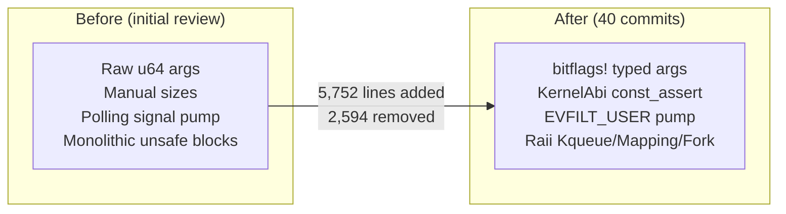

# Carrick Code Review — Post-Refactoring Re-evaluation

> [!NOTE]
> This is a **delta review** covering the ~40 commits of refactoring since the initial review. The codebase now has 35 source files (6 new), totaling ~1.3M bytes. The refactoring has delivered **substantial improvements** in type safety, concurrency correctness, and Linux ABI completeness. This review tracks what was fixed, what remains open, and what's new.

## Completion Ledger

Status: in progress on branch `codex/address-gap-research`.

Plan: `docs/superpowers/plans/2026-05-23-gap-research-completion.md`

- [ ] Security and guest-visible correctness batch: xattrs, rooted path handling, allocation caps, memory advice, signal alt-stack validation, time/sysinfo, host socket nonblocking, entropy/ELF validation.
- [ ] Runtime safety and maintainability batch: panic-safe trap rebuild, fork snapshot ownership, `PROT_NONE` lookup, `GPR_TABLE`, runtime trace flag caching, lock ordering, C-string reads, `/proc` task listing, SIGWINCH draining, DTrace RAII.
- [ ] Partial-addressed review items: errno/error boundary, duplicated trap-loop responsibilities, and subsystem/crate error typing either completed or closed with evidence.
- [ ] Final verification and integration: targeted tests, full cargo hygiene, logical commits, and fast-forward back into `main`.

---

## Refactoring Scorecard

### ✅ Fixed (11 items)

| Previous Finding | How Fixed | Commit |
|---|---|---|
| Raw `args[0]` / `args[1] as i32` type-width mismatches | `SyscallRequest::arg(n)` + `bitflags!` types (`LinuxOpenFlags`, `LinuxMmapFlags`, etc.) | `56671a5 feat: type linux flags and ABI reads` |
| Missing `O_LARGEFILE` handling | `LinuxOpenFlags::LARGEFILE` in bitflags, stripped in translation | Same |
| Wire-format size mismatches (termios 44→36 byte bug class) | `KernelAbi` trait with `const ABI_SIZE` + compile-time `const_assert!`; `write_kernel_struct`/`read_kernel_struct` helpers | Same |
| `SA_ONSTACK` not delivered on alt stack | Full implementation in `dispatch/signal.rs` | `98febdd signal: deliver SA_ONSTACK handlers on the alternate signal stack` |
| `vcpu_kick` held lock during kicks → deadlock risk | Snapshot-then-kick pattern; lock released before `kick_ids()` | `5ad3087 refactor: own host mappings and shared protections` |
| Signal pump busy-polling with `usleep(250ms)` | Redesigned: `EVFILT_USER` kqueue + split pipe. Process genuinely sleeps when idle. | `2254732 fix: split signal pump wake pipe` + `be2beba signal/proc: block the pump on EVFILT_USER` |
| `/sys/devices/system/cpu/online` hardcoded `"0-3"` | Uses `std::thread::available_parallelism()` with fallback | `89ff975 refactor: move synthetic proc sys rendering into vfs` |
| `prlimit64` silently ignored new limits | Now validates and stores them | `f811dab prlimit64: accept setting a resource limit instead of EINVAL` |
| `setitimer` not delivering signals | Timer thread now calls `notify_pump` → vCPU kick | `d4ce8ba time: deliver SIGALRM/SIGVTALRM/SIGPROF on interval-timer expiry` |
| `FUTEX_WAIT_BITSET` timeout wrongly treated as relative | Fixed to use absolute timeout per Linux semantics | `e48db6a futex: FUTEX_WAIT_BITSET timeout is absolute, not relative` |
| `epoll_ctl`/`epoll_pwait` missing argument validation | Added proper validation | `8a4236e epoll: argument validation on epoll_ctl / epoll_pwait` |

### 🔶 Partially Addressed (3 items)

| Previous Finding | Current Status |
|---|---|
| Errno sign convention inconsistency | `HostSyscallError` covers host-errno paths. Guest-side still mixed (`-EINVAL` vs `Err(anyhow!(...))` → `-EIO`). ~60% standardized. |
| Three trap loops duplicate ~70% code | `1d9c301 refactor: extract threaded runtime transitions` moved some logic out, but `run_combined_syscall_loop_with_dispatcher`, `run_vcpu_until_exit`, and `run_split_loop` still share ~60% identical code. |
| Per-subsystem error types | `DispatchError` enum replaces some `anyhow::Result` returns but crate-level `CarrickError` not yet implemented. |

### ❌ Still Open (13 items from previous review)

| # | Sev | Finding | File |
|---|---|---|---|
| 1 | **Critical** | `ptr::write(self)` in fork/execve — panic-unsafe window | [trap.rs](file:///Volumes/CaseSensitive/carrick/src/trap.rs) ~L1580, L1868 |
| 2 | **Critical** | Internal xattr names (`user.carrick.uid/gid`) leak to guest | [fs_backend.rs](file:///Volumes/CaseSensitive/carrick/src/fs_backend.rs) / [dispatch/fs.rs](file:///Volumes/CaseSensitive/carrick/src/dispatch/fs.rs) |
| 3 | **High** | Sandbox escape via symlink TOCTOU in `resolve_beneath()` | [fs_backend.rs](file:///Volumes/CaseSensitive/carrick/src/fs_backend.rs) ~L300 |
| 4 | **High** | `ptsname()` not thread-safe (process-global static buffer) | [vfs/devpts.rs](file:///Volumes/CaseSensitive/carrick/src/vfs/devpts.rs) ~L142 |
| 5 | **High** | `truncate()` OOM via uncapped `len as usize` | [vfs/rootfs.rs](file:///Volumes/CaseSensitive/carrick/src/vfs/rootfs.rs) ~L756 |
| 6 | **High** | Linear scan of `PROT_NONE` ranges on every memory access | [trap.rs](file:///Volumes/CaseSensitive/carrick/src/trap.rs) ~L858 |
| 7 | **High** | `GPR_TABLE` duplicated 6 times | [trap.rs](file:///Volumes/CaseSensitive/carrick/src/trap.rs) 6 sites |
| 8 | **High** | `env::var_os` in combined trap loop not cached | [runtime.rs](file:///Volumes/CaseSensitive/carrick/src/runtime.rs) ~L497 |
| 9 | **Medium** | Lock ordering undocumented across subsystem locks | dispatch module |
| 10 | **Medium** | `allocate_fd` TOCTOU race (read lock → insert) | [dispatch/fs.rs](file:///Volumes/CaseSensitive/carrick/src/dispatch/fs.rs) |
| 11 | **Medium** | `MADV_DONTNEED` is a no-op (jemalloc relies on zero-fill) | [dispatch/mem.rs](file:///Volumes/CaseSensitive/carrick/src/dispatch/mem.rs) |
| 12 | **Medium** | Symlink resolution has no hop limit (infinite recursion) | [vfs/mod.rs](file:///Volumes/CaseSensitive/carrick/src/vfs/mod.rs) |
| 13 | **Medium** | Fork snapshot buffers leak in parent permanently | [trap.rs](file:///Volumes/CaseSensitive/carrick/src/trap.rs) ~L1502 |

---

## New Issues in Refactored/New Code

### High

| Sev | File | Issue |
|---|---|---|
| **HIGH** | [dispatch/signal.rs](file:///Volumes/CaseSensitive/carrick/src/dispatch/signal.rs) ~L620 | **SA_ONSTACK delivery doesn't validate alt stack is mapped.** `ss_sp + ss_size` is used as the new SP without checking the memory is mapped/writable. Guest registering an alt stack at an unmapped address causes a host-side write failure instead of a guest SIGSEGV. |
| **HIGH** | [dispatch/mem.rs](file:///Volumes/CaseSensitive/carrick/src/dispatch/mem.rs) ~L214 | **`dup_fd` leak on `map_shared_file` error path.** When `next_shared_file_address` returns `Some(addr)` but `map_shared_file` fails, the code falls through to the snapshot path without closing `dup_fd`. |
| **HIGH** | [dispatch/time.rs](file:///Volumes/CaseSensitive/carrick/src/dispatch/time.rs) ~L501 | **`sysinfo.uptime` reports epoch time, not uptime.** `SystemTime::now().duration_since(UNIX_EPOCH)` gives ~1.7 billion seconds. Programs like `htop` / `uptime` would show 55 years. Use `sysctl(KERN_BOOTTIME)` or monotonic clock. |
| **HIGH** | [trap.rs](file:///Volumes/CaseSensitive/carrick/src/trap.rs) ~L1826 | **`from_thread_spec` silently swallows `hv_vm_map` failures.** Comment says "tolerate HV_BAD_ARGUMENT for re-mapping", but all errors are swallowed including out-of-memory. Check for the specific error code. |

### Medium

| Sev | File | Issue |
|---|---|---|
| **MEDIUM** | [memory.rs](file:///Volumes/CaseSensitive/carrick/src/memory.rs) ~L593 | **`getentropy` return value unchecked.** If it fails, `AT_RANDOM` is all-zero → predictable stack canary. Check return and fall back to `/dev/urandom`. |
| **MEDIUM** | [memory.rs](file:///Volumes/CaseSensitive/carrick/src/memory.rs) ~L741 | **`wrapping_add` for segment end calculation.** A malicious ELF with `virtual_address + memory_size > u64::MAX` silently wraps. Use `checked_add`. |
| **MEDIUM** | [dispatch/time.rs](file:///Volumes/CaseSensitive/carrick/src/dispatch/time.rs) ~L120 | `clock_gettime(CLOCK_MONOTONIC)`: `(ticks * numer) / denom` can overflow `u64` if `numer > 1`. Use `u128` intermediate. |
| **MEDIUM** | [dispatch/signal.rs](file:///Volumes/CaseSensitive/carrick/src/dispatch/signal.rs) ~L672 | **`rt_sigqueueinfo` rejects self-signal from forked child.** Compares target against `LINUX_BOOTSTRAP_PID` only; after fork, child's pid != bootstrap pid → ESRCH on self-signal. Should also check `std::process::id()`. |
| **MEDIUM** | [dispatch/net.rs](file:///Volumes/CaseSensitive/carrick/src/dispatch/net.rs) ~L1246 | **Host sockets not always set `O_NONBLOCK` at creation.** The `blocking_io` invariant requires non-blocking host fds, but `host_socket_install` only sets it when the guest passes `SOCK_NONBLOCK`. A new I/O path without `MSG_DONTWAIT` could block under the dispatcher lock. |
| **MEDIUM** | [dispatch/mod.rs](file:///Volumes/CaseSensitive/carrick/src/dispatch/mod.rs) ~L4024 | **`read_guest_c_string` is O(n) per byte.** Each byte is read with a separate `read_bytes(address, 1)` call. For PATH_MAX=4096 this is 4096 calls. Read in 256-byte chunks and scan for NUL. |
| **MEDIUM** | [vfs/proc.rs](file:///Volumes/CaseSensitive/carrick/src/vfs/proc.rs) ~L500 | `/proc/<pid>/task/` readdir uses a fixed `[0u64; 64]` array for thread handles. Processes with >64 threads have their list truncated silently. |
| **MEDIUM** | [thread.rs](file:///Volumes/CaseSensitive/carrick/src/thread.rs) ~L260 | `FUTEX_CMP_REQUEUE` acquires source then destination bucket locks. Verify no other path takes them in reverse order. |
| **MEDIUM** | [pty_relay.rs](file:///Volumes/CaseSensitive/carrick/src/pty_relay.rs) ~L600 | `handle_sigwinch` drains one byte instead of all. Multiple coalesced signals leave bytes in the pipe. |
| **MEDIUM** | [dispatch/signal.rs](file:///Volumes/CaseSensitive/carrick/src/dispatch/signal.rs) ~L250 | `rt_sigprocmask(SIG_SETMASK)` doesn't strip SIGKILL/SIGSTOP bits from the stored mask. Signal delivery skips them, so this is cosmetic, but the mask value is technically wrong. |
| **MEDIUM** | [dispatch/fs.rs](file:///Volumes/CaseSensitive/carrick/src/dispatch/fs.rs) ~L3968 | **Raw macOS errno in streamed-stdio write path.** Uses `*libc::__error()` directly instead of `.host_syscall_errno()` translation. Some macOS errnos disagree with Linux (e.g., EOPNOTSUPP=45 vs 95). |

### Low

| Sev | File | Issue |
|---|---|---|
| **LOW** | [syscall.rs](file:///Volumes/CaseSensitive/carrick/src/syscall.rs) | Syscall table uses binary search but no test verifies sortedness. |
| **LOW** | [elf.rs](file:///Volumes/CaseSensitive/carrick/src/elf.rs) | `validate_elf()` accepts any `e_machine`. Only `EM_AARCH64` is supported. |
| **LOW** | [vfs/proc.rs](file:///Volumes/CaseSensitive/carrick/src/vfs/proc.rs) ~L250 | `/proc/<pid>/cmdline` returns comm name instead of actual argv (macOS limitation). Documented but may confuse tools that parse by NUL-splitting. |
| **LOW** | [dtrace_consumer.rs](file:///Volumes/CaseSensitive/carrick/src/dtrace_consumer.rs) | Manual cleanup of `dtrace_close`/`dtrace_proc_release` — RAII guard recommended. |

---

## Quality of New Extracted Modules

All 6 new modules demonstrate **excellent** engineering quality:

| Module | Lines | RAII | Tests | Safety Comments | Assessment |
|---|---|---|---|---|---|
| [ulock.rs](file:///Volumes/CaseSensitive/carrick/src/ulock.rs) | 85 | N/A (syscalls) | — | ✅ 2 sites | **Excellent** — `ULF_NO_ERRNO` avoids errno race; clean platform fallback |
| [fork_coord.rs](file:///Volumes/CaseSensitive/carrick/src/fork_coord.rs) | 102 | `PreparedHostFork` token | ✅ 1 test | — | **Good** — RAII token prevents accidental fork |
| [darwin_kqueue.rs](file:///Volumes/CaseSensitive/carrick/src/darwin_kqueue.rs) | 197 | `Kqueue` Drop | ✅ 2 tests | ✅ | **Excellent** — `Kevent` newtype prevents raw construction |
| [darwin_fs.rs](file:///Volumes/CaseSensitive/carrick/src/darwin_fs.rs) | 120 | `CopyfileState` Drop | ✅ 1 test | ✅ | **Good** — Clean RAII for copyfile state |
| [host_mapping.rs](file:///Volumes/CaseSensitive/carrick/src/host_mapping.rs) | 116 | `OwnedHostMapping` Drop | ✅ 1 test | — | **Excellent** — RAII munmap; shared/private tracking |
| [host_proc.rs](file:///Volumes/CaseSensitive/carrick/src/host_proc.rs) | 256 | N/A | — | ✅ 5 sites | **Good** — Bounded ppid walk; thread-level state aggregation |

> [!TIP]
> The pattern in these modules — small, focused, RAII-clean, tested, `// SAFETY:`-documented — is the template for future extractions from the large files.

---

## Architectural Improvements



### Key Wins

1. **`KernelAbi` trait** — The `const ABI_SIZE` + `const_assert!` pattern eliminates the entire class of "wrote N+8 bytes and corrupted the guest's stack canary" bugs. This is the single most impactful safety improvement.

2. **`bitflags!` for Linux flags** — `LinuxOpenFlags`, `LinuxMmapFlags`, etc. catch type-width and flag-identity bugs at compile time. The `SUPPORTED_MASK` constants enable clean unsupported-flag validation.

3. **Signal pump redesign** — `EVFILT_USER` kqueue replaces `usleep(250ms)` polling. The process genuinely sleeps when idle, fixing `/proc/<pid>/stat` reporting and reducing CPU waste. Signal handlers use the pipe (async-signal-safe); normal threads use `trigger_user` (not async-signal-safe but correct from dispatch context).

4. **RAII extraction modules** — `OwnedHostMapping`, `Kqueue`, `CopyfileState`, `PreparedHostFork` all prevent resource leaks on error paths. The `host_mapping.rs` module is particularly good — it replaces raw `mmap`/`munmap` pairs scattered through trap.rs with owned, droppable mappings.

5. **Cross-process futex via `__ulock`** — Cleanly layered: `ulock.rs` provides the raw syscall, `thread.rs` routes shared futexes through it, and the existing parking_lot path handles private futexes. LTP's `tst_checkpoint` now works.

---

## Remaining Priorities (Recommended Order)

### 1. Fix xattr namespace leak (Critical, small fix)

The xattr dispatch in [dispatch/fs.rs:3640-3760](file:///Volumes/CaseSensitive/carrick/src/dispatch/fs.rs#L3640-L3760) passes guest-supplied xattr names directly to the overlay without checking if they match `CARRICK_UID_XATTR_NAME`, `CARRICK_GID_XATTR_NAME`, or `CARRICK_MODE_XATTR_NAME`. A guest can read/write/list internal metadata xattrs.

**Fix:** Add a 3-line guard at the top of `setxattr()`, `getxattr()`, and `listxattr()`:

```rust
if name.starts_with("user.carrick.") {
    return Ok(DispatchOutcome::Errno { errno: LINUX_ENODATA });
}
```

And filter internal names in `listxattr`'s output assembly.

### 2. Sandbox escape via resolve_beneath (High, security-critical)

[fs_backend.rs:~L300](file:///Volumes/CaseSensitive/carrick/src/fs_backend.rs) — `canonicalize()` + `starts_with()` is a well-known TOCTOU. Replace with `RESOLVE_BENEATH` (macOS Ventura+) or per-component `openat(O_NOFOLLOW)` chaining.

### 3. `ptr::write(self)` panic safety (Critical, design change)

[trap.rs:~L1580](file:///Volumes/CaseSensitive/carrick/src/trap.rs) — Use `ManuallyDrop::take()` + rebuild, or wrap the destroy-then-rebuild in a helper guaranteed not to panic.

### 4. `ptsname()` thread-safety (High, small fix)

[vfs/devpts.rs:~L142](file:///Volumes/CaseSensitive/carrick/src/vfs/devpts.rs) — Replace `ptsname()` with `ptsname_r()`. Available on macOS.

### 5. Cap guest-controlled allocations (High, several small fixes)

- `truncate()` in [vfs/rootfs.rs](file:///Volumes/CaseSensitive/carrick/src/vfs/rootfs.rs): clamp `len` to 2 GiB
- `read_guest_cstring()`: add `max_len` parameter
- `mincore()`: validate `length` against arena size

### 6. Document lock ordering (Medium, documentation)

Add a `// LOCK ORDERING: creds < fs < mem < proc < signal` comment at the top of [dispatch/mod.rs](file:///Volumes/CaseSensitive/carrick/src/dispatch/mod.rs) and audit all callers.

### 7. Extract GPR_TABLE + cache env var (High, quick wins)

- `GPR_TABLE`: 6 duplicates in [trap.rs](file:///Volumes/CaseSensitive/carrick/src/trap.rs) → 1 module-level constant
- `CARRICK_TRACE_TRAPS`: cache before combined loop in [runtime.rs](file:///Volumes/CaseSensitive/carrick/src/runtime.rs)

---

## File Size Tracker

The large-file situation is unchanged. The `normalized_dispatch!` macro migration is the right approach but hasn't yet reduced `mod.rs`/`fs.rs` to manageable sizes.

| File | Size | Lines | Δ | Status |
|---|---|---|---|---|
| [dispatch/fs.rs](file:///Volumes/CaseSensitive/carrick/src/dispatch/fs.rs) | 228KB | ~5,500 | +2KB | Still largest — split recommended |
| [dispatch/mod.rs](file:///Volumes/CaseSensitive/carrick/src/dispatch/mod.rs) | 161KB | ~4,700 | **-7KB** | Improving via `normalized_dispatch!` |
| [dispatch/net.rs](file:///Volumes/CaseSensitive/carrick/src/dispatch/net.rs) | 121KB | ~3,100 | **-2KB** | Slight improvement |
| [trap.rs](file:///Volumes/CaseSensitive/carrick/src/trap.rs) | 104KB | ~2,500 | +5KB | Growing (new shared mmap, fork features) |
| [fs_backend.rs](file:///Volumes/CaseSensitive/carrick/src/fs_backend.rs) | 82KB | ~2,100 | +1KB | Stable |
| [runtime.rs](file:///Volumes/CaseSensitive/carrick/src/runtime.rs) | 74KB | ~1,800 | +2KB | Growing (transition extraction) |

---

## Conclusion

> [!IMPORTANT]
> The refactoring has delivered **significant, measurable quality improvements**. The `KernelAbi` trait, `bitflags!` types, RAII extraction modules, and signal pump redesign represent strong engineering work. The 6 new modules are uniformly excellent — small, focused, tested, and well-documented. The project is trending in the right direction.
>
> The remaining priority items are (1) the xattr namespace leak (small fix, high impact), (2) the `resolve_beneath` sandbox TOCTOU (security-critical), and (3) the `ptr::write(self)` panic-safety window in fork/execve. These 3 items represent the primary remaining safety surface.
